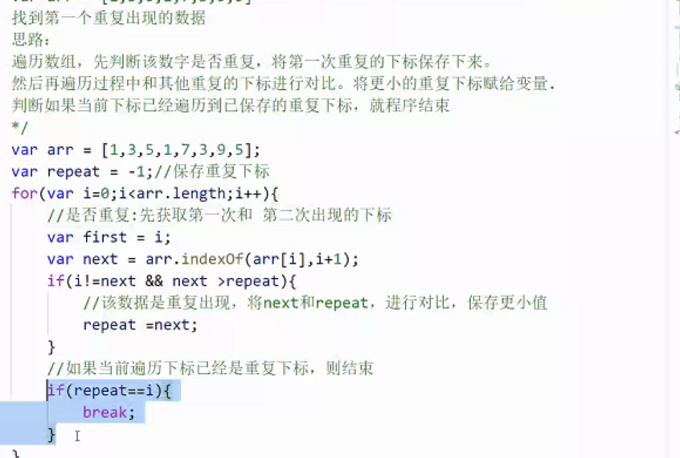
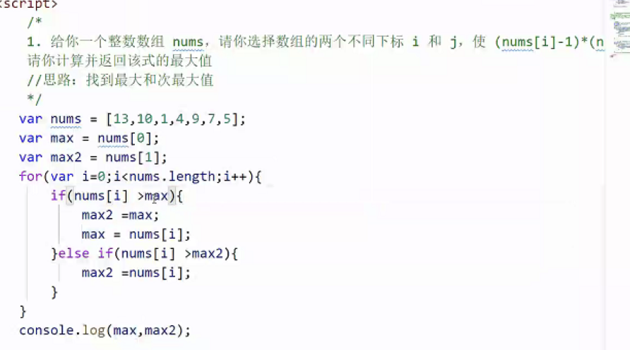

- #🌈笔记
	- # jsAPI
		- ### **push**：数组==末尾==添加一个或多个数据
		- ### **join**：将数组转为字符串
			- 将数组按照给定的分隔符转为字符串形式。
			- ==不影响原数组==。
			- 默认以逗号分隔
		- ### splice：完成数组的指定删除和插入
			- 从第三个数据开始，就是要插入的数据
			- 如果仅实现删除，提供前两个参数
			- 如果仅实现插入，设置删除参数为0 (第二个参数)
		- ### pop：删除并得到数据最后一个数据
		- ### indexOf：查找某数据在数组中==第一次==出现的下标
			- 1.从数组开头开始查找
			- 2. 指定位置开始查找
				- ```js
				  var first = arr.indexOf(10);
				  var second = arr.indexOf(10,first+1)
				  //后面的参数表示开始查找的下标
				  ```
		- ### lastIndexOf：查找某数据在数组中最后一次出现的下标
		- ### reverse：倒序存放，直接==改变原数组==
		- ### **concat**：完成多个数组的合成，生成一个新的大数组，==不影响原数组==
		- ### sort：插入快速排序算法
			- 常用算法
				- 默认排序：按照文字(0-9，a-z)
					- `arr.sort()`
				- 降序
					- `arr.sort((a,b)=>{return b-a;})`
				- 升序
					- `arr.sort((a,b)=>{return a-b;})`
				- 数字反转
					- `arr.sort({return -1;})`
				- 随机打乱
					- `arr.sort((a,b)=>{Math.random()-0.5;})`
					- 返回值是 介于 -0.5 ~ +0.5
					- 因此不知道是否交换
			- 理论
				- 需要对两个参数进行比较后，返回一个值给sort函数
				- 告诉sort函数，a、b哪一个更大
				- 比较相邻的数 a,b
					- 返回=0，ab不交换顺序，但是会和其他元素比较
					- 返回>0，交换顺序
					- 返回<0，不交换顺序
				- [MDN 解释](https://developer.mozilla.org/zh-TW/docs/Web/JavaScript/Reference/Global_Objects/Array/sort)
					- 如果 compareFunction(a, b) 小于 0 ，那么 a 会被排列到 b 之前；
					- 如果 compareFunction(a, b) 等于 0 ， a 和 b 的相对位置不变。
					- 如果 compareFunction(a, b) 大于 0 ， b 会被排列到 a 之前。
	- ## 数组排序
		- 概念：==冒泡==和==快排==是最常见的排序算法
		-
		- ### 冒泡排序
			- ```js
			  //外层循环是用于确定要多少次排序过程
			  for(let i=0;i<arr.length-1;i++){
			    //单词排序过程
			    for(let j=0;j<arr.lenth-i-1;j++){
			      //如果当前下标的数据大于下一个位置的数据，就进行交换
			      if(arr[j]>arr[j+1]){
			        	var temp = arr[i];
			        	arr[i] = arr[i+1];
			        	arr[i+1] = temp;
			      }
			    }
			  }
			  ```
		- 快排
			-
	- #小细节🔆
		- 如何检测程序运行时间
			- ```js
			  console.time();
			  	function(){...};
			  console.timeEng();
			  ```
- [[JavaScript-30]]
	- # Day-9: console 相关操作
		- ### 给页面标签添加断点
		- ### `.log` 的更多用法
			- ```js
			  console.log("输出一个字符串 %s ", "log");
			  console.log("输出一个整数是 %d ", 1.23); //1
			  console.log("输出一个小数是 %f ", 1.23); //1.23
			  console.log("%c不同样式的输出效果", "color: #00fdff; font-size: 2em;");
			  ```
		- ### 不同样式的输出
			- ```js
			  // warning!
			  console.warn("三角感叹号图标，淡黄色背景")
			  // Error :|
			  console.error("红叉图标，红字红色背景");
			  // Info
			  console.info("蓝色圆形感叹号图标");
			  ```
		- 打印输出DOM元素
			- `log` 输出这个 DOM 的 HTML 标签
			- `dir` 则会输出这个 DOM 元素的属性列表。
		- `asset()` 方法进行测试
		- 以更清晰的形式输出数据
		- `count()` 计数
		- `time` 计时
		-
- [[力扣-算法]]
	- ## 早餐问题
		- ==[[双指针法]] O(m+n)==
			- **计算符合当前金额的最大值组合，其他所有小于这个价格的组合，都成立**
			- for循环适合已知次数，while适合未知
			- ### 和for循环区别
				- for循环自动i++，总和大于条件的情况，i--，指针往回退
			- ### 什么时候用双指针
				- ==有序==数组，两数之和
			- ### i，j指针的走向顺序和嵌套大有讲究
				- #### 不能选择大大，即两个指针都从大到小
					- 因为都选择大，会有指针折返的情况，不是最优解
					- 第一次，i最大，要找到找到合适的j，要j++
					- 第二次，i减小，要找j，j需要增大，即j--
				- #### 大小组合时，对于主循环指针有要求
					- 对于for嵌套，最外层为主循环指针
					- 对于while循环，满足条件时++的是主循环
						- 构成sum累加因子的为副指针
					- 要求：主指针从小到大，副指针从大到小
					- 主循环指针：遍历完后，sum累加到所有情况
					- 如果符合要求，
						- 主指针遍历完，包含所有情况
						- 副指针遍历完，此时副指针最小值已无法满足要求，主指针还在增加，继续循环也没用，结束循环
					- 如果不符合，主指针从大到小，副指针从小到大
						- 主指针遍历完，包含所有情况
						- 副指针遍历完，此时副指针最大值满足，主指针还在减小，后续循环中的所有条件都满足要求，但是已经退出循环，即，少计算几种可能性。
		- ==[[二分法]]==
	- 
	- 
	-