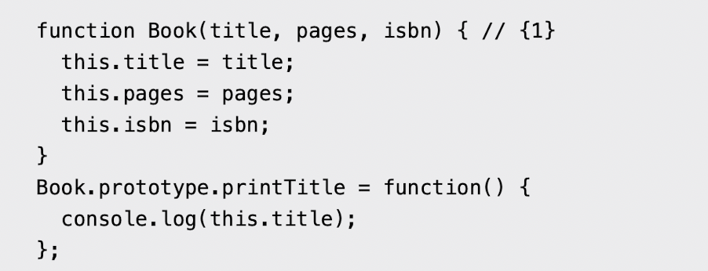

- [[第二阶段面试题]]
- 模板字面量可以用于多行字符串，直接换行，不需要 \ n
- 函数的参数默认值
- arguments对象：数组，包含函数被调用时传入的参数
	- 即使不知道参数的名称，也可以动态获取这些参数
	- ... 展开运算符可以替代arguments，当做剩余参数使用
- 声明展开 `...`
	- apply()：数组转化为参数
		- fn.apply(arr)
- 剩余参数 ...rest
- [[数组解构]]
	- 一次初始化多个变量
	- 交换值，不需要创建临时变量
		- [x,y] = [y,x]
	- 属性简写 {x,y}  = {x:a,b:y}
	- 简写方法名
		-
- 
-
-
-