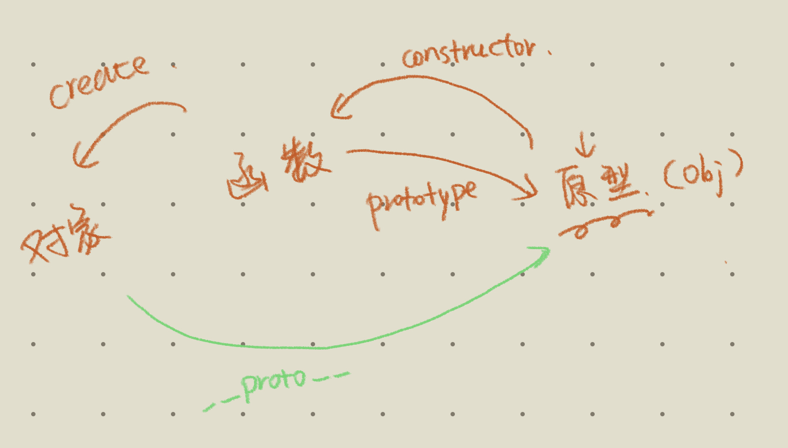

- # 异常
- 程序未按照原计划正常执行的现象被称为`异常`
- ## 内置异常对象
	- 当Js的程序不能正常执行时，系统会收集异常信息，根据异常类型创建对应的==异常对象==，用于储存、封装异常数据。默认情况下，系统将会将异常对象进行控制台输出
	- ## 对象
		- ### `Error`
			- 所有异常的父类
		- 常见子类
			- `ReferenceError`
				- 引用异常，比如：在使用不存在的变量时，会发生该异常。
			- `TypeError`
				- 类型异常，一般在实际类型与预期类型不一致时，会发生该异常
			- `SyntaxError`
				- 语法异常，语法编写有误，会发生该异常
			- `RangeError`
				- 范围异常，一般在指定的值不再有效范围内时，发生该异常
			- `URIError`
				- 地址异常，一般在URI不合法时，发生该异常
	- URI 和 URL区别 #DIFF #card
		-
	- ## 处理异常
		- try
			- 必须。编写可能发生异常的代码
		- catch
			- 必须，当try代码发生异常时，会执行的代码
		- finally
			- 可选。无论try是否发生异常，是否有return，都会在trycatch执行后，最后执行的代码
		- 异常对象
			- 属性：
				- `name`：异常名称
				- `massage`：异常信息(异常补充说明)
				- `stack`：异常的执行栈(定位异常出现的位置)
	- ## 主动抛出异常
		- throw 异常对象
	- ## 自定义异常
		- js提供的内置异常有限，不能表示所有异常情况，故提供自定义异常，增加编程灵活性，适应各种编程需求。
		- 语法
			- 自定义异常类并继承
			- ```js
			  class UploadError extends Error {
			    constructor(mes) {
			      super(mes);
			      this.name = 'UploadError';
			    }
			  }
			  ```
- # ES5 面向对象
- ## 类
	- ```js
	  function 类名(){
	    //属性
	    this.属性名称 = 属性值
	    ......
	    this.函数名称 = function(形参列表){
	      函数内容
	    }
	  }
	  ```
		-
- 对象
	- ```js
	  let 对象名称 = new 目标类名称(实参列表)
	  ```
- # 原型
	- ES5创建对象是通过函数创建，而函数中有一个内置属性`prototype`，该属性引用了一个对象，这个对象就是原型对象
		- 默认的原型对象是Object对象
	- 函数、函数的原型对象与函数创建的对象三者关系
	  id:: 624162f4-962f-4554-bc91-d7153884b90a
		- 函数与函数原型对象
			- 函数中的`prototype`属性引用了原型对象
			- 原型对象中的`constructor`属性引用了函数本身，该属性可以修改
		- 函数创建的对象与函数的原型对象
			- 函数创建的对象有一个内置属性__proto__[ [Prototype] ]，该属性引用了函数的原型对象,该属性是隐藏属性，不允许修改
			- __proto__前后各有两个下划线
		- {:height 213, :width 401}
	- new关键字调用函数时实现流程
	  id:: 6241703c-ac9e-4cf4-b67d-9a439c72f7d8
		- 1.在内存中创建对象空间(堆)
		- 2. 对对象的内置属性 `__proto__`([ [prototype]])赋值为构造函数的`prototype`属性值
			- ```js
			  let cat = new Cat('小花')
			  cat.[[prototype]] = Cat.prototype
			  ```
		- 3. 改变构造函数的`this`指向为当前对象
		- 4. 执行构造函数内部代码
		- background-color:: #793e3e
		  5. 如果构造函数返回非空对象，则返回该对象，否则返回刚创建的新对象
			- ```js
			  function Cat(){
			    ...
			    return new Animal('测试',1)
			  }
			  ```
			- 如果构造函数返回的是基本类型，实际会生成一个对象
			- 如果构造函数没有return，返回刚创建的新对象
			- 如果构造函数返回的是引用值类型，则实际返回的是该引用值类型
- # 原型链
- 每个对象拥有自己的原型,而原型又是一个对象,原型对象又有自己的原型,直到Obejct为止，这些对象想成了一种链式结构，被称为原型链
	- Object本身是个函数，Object函数的原型(__proto__)为null
- 作用
	- 对象的属性和函数访问的顺序取决于原型链
		- 优先查找当前对象中是否存在指定属性和函数，如果不存在，则将查找目标切换为当前对象的原型对象，如果存在，则直接使用
		- 如果原型对象存在指定属性或函数，则直接使用，否则将查找目标切换为当前原型对象的原型，以此类推，==直到Object对象为止==
		- 如果Object中也不存在执行属性，则为`undefined`，如果不存在指定函数，则报错
- # API
	- 作用：改变函数的执行对象(内部`this`指向)
		- `call(obj,arg0,...)`
			- 将当前函数作为`obj`对象中的函数调用，并传入函数的实参
		- `apply(obj,[arg0,...])`
			- 将当前函数作为obj 对象中的函数调用，并以==数组的形式==传入函数的实参
		- `bind()`
			- 改变`this`指向后，不会马上调用函数，而是返回改变`this`后的新函数对象
			- 相当于把目标函数整个拷贝过来，可以后续反复调用
	- call、apply、bind #card
	  id:: 62417cd6-9110-4923-8909-2c91b3358331
		- 联系：都可以改变函数的`this`指向
		- 区别：
			- call与apply改变`this`指向后立即执行目标函数
			- 调用 call 和 apply 的对象，必须是一个函数 Function
			- 第一个参数，如果不传，则默认为全局对象 window。
			- call：如果将所有的参数作为数组传入，它们会作为一个整体映射到 Function 对应的第一个参数上，之后参数都为空。
			- apply：第二个参数，必须是数组或者类数组，它们会被转换成类数组，传入 Function 中，并且会被==映射到 Function 对应的参数==上。
			- bind改变`this`指向后，返回新的函数对象，==不会立即执行==，需要调用才会执行
			- call和bind的实际参数是独立传入的，apply实际参数是==以数组元素的形式==传入