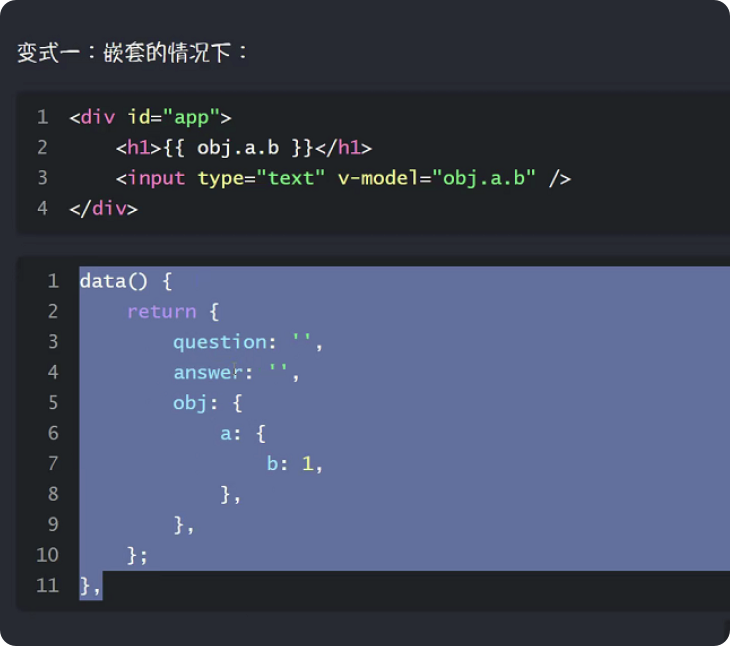
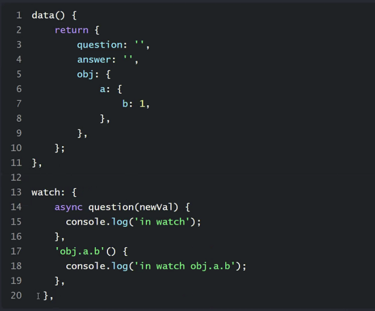
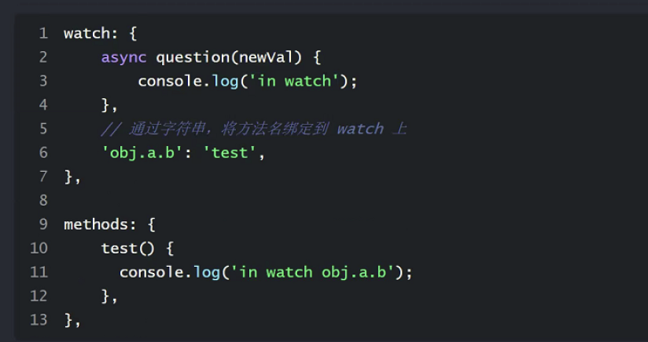
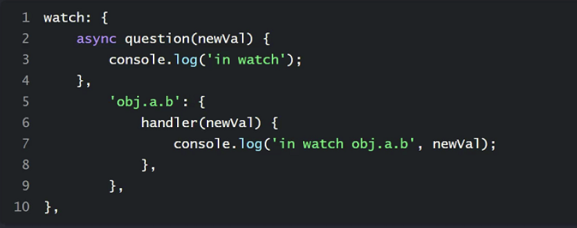
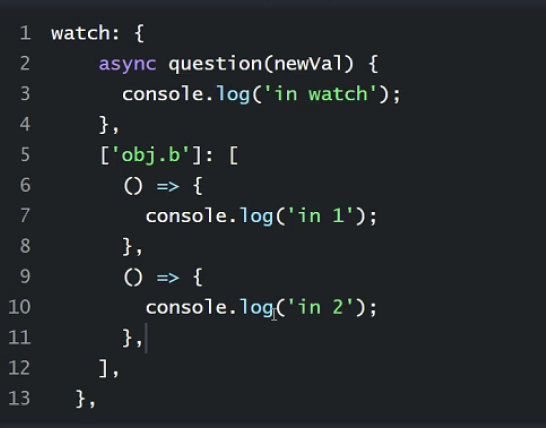

- ## v-model 修饰符
	- `lazy`：当input修改完成之后，才会更新数据
	- `trim`：去除字符串首尾的空格
	- `number`：接收到的内容转换成数字
	- 修饰符可以连用
- ## 计算属性 computed
	- 计算属性也称之为==衍生属性==。根据某一个状态值，衍生出来的其他状态
		- ```js
		  computed:{
		    arrLength(){
		      return this.arr.length
		    }
		  }
		  ```
	- 在computed里面定义的属性，它的值会被缓存。只执行一次，初始化的时候会执行，当它的依赖发生更新的时候，会被执行。
	- 它的依赖只能是定义在data中的响应式数据
	- 底层逻辑：get、set方法
		- ```js
		  arrLength:{
		    get(){
		      return this.arr.length;
		    },
		    set(newVal){
		      this.arrLength = newVal
		    }
		  }
		  ```
	- 计算属性定义的时候是通过get、set来定义，但是其本质就是一个属性，和methods相比，区别在于==计算属性==会缓存计算之后的结果
- #新思路
	- 如果填充的类型为对象，那么被赋值的是同一个内存地址的对象，而不是深拷贝对象。
	- 创建一次，其他的都直接等过来(指针引用)
	- 解决办法：将arr深拷贝一下，再修改其值
		- ```js
		  arr = JSON.parse(JSON.stringify(arr))
		  
		  //示例
		  let arr = new Array(50).fill(new Array)
		  // 深拷贝
		  arr = JSON.parse(JSON.stringify(arr))
		  arr[1].push(50)
		  console.log(arr);
		  ```
- # 监听器(侦听器) watch
	- 当某个状态发生更新之后，造成的影响(需要做的其他的事情)
	- watch 当监听的状态发生变化的时候，会被触发
	- ```js
	  watch:{
	    async question(newVal){
	      this,answer = await axios
	      .get('https://yesno.wtf/api')
	      .then(({data})=>data.answer)
	    }
	  }
	  ```
	- ### computed、methods、watch之间的区别？ #card
		- watch看重 状态发生后，要处理的一系列的==过程==，过程实际上和被监听的对象并不是强关联。
		- 相比于computed(计算属性)更注重==结果==，这个结果会依赖其他的状态
		- watch里可以出现 ==异步代码==，computed中一般不会出现异步操作
		- 计算属性定义的时候是通过get、set来定义，但是其本质就是一个属性，和methods相比，区别在于==计算属性==会缓存计算之后的结果
	- 变式一：嵌套
		- {:height 310, :width 317}
		- {:height 333, :width 431}
	- 变式二：字符串
		- {:height 216, :width 427}
	- 变式三：对象
		- {:height 175, :width 460}
		- #### handler：Function
			- 当状态发生更新时，执行的方法
		- #### deep: true
			- deep会监听对象和对象==内部==的所有属性
				- obj 和 obj.a
		- #### immediate：true
			- ==初始==时就执行，否则为false，在改变时才执行
	- 变式四：数组
		- 当状态发生之后，有多个方法需要执行，将方法放进数组中
		- {:height 238, :width 323}
		- 数组中可以放 用字符串表示的方法、handler(即变式二、变式三)
- 浏览器进行通信的两种技术 #card
	- 浏览器进行通信技术有两种 `ajax` 和 `fetch`
- [[Lodash]]
	- _.initial(arr)
		- 返回arr中除最后一个元素外的所有元素，(去除最后一个元素)
	- _.intersection(arr1,arr2...)
		- 返回包含==交集==元素的新数组
		-