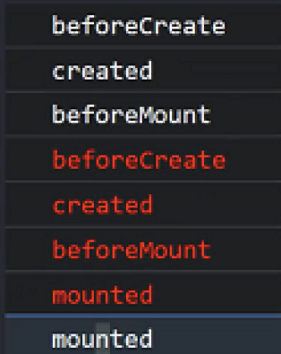
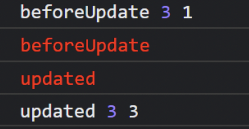

- id:: 626f758a-8c5c-4ec9-82b5-9c8afadd915b
  collapsed:: true
  >
	-
	-
- # Vue生命周期
	- 描述一件事从创建到销毁的整个过程，叫做`生命周期`
	- Vue实例的生命周期一共分成三个阶段：初始化阶段、运行阶段(更新阶段)、销毁阶段。Vue分别在这三个阶段中，提供了不同的生命周期函数(钩子函数)，让开发者可以介入到整个实例的管理
	- ## 初始化阶段
		- 初始化阶段就是Vue将数据渲染到页面的一个阶段
		  background-color:: #978626
		- `init Event` & `lifeCycle` ：Events是Vue构造函数依赖的一些事件，lifeCycle 生命周期函数
		- `beforeCreate`： 第一个生命周期函数，创建内部数据之前调用钩子函数。有哪些数据需要初始化？ props、data、methods、computed、watch 等都`无法访问`。但是可以访问到一些全局的数据。==Loading动画==
		- `Init injection` & `reactivity`：开始初始化数据。data方法执行之前，props已经被初始化。data方法执行之后，就可以拿到需要处理的数据。props、data、methods、computed、watch 等`可以访问`
		- `created`：第二个生命周期函数会被执行，在这个函数中，我们可以访问到当前组件中的数据，还可以操作这些数据，我们也会在这些函数中做一些依赖当前数据的==异步操作==
		- `模板解析`：我们的模板本质上是一个字符串，把字符串转换成真实的页面，这样的过程称之为模板解析。
			- 字符串 -> 抽象语法树：字符串包含元素、mastache语法、很多的指令进行分类，提取之后的结果就是 `抽象语法树`
			- 抽象语法树 -> 渲染函数：render函数。
			- 渲染函数 -> vNode(虚拟节点)本质上就是JavaScript对象，通过这个对象来描述真实DOM
		- `beforeMount`：在这个函数执行之前，渲染函数已经定义完成，但是==还没执行==，产生了vNode，但没有获取到。`this.$el`依然为undefined
		- `create vm.$el`：通过渲染函数渲染页面：产生虚拟节点，再通过虚拟节点映射到一个真实DOM，并且将DOM插入到页面
		- `mounted`：当组件渲染完成之后，数据和事件都已经绑定到视图了，用户可以开始操作。当mounted执行时，意味着初始化阶段结束，页面进入到运行阶段
	- ## 更新阶段(运行阶段)
		- `beforeUpdate`：更新之前的钩子函数。这里的更新指的是视图的更新，状态是实时发生变化的。视图的更新是放在异步更新队列里。我们可以在这个钩子函数中，继续修改状态，而且不会触发新的更新。数据是最新的，节点vNode不是。
		- `vNode rerender patch`：进入异步更新队列，真正开始更新视图，vue需要知道更新视图的哪一个部分。它需要知道前后两次视图发生变化的点在哪。
			- `patch`：找前后两次vNode的区别。当更新的时候`render`函数会被调用，拿到了最新的vNode，最新的vNode(当前操作)和上一次vNode(初始化)做一个对比，diff算法，然后通过和真实节点的映射关系，做最小化的更新。
		- `updated`：更新完整之后的回调函数。在这里就可以访问到最新的节点。在这里操作状态，会触发下一次更新，死循环
	- ## 销毁阶段
		- 当我们进行试图切换时，意味着进入到组件的销毁阶段
		- `beforeDestroy`：销毁之前执行的函数，在这里函数依然可以访问到我们实例中的数据
		- `destroyed`：销毁之后执行的函数，
	- ### 父子组件嵌套时，生命周期函数的执行顺序 #card
		- {:height 208, :width 151}
		- 父子组件无依赖的情况
			- 父级组件更新，子组件不会重新渲染
			- 子组件更新，父组件不会重新渲染
			- 虽然是嵌套关系，但是不会互相影响
		- 父子组件有依赖的情况
			- 子组件依赖父级组件的状态值，当父级组件更新，子组件会重新渲染
				- {:height 119, :width 256}
- ## 组件间的通信
  background-color:: #978626
  collapsed:: true
	- ### props & listeners
		- #### 兄弟组件间的通信
			- 将需要共享的状态，统一定义在兄弟组件的父级组件中，利用单向数据流，通过props和listeners ，把状态和操作状态的方法交给子组件，达到兄弟组件间通信的目的。
	- ### $parent 和 $children
		- `$parent`：在子组件中，我们可以直接通过`this.$parent`来获取父级组件的实例，从而拿到想到的数据和方法，这种依赖关系是一种隐藏的依赖。
	- ### ref
		- 通过`$children`设置ref属性，通过$refs
	- ### 事件总线
		- 兄弟之间的通信通过事件总线
		- 通过Vue构造函数创建一个实例，叫事件总线
		- ```js
		  // 发送消息
		  EventBus.$emit(channel: string, callback(payload1,…))
		   
		  // 监听接收消息
		  EventBus.$on(channel: string, callback(payload1,…))
		  ```
	- ### provide & inject
		- 父子(孙子)组件共享数据的方案
		- 这种方案是为了解决 多层次组件嵌套，需要通过props来传递数据的问题
		- 问题：如果在provide定义的数据时基本数据类型时，injected 注入进来的数据就不再是响应式的
			- 解决：在provide里使用==引用对象==
- # vuex
	- 组件之间的通信方式，其目的是为了数据的共享。vue提供了一个全局的状态管理方案
	- 在 `main.js` 中，直接引入 `store` 对象，添加到 vue 配置文件中去。
		- ```js
		  // ./main.js
		  import Vue from "vue";
		  import App from "./App.vue";
		  import router from "./router";
		  // vuex 全局状态仓库
		  import store from "./store";
		  Vue.config.productionTip = false;
		  // 全局的自动化注册
		  import "./utils/register.js";
		  // 全局定义指令 v-html v-i-html
		  // 第一个参数是指令的名称 第二个参数就是指令的描述
		  new Vue({
		    router,
		    store,
		    render: (h) => h(App),
		  }).$mount("#app");
		  ```
	- ## state
		- 定义全局状态
			- `state` 称之为 状态，用来描述 store 中管理的数据。和 Vue 中的 data 一样，它的类型是一个 `object` 类型。在 Vuex 中，直接通过 `state` 属性来定义：
				- ```js
				  //store文件夹中的index.js
				  import Vue from 'vue';
				  import Vuex from 'vuex';
				  // 引入 Vuex
				  Vue.use(Vuex);
				  // 初始化一个 store
				  export default new Vuex.Store({
				      state: {
				          // 在 state 中定义 count 状态
				          count: 0
				      },
				      mutations: {},
				      actions: {},
				      modules: {}
				  });
				  ```
	- ### 在组件中使用 state
		- 我们如何在 Vue 组件中展示状态呢？由于 Vuex 的状态存储是响应式的，从 store 实例中读取状态最简单的方法就是在计算属性中返回某个状态：
		- ```js
		  <template>
		      <div>
		          <h1>{{ count }}</h1>
		          <button>+</button>
		          <button>-</button>
		      </div>
		  </template>
		  <script>
		  export default {
		      name: 'CounterIndex',
		      computed: {
		          count() {
		              // 通过 this.$store 访问全局的 state
		              return this.$store.state.count;
		          }
		      }
		  };
		  </script>
		  ```
		- Vuex 通过 Vue 的插件系统将 store 实例从根组件中“注入”到所有的子组件里。且子组件能通过 this.$store 访问到。
	- ### 辅助函数 mapState
		- 当一个组件需要获取多个状态的时候，将这些状态都声明为计算属性会有些重复和冗余。这是，可以使用 mapState 辅助函数来快速获取。返回值是==对象==
		- ```js
		  // 不使用辅助函数的写法
		  export default {
		      name: 'CounterIndex',
		      computed: {
		          count() {
		              return this.$store.state.count;
		          },
		          a() {
		              return this.$store.state.a;
		          },
		          b() {
		              return this.$store.state.b;
		          },
		          c() {
		              return this.$store.state.c;
		          }
		      }
		  };
		  ```
	- ### 数组
		- 通过数组，快速获取全局的 state。
		- ```js
		  import { mapState } from 'vuex';
		  export default {
		    name: 'CounterIndex',
		    computed: mapState(['count', 'a', 'b', 'c'])
		  };
		  ```
	- ### 对象
		- 有时候，全局的状态属性有可能和组件中定义的局部状态有冲突，这时，我们就可以使用 对象 来给 state 重命名。
		- ```js
		  <script>
		    import { mapState } from 'vuex';
		    export default {
		        name: 'CounterIndex',
		        data() {
		            return {
		                d: 10
		            };
		        },
		        computed: mapState({
		            // 箭头函数
		            count: state => state.count,
		            // 通过函数重命名
		            a1: state => state.a,
		            // 别名
		            b1: 'b',
		            // 为了获取本地状态，可以使用 `this`，但是要用普通函数声明
		            sum() {
		                return this.$store.state.c + this.d;
		            }
		        }),
		        mounted() {
		            console.log(this);
		        }
		    };
		  </script>
		  ```
	- ### 对象展开运算符
		- mapState 函数返回的是一个对象。我们可以通过 ... 运算符，将其和组件自身的 计算属性 进行混合。
		- ```js
		  export default {
		    name: 'CounterIndex',
		    data() {
		        return {
		            d: 10
		        };
		    },
		    computed: {
		        // 自身的 计算属性
		        doubleD() {
		            return this.d * 2;
		        },
		        // 通过 mapState 拿到的全局状态
		        ...mapState({
		            // 箭头函数
		            count: state => state.count,
		            // 通过函数重命名
		            a1: state => state.a,
		            // 别名
		            b1: 'b',
		            // 为了获取本地状态，可以使用 `this`，但是要用普通函数声明
		            sum() {
		                return this.$store.state.c + this.d;
		            }
		        })
		    },
		  };
		  ... 运算符，会将 mapState 返回的对象中的属性，一个一个的展开之后，合并到 computed 中去。
		  ```
- ## mutation
- ### 定义
	- 在 Vuex 中，当状态发生更新时，我们应该如何修改 state？
	- 在 Vuex 中，修改 state 的唯一途径就是提交 mutation。`mutation` 本质就是一个函数，函数名就是当前修改事件的类型，当这个函数被触发的时候，Vuex 会将 state 传递给这个函数，从而，让我们在 mutation 函数内进行 state 的更新。
	- ```js
	  // 初始化一个 store
	  export default new Vuex.Store({
	    // 全局状态
	    state: {
	        // 在 state 中定义 count 状态
	        count: 0
	    },
	    // mutations 中定义修改 state 的方法
	    mutations: {
	        // 定义一个方法，用于修改 state 中的 count 状态
	        add(state) {
	            state.count++;
	        },
	        // 可以使用箭头函数
	        minus: state => state.count--
	    },
	    actions: {},
	    modules: {}
	  });
	  ```
	- 我们使用 普通函数 和 箭头函数 两种方式来定义 mutation 都是可以的，因为==我们不会使用 this 关键字来获取任何状态值。==
- ### 触发
	- 在组件中使用 `commit` 方法触发 mutation 的执行，commit 方法的参数映射的是 mutations 中的名称。
	- ```js
	  export default {
	    name: 'CounterIndex',
	    computed: mapState(['count']),
	    methods: {
	        add() {
	            // 使用 commit 方法触发 store 中的 mutations
	            // commit 方法的参数为 mutations 的名称
	            this.$store.commit('add');
	        },
	        minus() {
	            this.$store.commit('minus');
	        }
	    }
	  };
	  ```
- ### 辅助函数
	- 和 `mapState` 一样，你可以使用 ==数组== 风格的 `mapMutations`。
- ```js
  import { mapState, mapMutations } from "vuex";
  export default {
  name: "CounterIndex",
  computed: mapState(["count"]),
  // 使用数组风格的mutation
  methods: mapMutations(["add", "minus"]),
  };
  ```
- 或者使用==对象==风格的：
- ```js
  import { mapState, mapMutations } from "vuex";
  export default {
  name: "CounterIndex",
  computed: mapState(["count"]),
  // 使用对象风格的mutation
  methods: mapMutations({
    add: "add",
    minus: "minus",
  }),
  };
  ```