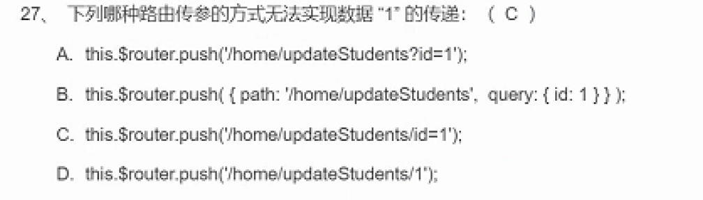

- [[考试总结]]
	- query和params
		- params；添加在path里
			- 使用`params`获取
		- query：直接以?形式添加
			- 也就是直接从url获取，url传参
	- mutation和action区别
		- action：异步、==业务的操作==
		- mutation：修改state的方法，通过`commit`来触发更新，==视图的更新==
	- ==规范问题==，要做什么操作，直接找对应的对象
		- getter：第一个参数state，计算属性，不应该修改状态state(该在mutation)
		- action：第一个参数context，包含state
	- path路径以`/`开头会被当做根路径，会直接从端口号后替换地址，因此子路由的path开头都不应该添加`/`
	- 
	- `:key`
		- 元素的唯一识别码
		- key的值只能是字符串，自动调用toString()方法
	- created、mounted 的区别？ #card
		- created：有data、methods之类，即可以通过this获取信息，但是没有元素节点
		- mounted：已经挂载，能够访问到真实节点
	- beforeRouteEnter执行时，vue实例还没被创建出来，无法访问this
	- 事件总线，要注意==组件加载顺序==，以及在页面中的渲染顺序
	- vue不能检测视图更新的情况 #card #vue
		- 对象的属性能够转换成get、set
		- 对象属性的删除，要使用`this.$delete`才能更新视图
		- 对象属性的添加，`this.$set`
		- 数组的删除：splice才能更新视图
		- 数组的修改长度不能更新
		- 数组通过index的==任何操作==都不能更新视图
	-
		-
	-
	-
	-
	-