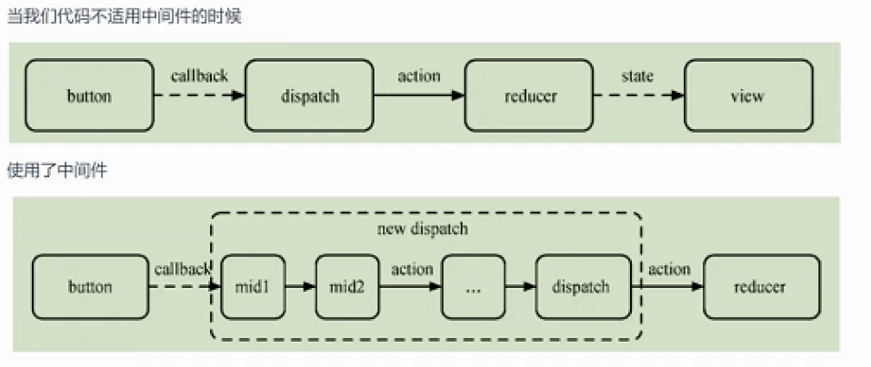

- [[面试题]]
  collapsed:: true
	- ## 前端性能优化方案
	- ### 一、CDN加速
	- 开发过程中有很多资源都可以通过CDN内容分发网络资源来获取
	- CDN：代表内容分发网络，利用最靠近用户的服务器来提供资源访问，包括音视频资源
	- 目的：提高访问速度，降低传出成本
	- 自己写的代码也可以加入CDN
	- CDN一般会用于托管静态资源，比如图片、文本、脚本等，可以使用CDN来加速访问
		- 可以将项目中的静态资源部署到CDN服务器，减少服务器访问压力
	- ### 二、懒加载
	- 指图片的懒加载方案，在长网页中，为了提高页面渲染速度，我们会将不可见的区域图片资源进行延迟加载。用户看到的窗口有限，如果不可见的区域我们默认加载图片，会造成卡顿
	- 实现懒加载
		- ```jsx
		  {list.map(item=>{
		    return 
		  })}
		  ```
	- 滚动屏幕的时候，我们会判断当前内容是否进入可见区域，动态将data-src的值赋值给src属性，一旦src有了内容，马上服务器获取资源，前端进行加载
	- `懒加载`：延迟加载资源
	- `预加载`
		- 小程序分包的时候，可以指定分包完了后，子包的加载顺序
		- 等主包加载完毕，加载子包1，完毕后，加载子包2
	- ### 三、回流和重绘
		- https://s2.loli.net/2022/06/07/hqkds32ioJXM1Ef.png
		- 浏览器底层
		- HTML解析器：将后端返回的网页加载成一个DOM树
		- CSS解析器：将页面中加载回来的css样式解析成最终样式表
		- js解析器：vs引擎解析js代码
		- 页面一旦被浏览器加载，就会读取页面代码
			- 将HTML代码解析为DOM树
			- 页面中引入css样式后，使用css解析器加载css代码，计算最终样式
			- 以上两条线并行运行(html先运行，实际上是交错运行)
			- 将计算后的样式和DOM树结合生成render tree，调用浏览器底层的layout(对视图进行布局的模块)，进行重绘、回流显示网页
		- #### 重绘和回流
			- ==回流==：将render tree 中的部分或者全部元素的尺寸、位置结构、属性发生变化，影响了页面结构，浏览器会重新渲染部分或者全部文档
			- ==重绘==：当页面中某些元素的样式发生变化(颜色、字体)，并不影响元素在标准文档流中的位置
			- 减少重绘和回流
			  background-color:: #978626
				- 操作DOM的时候，尽量避免在==低层级==里面操作DOM
				- 不要使用table布局一个小改动，造成整个table的重新渲染
				- 不要频繁操作元素样式，对于静态页面，尽量通过==class==来操作
				- 可以通过documentFragment来创建一个文档片段，这个片段中的dom元素会最后渲染到节点上面。不会马上更新，其他更新完再更新fragment中的元素
				- 默认情况下可以设置`display:none`，此时元素会渲染出来，但不显示，不会引发页面的重绘和回流
		- ### 四、节流和防抖
			- 函数防抖：指定时间内，事件再次触发，重新计时，只执行最后一次
			- 函数节流：指定时间内，事件多次触发，指定时间内只会触发一次
- # Redux #React
- ## 四、合并操作
- ### reducer合并
- 提供的reducer默认增加命名空间
- 使用redux提供的api
	- ```js
	  import {combineReducer} from "redux"
	  combineReducer({
	    counterRD:counterReducer,
	    ...RD:....Reducer  //默认规范命名简写reducer为RD
	  })
	  ```
- action合并
- ## 五、中间件
	- redux默认只提供了数据管理核心流程，并没有提供异步解决方案
	- redux设置过程中，将很多的功能以中间件的形式加载进来
- 中间件的执行流程
	- 
- redux中我们常用的中间件
- redux-logger：日志中间件，如果你要用它，记录日志
- redux-thunk：可以发送异步请求，相当于vuex actions
- rudex-saga：这个也可以处理异步请求。generator编程、iterator编程
- ### redux-saga 使用流程
- 处理异步请求
- # 迭代器和生成器
- ## 一、迭代器
- 迭代器就是一种对数据进行遍历的操作方式。
- 为不同的数据接口提供统一的访问机制。任何数据结构䢣部署Iterator接口(标准)，就可以完成遍历操作(即依次处理数据结构的所有成员)
- 迭代器在内容中通过指针的方式一个一个获取数据
- Iterator的作用
	- 为各种数据结构，提供一个统一的、简便的访问接口
	- 使得数据结构的成员能够按某种次序排列
	- ES6创造了一种新的遍历命令 for...of循环，Iterator接口主要供for...of使用
	- 迭代器是一个特殊的对象，所有的迭代对象都有next()方式，每次调用完上一个元素。next自动寻找下一个元素。每次找到要获取的内容，返回一个对象(value：迭代的值，done：是否已被迭代)
	-
-
- [[口语练习]]
	- And I planned to find the flag and pointed it as I sing this part. And what I didn’t realize was that they were gonna move the flag. And when I get out there, I started turning and I was like, “Oh girl, just keep turning and maybe it’ll show up.” Turns out they still kept the flag up on that beautiful day, and I found it, and I was so grateful.
	-