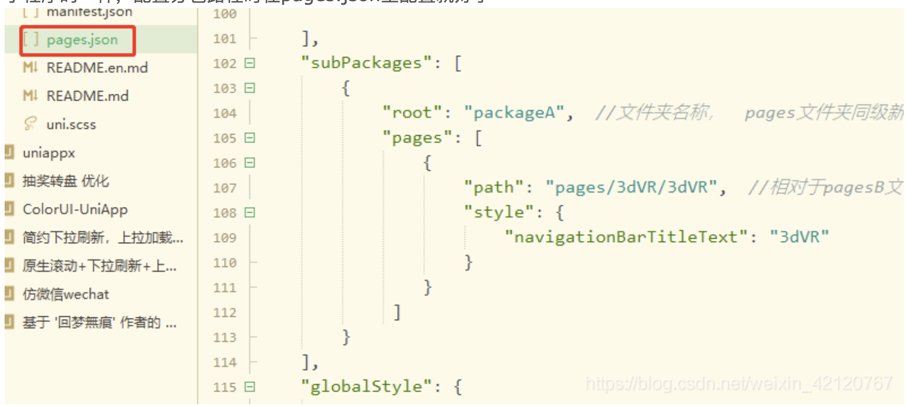

- 缓存策略
- 鉴权
  collapsed:: true
	- 路由鉴权
		- vue、react、uniapp、vue3
	- 菜单鉴权
	- 按钮鉴权
	- 角色鉴权
- 注册组件
  collapsed:: true
	- vue2需要注册，全局或组件内，一般写全局注册工具js
		-
	- react不需要，但需要引入
	- vue3不需要注册，但是需要引入
- [[Webpack]]
  collapsed:: true
	- ### 带表达式的 require 语句
		- 即常见require语句
		- `require('../template.js')`
			- 自动创建上下文，包含参数 Directory 和 Regular expression(正则)
		- 也可以使用`require.context`创建自己的模块
			- 用处：vue2自动[全局注册js文件](https://v3.cn.vuejs.org/cookbook/automatic-global-registration-of-base-components.html#基础示例)
			- directory：要搜索的文件夹目录
			- useSubdirectories：是否搜索子目录，boolean
			- regExp： `/expression/`
		- 该方法返回一个require函数
			- 其中keys 也是一个函数，它返回一个数组，由所有可能被上下文模块处理的请求组成。
- ### 在浏览器输入 URL 回车之后发生了什么
- 问
  background-color:: #978626
	- uniapp 直接发布ios和安卓，可行吗？ 存在问题吗？分包？写了图片压缩，但是储存到数据库，但是需要显示preview，储存在手机？还是说图床？真实项目会用图床吗？
		- 图片经过压缩和使用网络连接形式，避免静态资源占用太多内存
	- 小微公司，独立开发？合作？少量人员？
- uniapp分包
	- 配置分包路径时在pages.json里配置就好了
		- 
		- ### 分包没超过，真机调试显示超过？ #card
		  collapsed:: true
			- vendor打包了分包的依赖，你在分包使用require引入的给打包到vendor.js里了，这就是导致明明主包都没有超过2M，打包后却超过的原因。
			- 解决
				- 打开manifest.json,在“mp-weixin”里添加代码
					- ```js
					  "optimization":{ 
					    "subPackages":true
					  }
					  ```
-