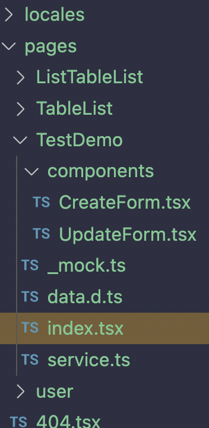
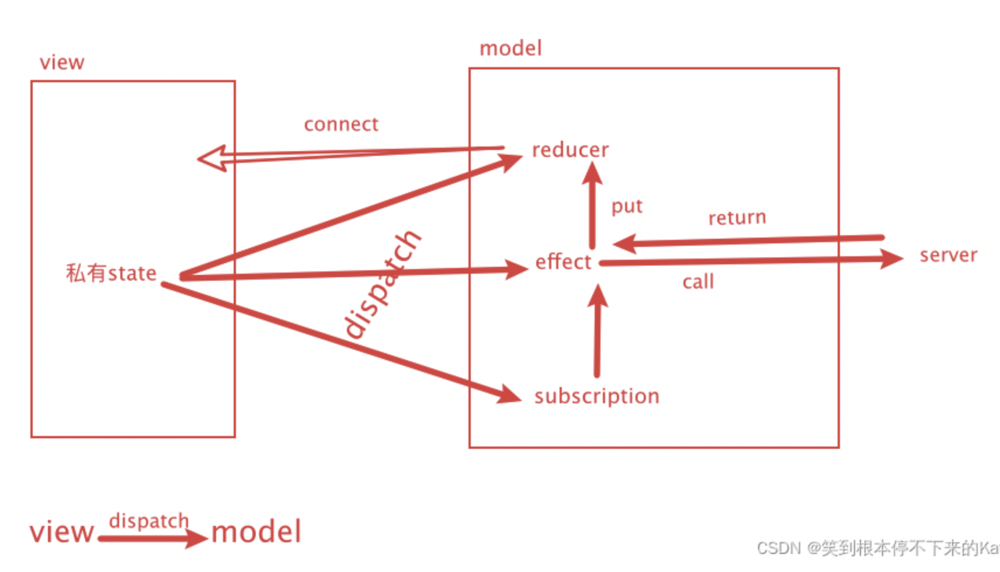

- LATER proTable
	- *Drawer*  浮层表单
	- *ModalForm*  新建表单
	- *UpdateForm*  触发`配置`操作后，弹出该表单
	- 选中后进行批量操作
	  collapsed:: true
		- ```jsx
		  {selectedRowsState?.length > 0 && (
		    <FooterToolbar
		      extra={
		        <div>
		          已选择{' '}
		          <a
		            style={{
		              fontWeight: 600,
		            }}
		            >
		            {selectedRowsState.length}
		          </a>{' '}
		          项 &nbsp;&nbsp;
		          <span>
		            服务调用次数总计 {selectedRowsState.reduce((pre, item) => pre + item.callNo!, 0)} 万
		          </span>
		        </div>
		      }
		      >
		      <Button
		        onClick={async () => {
		          await handleRemove(selectedRowsState);
		          setSelectedRows([]);
		          actionRef.current?.reloadAndRest?.();
		        }}
		        >
		        批量删除
		      </Button>
		      <Button type="primary">批量审批</Button>
		    </FooterToolbar>
		  )}
		  ```
	- 表格右上角额外操作 - 新建Btn
	  collapsed:: true
		- ```jsx
		  toolBarRender={() => [
		    <Button
		      type="primary"
		      key="primary"
		      onClick={() => {
		        handleModalVisible(true);
		      }}
		      >
		      <PlusOutlined /> 新建
		    </Button>,
		  ]}
		  ```
	- 嵌套表格
		- 函数定义return出proTable
		- 定义外层table时，配置属性`expandable`
			- `expandable={{ expandedRowRender }}`
	- 可编辑表格
		- `rowKey="id"`  不能少！否则不能编辑
	- 业务定制(修改原title位置，以及在title上面作修改)
	  collapsed:: true
		- ```jsx
		  cardProps={{ title: '业务定制', bordered: true }}
		  - headerTitle={
		  - <Button
		  - key="primary"
		  - type="primary"
		  - onClick={() => {
		  - alert('add');
		  - }}
		  - >
		  - 添加
		  - </Button>
		  - }
		  ```
		-
	- valueType
	  collapsed:: true
		- date
		- index
		- image
		- avatar
		- option
			- ```jsx
			  render: (_, row, index, action) => {
			        <a
			          key="a"
			          onClick={() => {
			            action?.startEditable(row.key);
			          }}
			        >
			          编辑
			        </a>,
			    },
			  ```
- LATER 标准umi文件夹模板   [玩转 Ant Design Pro ：Model、Services、Mock 详解 - 掘金](https://juejin.cn/post/6844904118314614798#heading-14)
  collapsed:: true
	- {:height 404, :width 142}
	- `_mock.js`
		- mock数据，单独的mock数据
		- 全局mock数据在mock文件夹
		- 不使用mock数据
			- `npm run start:no-mock`
	- `data.d.ts`
		- 当前页面的数据的`type`
		  collapsed:: true
			- ```tsx
			  export type TableListItem = {
			    key: number;
			    disabled?: boolean;
			    href: string;
			    avatar: string;
			    name: string;
			    owner: string;
			    desc: string;
			    callNo: number;
			    status: string;
			    updatedAt: Date;
			    createdAt: Date;
			    progress: number;
			  };
			  export type TableListPagination = {
			    total: number;
			    pageSize: number;
			    current: number;
			  };
			  export type TableListParams = {
			    status?: string;
			    name?: string;
			    desc?: string;
			    key?: number;
			    pageSize?: number;
			    currentPage?: number;
			    filter?: Record<string, any[]>;
			    sorter?: Record<string, any>;
			  };
			  ```
		- 使用
		  collapsed:: true
			- ```tsx
			  import { rule, addRule, updateRule, removeRule } from './service';
			  import type { TableListItem, TableListPagination } from './data';
			  ```
	- `index.tsx`
	- `service.ts`
		- 和服务端进行交互时我们需要使用到Services
		- 使用封装的 request.js模块发送请求
	- `Model`
		- 在`src/models`目录下新建todoList.js文件
		- Model是dvajs里面的概念，dva 通过 model 的概念把一个领域的模型管理起来，
			- 同步更新 state 的 reducers， = mutation
			- 处理异步逻辑的 effects， = actions
			- 订阅数据源的 subscriptions
			- Code
			  collapsed:: true
				- ```js
				  import { todoListQuery } from '../pages/TodoList/service'
				  
				  
				  const todoListModel = {
				      namespace: 'todoList',
				      state: {
				          list: [],
				      },
				      reducers: {
				          save(state, action) {
				              var newState = JSON.parse(JSON.stringify(state))
				              newState.list = action.value;
				              return newState;
				          },
				          add(state, action) {
				              var newState = JSON.parse(JSON.stringify(state))
				              newState.list.push(action.value);
				              return newState;
				          },
				          delete(state,{ payload: key }){
				              var newState = JSON.parse(JSON.stringify(state))
				              console.log('state--',state,'key:',key)
				              newState.list = newState.list.filter(item => item.key !== key);
				              return newState;
				          }
				      },
				      effects: {
				          *getListApi(_, { call, put }) {
				              const response = yield call(todoListQuery);
				              console.log('myRes', response)
				              yield put({ type: 'save', value: response });
				          },
				      }
				  };
				  export default todoListModel;
				  ```
		- connect
		  collapsed:: true
			- 被 connect 的 Component 会自动在 props 中拥有 dispatch 方法。
			- code (使用connect高阶函数组件)
			  collapsed:: true
				- ```js
				  import React, { Component } from 'react';
				  import { connect } from 'dva';
				  import { message } from 'antd';
				  import AddNewList from './components/AddNewList'
				  import MyList from './components/List'
				  
				  /**
				   * 查询列表
				   * 
				   */
				  
				  const queryList = async (dispatch) => {
				      const hide = message.loading('正在查询');
				      try {
				        await dispatch({
				          type: 'todoList/getListApi',
				        });
				        hide();
				        message.success('查询成功');
				        return true;
				      } catch (error) {
				        hide();
				        message.error('查询失败请重试！');
				        return false;
				      }
				    };
				  
				  class index extends Component {
				      componentDidMount(){
				        queryList(this.props.dispatch)
				      }
				      render() {
				          return (
				              <div>
				              <h2 style={{background:'#1890ff',color:'#fff',height:'85px',lineHeight:'85px',textAlign:'center',borderRadius:'10px',fontSize:'45px'}}>我的代办</h2>
				              <AddNewList />
				                <MyList onDelete={this.props.handleDelete} list={this.props.list}/>
				              </div>
				          );
				      }
				  }
				  
				  function mapStateToProps(state) {
				      return {
				        list: state.todoList.list,
				      };
				  }
				  
				  function mapDispatchToProps(dispatch) {
				      return {
				        dispatch,
				        handleDelete(key) {
				          dispatch({
				              type: 'todoList/delete',
				              payload: key,
				          });
				      }
				      };
				  }
				  export default connect(
				      mapStateToProps,mapDispatchToProps
				  )(index);
				  ```
			- code  useDispatch()、useSelector
				- ```js
				  import {useDispatch} from 'umi';
				  const Home=()=>{
				      const dispatch = useDispatch()
				      const getData=()=>{
				          dispatch({
				              type:"home/get"
				          })
				      }
				      return (
				          <div>
				              <h1>这是home页面</h1>
				              <button onClick={getData}>获取数据</button>
				          </div>
				      )
				  }
				  export default Home
				  ```
			- useSelector
				- ```js
				  import { useSelector, useDispatch，useStore } from 'umi';
				  
				  const Index = () => {
				    // useSelector 通过getState()方法找到demo的data
				    const state = useSelector(state => state.getState().demo.data) 
				    // useStore：如果store中的state改变，这个将不会自动更新
				    //const state = useStore(state.getState())
				    const dispatch = useDispatch()
				  
				    const deleteHandler = async (id) => {
				      dispatch({
				        type:'users/delUser',  
				        payload:{
				          id
				        }
				      })
				    };
				  
				    return()
				  }
				  export default Index
				  ```
			- 
	- dva+umi  CURD 应用
		- service + model + component
		- service：发送请求，获取数据
			- ```js
			  // 1、service
			  export function remove(id) {
			    return request(`/api/users/${id}`, {
			      method: 'DELETE',
			    });
			  }
			  ```
		- model：处理数据：reducers、effects
			- ```js
			  // 2、model
			  *remove({ payload: id }, { call, put, select }) {
			    yield call(usersService.remove, id);
			    const page = yield select(state => state.users.page);
			    yield put({ type: 'fetch', payload: { page } });
			  },
			  ```
		- components：dispatch 触发action
			- ```js
			  // 3、component
			  deleteHandler(){
			    dispatch({
			    	type: 'users/remove',
			    	payload: id,
			    });
			  }
			  ```