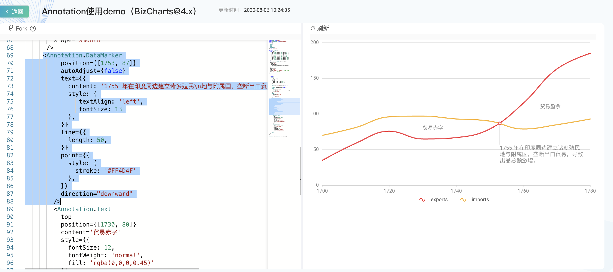
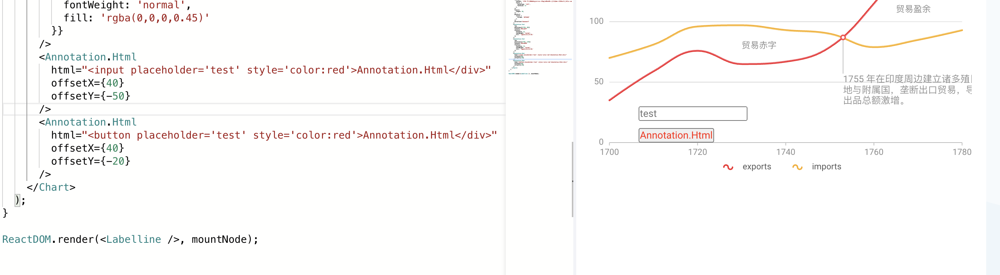
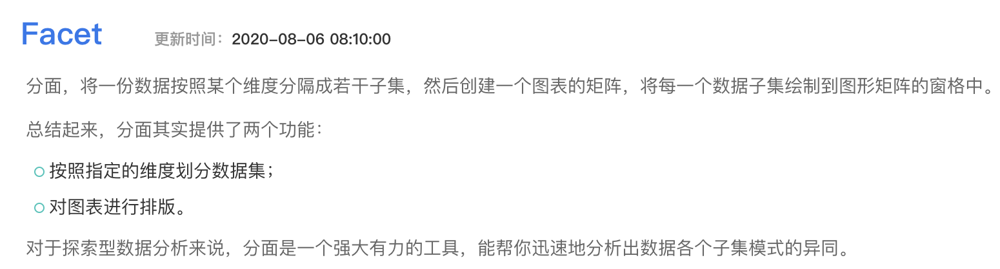
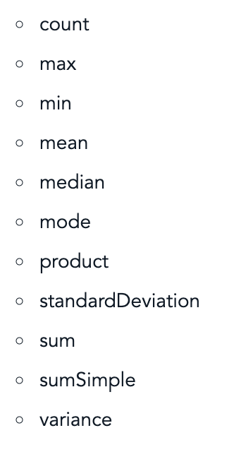
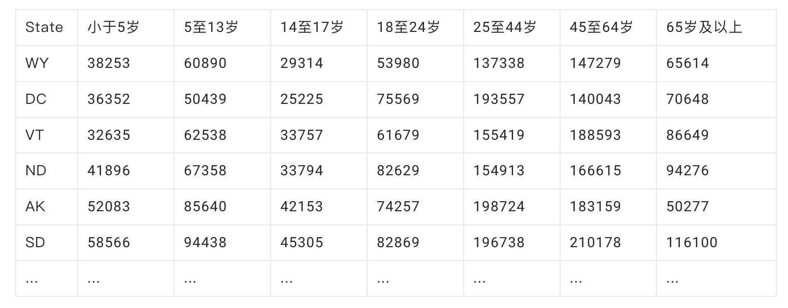
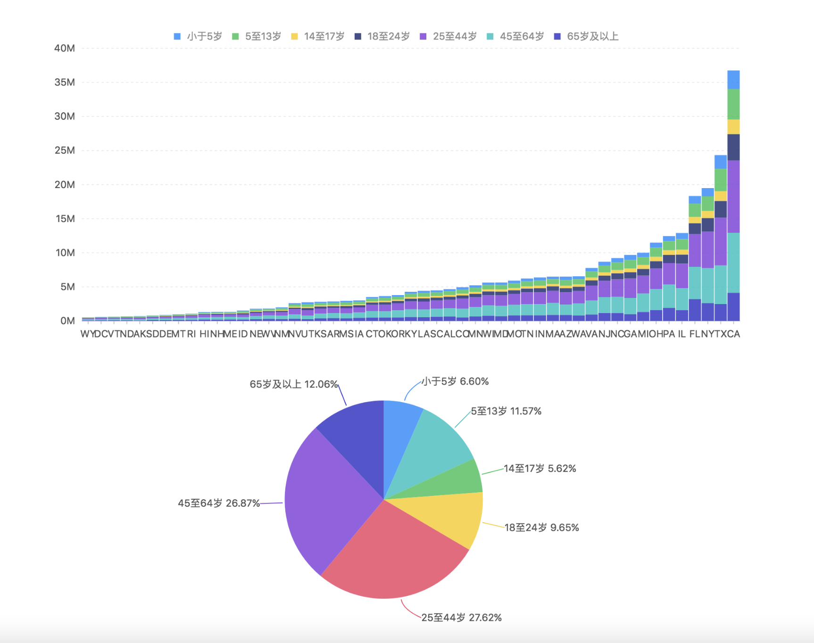
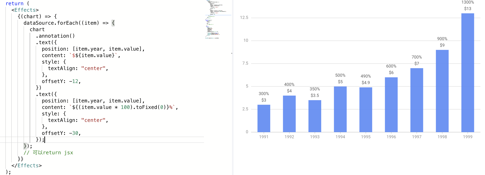

- ## slider 滑块
  collapsed:: true
	- 需要单独引入
	  collapsed:: true
		- ```jsx
		  import { Chart Slider Line } from 'bizcharts';
		  
		  <Chart padding="auto" autoFit height={500} data={data} >
		      <Line shape="hv" position="month*value" />
		      <Slider end={0.8} />
		    </Chart>
		  ```
	- 
- ## interaction  交互
  collapsed:: true
	- active-region  鼠标在画布上移动时对应位置的分类出现背景框
	- view-zoom  鼠标==滚动==时，图表内部缩放
	- element-highlight 高亮
	- brush  框选过滤图形
		- brush-x
		- brush-y  把上面 brush Action 换成 brush-y 即成为新的交互，仅框选 y 轴相关的数据
	- ```jsx
	  <Interaction
	      type="tooltip"
	      config={{ // 修改了原有的tooltip交互，改为点击时展示。
	        start: [{ trigger: 'plot:click', action: 'tooltip:show' }],
	      }}
	    />
	  ```
- ## Annotation - 图形标注
  collapsed:: true
	- 支持html、文本、图片、数据点标注(marker，支持'min', 'median', 'max' 关键字)、
	- 
	- 
- ## Facet 分面
  collapsed:: true
	- 
- ## DataSet
  collapsed:: true
	- dataset 数据集
	- transform  数据转换
		- filter、sort、rename(字段重命名)、partition(数据分组：grouoBy、orderBy)、
		- aggregate 聚合统计
		  collapsed:: true
			- 
	- connector
	  collapsed:: true
		- CSV 文件 ->  图表
			- ```jsx
			  ds.source(data, {
			        type: 'csv', // 使用 CSV 类型的 Connector 装载 data
			      });
			  ```
			- 
			- 
			-
	- antV 数据集功能
		- 源数据的解析，将 `CSV` ,  `DSV` ,  `GeoJSON` 转成标准的 `JSON`
		- 加工数据，包括 `filter` ,  `map` ,  `fold` (补数据) 等操作
		- 统计函数，汇总统计、百分比、封箱 等统计函数
		- 特殊数据处理，包括 地理数据、矩形树图、桑基图、文字云 的数据处理
- ## Hooks
  collapsed:: true
	- Effects
		- 
	- 可以直接使用[G2的语法](https://g2.antv.vision/zh/docs/manual/about-g2)对chart对象进行配置
	- useView  获取view对象
	- useChartInstance 用于获得G2的chart实例的hooks
- watchingStates
	- 创建数据视图实例时，传入的 watchingStates 是用于指定该数据视图监听的 states 状态量的。默认监听所有状态量（也就是任何状态量变更都会导致数据视图重新计算），如果指定为空数组 []，则不监听任何状态量，如果指定为非空数组，则只监听数组元素对应的状态量变更。
- 动态更新数据
	- chart.changeData(data)
	-