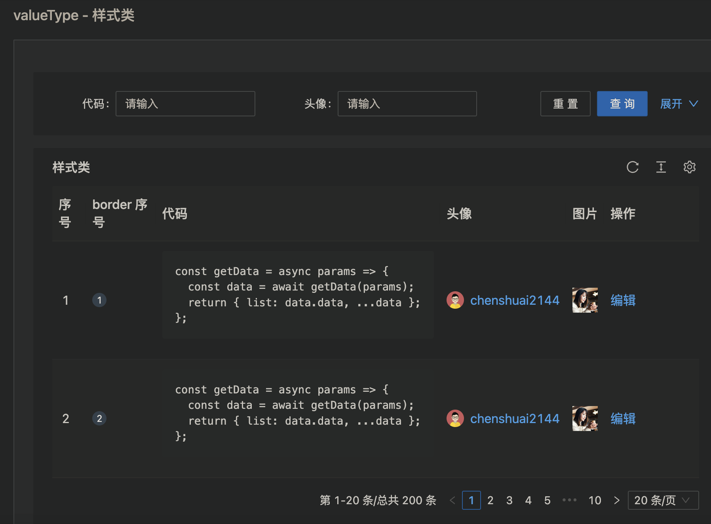
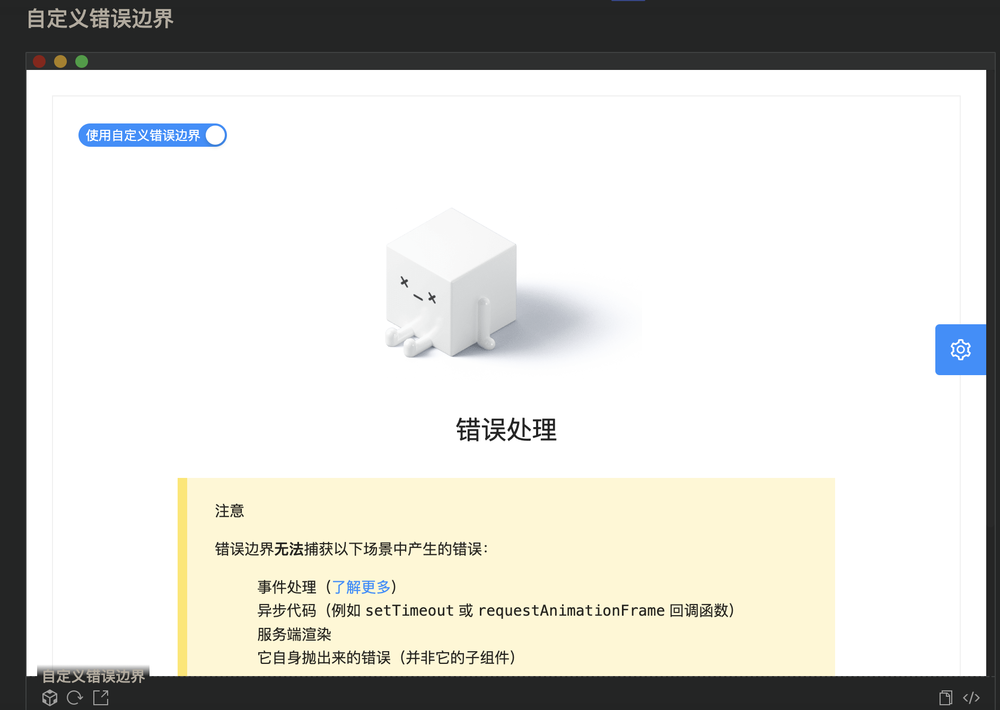

- ## 查询表格
  collapsed:: true
	- 
	- code
		- ```js
		  import { EllipsisOutlined, PlusOutlined } from '@ant-design/icons';
		  import type { ActionType, ProColumns } from '@ant-design/pro-components';
		  import { ProTable, TableDropdown } from '@ant-design/pro-components';
		  import { Button, Dropdown, Menu, Space, Tag } from 'antd';
		  import { useRef } from 'react';
		  import request from 'umi-request';
		  
		  type GithubIssueItem = {
		    url: string;
		    id: number;
		    number: number;
		    title: string;
		    labels: {
		      name: string;
		      color: string;
		    }[];
		    state: string;
		    comments: number;
		    created_at: string;
		    updated_at: string;
		    closed_at?: string;
		  };
		  
		  const columns: ProColumns<GithubIssueItem>[] = [
		    {
		      dataIndex: 'index',
		      valueType: 'indexBorder',
		      width: 48,
		    },
		    {
		      title: '标题',
		      dataIndex: 'title',
		      copyable: true,
		      ellipsis: true,
		      tip: '标题过长会自动收缩',
		      formItemProps: {
		        rules: [
		          {
		            required: true,
		            message: '此项为必填项',
		          },
		        ],
		      },
		    },
		    {
		      disable: true,
		      title: '状态',
		      dataIndex: 'state',
		      filters: true,
		      onFilter: true,
		      ellipsis: true,
		      valueType: 'select',
		      valueEnum: {
		        all: { text: '超长'.repeat(50) },
		        open: {
		          text: '未解决',
		          status: 'Error',
		        },
		        closed: {
		          text: '已解决',
		          status: 'Success',
		          disabled: true,
		        },
		        processing: {
		          text: '解决中',
		          status: 'Processing',
		        },
		      },
		    },
		    {
		      disable: true,
		      title: '标签',
		      dataIndex: 'labels',
		      search: false,
		      renderFormItem: (_, { defaultRender }) => {
		        return defaultRender(_);
		      },
		      render: (_, record) => (
		        <Space>
		          {record.labels.map(({ name, color }) => (
		            <Tag color={color} key={name}>
		              {name}
		            </Tag>
		          ))}
		        </Space>
		      ),
		    },
		    {
		      title: '创建时间',
		      key: 'showTime',
		      dataIndex: 'created_at',
		      valueType: 'dateTime',
		      sorter: true,
		      hideInSearch: true,
		    },
		    {
		      title: '创建时间',
		      dataIndex: 'created_at',
		      valueType: 'dateRange',
		      hideInTable: true,
		      search: {
		        transform: (value) => {
		          return {
		            startTime: value[0],
		            endTime: value[1],
		          };
		        },
		      },
		    },
		    {
		      title: '操作',
		      valueType: 'option',
		      key: 'option',
		      render: (text, record, _, action) => [
		        <a
		          key="editable"
		          onClick={() => {
		            action?.startEditable?.(record.id);
		          }}
		        >
		          编辑
		        </a>,
		        <a href={record.url} target="_blank" rel="noopener noreferrer" key="view">
		          查看
		        </a>,
		        <TableDropdown
		          key="actionGroup"
		          onSelect={() => action?.reload()}
		          menus={[
		            { key: 'copy', name: '复制' },
		            { key: 'delete', name: '删除' },
		          ]}
		        />,
		      ],
		    },
		  ];
		  
		  const menu = (
		    <Menu
		      items={[
		        {
		          label: '1st item',
		          key: '1',
		        },
		        {
		          label: '2nd item',
		          key: '1',
		        },
		        {
		          label: '3rd item',
		          key: '1',
		        },
		      ]}
		    />
		  );
		  
		  export default () => {
		    const actionRef = useRef<ActionType>();
		    return (
		      <ProTable<GithubIssueItem>
		        columns={columns}
		        actionRef={actionRef}
		        cardBordered
		        request={async (params = {}, sort, filter) => {
		          console.log(sort, filter);
		          return request<{
		            data: GithubIssueItem[];
		          }>('[Error](https://proapi.azurewebsites.net/github/issues',) {
		            params,
		          });
		        }}
		        editable={{
		          type: 'multiple',
		        }}
		        columnsState={{
		          persistenceKey: 'pro-table-singe-demos',
		          persistenceType: 'localStorage',
		          onChange(value) {
		            console.log('value: ', value);
		          },
		        }}
		        rowKey="id"
		        search={{
		          labelWidth: 'auto',
		        }}
		        options={{
		          setting: {
		            listsHeight: 400,
		          },
		        }}
		        form={{
		          // 由于配置了 transform，提交的参与与定义的不同这里需要转化一下
		          syncToUrl: (values, type) => {
		            if (type === 'get') {
		              return {
		                ...values,
		                created_at: [values.startTime, values.endTime],
		              };
		            }
		            return values;
		          },
		        }}
		        pagination={{
		          pageSize: 5,
		          onChange: (page) => console.log(page),
		        }}
		        dateFormatter="string"
		        headerTitle="高级表格"
		        toolBarRender={() => [
		          <Button key="button" icon={<PlusOutlined />} type="primary">
		            新建
		          </Button>,
		          <Dropdown key="menu" overlay={menu}>
		            <Button>
		              <EllipsisOutlined />
		            </Button>
		          </Dropdown>,
		        ]}
		      />
		    );
		  };
		  ```
- ## 查询无按钮表格
  collapsed:: true
	- 
	- code
		- ```js
		  import { DownOutlined, QuestionCircleOutlined } from '@ant-design/icons';
		  import type { ProColumns } from '@ant-design/pro-components';
		  import { ProTable, TableDropdown } from '@ant-design/pro-components';
		  import { Button, Tooltip } from 'antd';
		  
		  const valueEnum = {
		    0: 'close',
		    1: 'running',
		    2: 'online',
		    3: 'error',
		  };
		  
		  export type TableListItem = {
		    key: number;
		    name: string;
		    containers: number;
		    creator: string;
		    status: string;
		    createdAt: number;
		    memo: string;
		  };
		  const tableListDataSource: TableListItem[] = [];
		  
		  const creators = ['付小小', '曲丽丽', '林东东', '陈帅帅', '兼某某'];
		  
		  for (let i = 0; i < 5; i += 1) {
		    tableListDataSource.push({
		      key: i,
		      name: 'AppName',
		      containers: Math.floor(Math.random() * 20),
		      creator: creators[Math.floor(Math.random() * creators.length)],
		      status: valueEnum[Math.floor(Math.random() * 10) % 4],
		      createdAt: Date.now() - Math.floor(Math.random() * 100000),
		      memo: i % 2 === 1 ? '很长很长很长很长很长很长很长的文字要展示但是要留下尾巴' : '简短备注文案',
		    });
		  }
		  
		  const columns: ProColumns<TableListItem>[] = [
		    {
		      title: '应用名称',
		      width: 80,
		      dataIndex: 'name',
		      render: (_) => <a>{_}</a>,
		    },
		    {
		      title: '容器数量',
		      dataIndex: 'containers',
		      align: 'right',
		      sorter: (a, b) => a.containers - b.containers,
		    },
		    {
		      title: '状态',
		      width: 80,
		      dataIndex: 'status',
		      initialValue: 'all',
		      valueEnum: {
		        all: { text: '全部', status: 'Default' },
		        close: { text: '关闭', status: 'Default' },
		        running: { text: '运行中', status: 'Processing' },
		        online: { text: '已上线', status: 'Success' },
		        error: { text: '异常', status: 'Error' },
		      },
		    },
		    {
		      title: '创建者',
		      width: 80,
		      dataIndex: 'creator',
		      valueEnum: {
		        all: { text: '全部' },
		        付小小: { text: '付小小' },
		        曲丽丽: { text: '曲丽丽' },
		        林东东: { text: '林东东' },
		        陈帅帅: { text: '陈帅帅' },
		        兼某某: { text: '兼某某' },
		      },
		    },
		    {
		      title: (
		        <>
		          创建时间
		          <Tooltip placement="top" title="这是一段描述">
		            <QuestionCircleOutlined style={{ marginLeft: 4 }} />
		          </Tooltip>
		        </>
		      ),
		      width: 140,
		      key: 'since',
		      dataIndex: 'createdAt',
		      valueType: 'date',
		      sorter: (a, b) => a.createdAt - b.createdAt,
		    },
		    {
		      title: '备注',
		      dataIndex: 'memo',
		      ellipsis: true,
		      copyable: true,
		    },
		    {
		      title: '操作',
		      width: 180,
		      key: 'option',
		      valueType: 'option',
		      render: () => [
		        <a key="link">链路</a>,
		        <a key="link2">报警</a>,
		        <a key="link3">监控</a>,
		        <TableDropdown
		          key="actionGroup"
		          menus={[
		            { key: 'copy', name: '复制' },
		            { key: 'delete', name: '删除' },
		          ]}
		        />,
		      ],
		    },
		  ];
		  
		  export default () => {
		    return (
		      <ProTable<TableListItem>
		        columns={columns}
		        request={(params, sorter, filter) => {
		          // 表单搜索项会从 params 传入，传递给后端接口。
		          console.log(params, sorter, filter);
		          return Promise.resolve({
		            data: tableListDataSource,
		            success: true,
		          });
		        }}
		        rowKey="key"
		        pagination={{
		          showQuickJumper: true,
		        }}
		        search={{
		          optionRender: false,
		          collapsed: false,
		        }}
		        dateFormatter="string"
		        headerTitle="表格标题"
		        toolBarRender={() => [
		          <Button key="show">查看日志</Button>,
		          <Button key="out">
		            导出数据
		            <DownOutlined />
		          </Button>,
		          <Button type="primary" key="primary">
		            创建应用
		          </Button>,
		        ]}
		      />
		    );
		  };
		  ```
- ## 无查询表格
  collapsed:: true
	- 
	- code
		- ```js
		  import { DownOutlined, QuestionCircleOutlined } from '@ant-design/icons';
		  import type { ProColumns } from '@ant-design/pro-components';
		  import { ProTable, TableDropdown } from '@ant-design/pro-components';
		  import { Button, Tooltip } from 'antd';
		  
		  const valueEnum = {
		    0: 'close',
		    1: 'running',
		    2: 'online',
		    3: 'error',
		  };
		  
		  export type TableListItem = {
		    key: number;
		    name: string;
		    containers: number;
		    creator: string;
		    status: string;
		    createdAt: number;
		    memo: string;
		  };
		  const tableListDataSource: TableListItem[] = [];
		  
		  const creators = ['付小小', '曲丽丽', '林东东', '陈帅帅', '兼某某'];
		  
		  for (let i = 0; i < 5; i += 1) {
		    tableListDataSource.push({
		      key: i,
		      name: 'AppName',
		      containers: Math.floor(Math.random() * 20),
		      creator: creators[Math.floor(Math.random() * creators.length)],
		      status: valueEnum[Math.floor(Math.random() * 10) % 4],
		      createdAt: Date.now() - Math.floor(Math.random() * 100000),
		      memo: i % 2 === 1 ? '很长很长很长很长很长很长很长的文字要展示但是要留下尾巴' : '简短备注文案',
		    });
		  }
		  
		  const columns: ProColumns<TableListItem>[] = [
		    {
		      title: '应用名称',
		      width: 80,
		      dataIndex: 'name',
		      render: (_) => <a>{_}</a>,
		    },
		    {
		      title: '容器数量',
		      dataIndex: 'containers',
		      align: 'right',
		      sorter: (a, b) => a.containers - b.containers,
		    },
		    {
		      title: '状态',
		      width: 80,
		      dataIndex: 'status',
		      initialValue: 'all',
		      valueEnum: {
		        all: { text: '全部', status: 'Default' },
		        close: { text: '关闭', status: 'Default' },
		        running: { text: '运行中', status: 'Processing' },
		        online: { text: '已上线', status: 'Success' },
		        error: { text: '异常', status: 'Error' },
		      },
		    },
		    {
		      title: '创建者',
		      width: 80,
		      dataIndex: 'creator',
		      valueEnum: {
		        all: { text: '全部' },
		        付小小: { text: '付小小' },
		        曲丽丽: { text: '曲丽丽' },
		        林东东: { text: '林东东' },
		        陈帅帅: { text: '陈帅帅' },
		        兼某某: { text: '兼某某' },
		      },
		    },
		    {
		      title: (
		        <>
		          创建时间
		          <Tooltip placement="top" title="这是一段描述">
		            <QuestionCircleOutlined style={{ marginLeft: 4 }} />
		          </Tooltip>
		        </>
		      ),
		      width: 140,
		      key: 'since',
		      dataIndex: 'createdAt',
		      valueType: 'date',
		      sorter: (a, b) => a.createdAt - b.createdAt,
		    },
		    {
		      title: '备注',
		      dataIndex: 'memo',
		      ellipsis: true,
		      copyable: true,
		    },
		    {
		      title: '操作',
		      width: 180,
		      key: 'option',
		      valueType: 'option',
		      render: () => [
		        <a key="link">链路</a>,
		        <a key="link2">报警</a>,
		        <a key="link3">监控</a>,
		        <TableDropdown
		          key="actionGroup"
		          menus={[
		            { key: 'copy', name: '复制' },
		            { key: 'delete', name: '删除' },
		          ]}
		        />,
		      ],
		    },
		  ];
		  
		  export default () => {
		    return (
		      <ProTable<TableListItem>
		        dataSource={tableListDataSource}
		        rowKey="key"
		        pagination={{
		          showQuickJumper: true,
		        }}
		        columns={columns}
		        search={false}
		        dateFormatter="string"
		        headerTitle="表格标题"
		        toolBarRender={() => [
		          <Button key="show">查看日志</Button>,
		          <Button key="out">
		            导出数据
		            <DownOutlined />
		          </Button>,
		          <Button type="primary" key="primary">
		            创建应用
		          </Button>,
		        ]}
		      />
		    );
		  };
		  ```
- ## 轻量筛选替换查询表格
  collapsed:: true
	- 
	- code
		- ```js
		  import { QuestionCircleOutlined } from '@ant-design/icons';
		  import type { ProColumns } from '@ant-design/pro-components';
		  import { ProTable, TableDropdown } from '@ant-design/pro-components';
		  import { Tooltip } from 'antd';
		  import moment from 'moment';
		  
		  export type TableListItem = {
		    key: number;
		    name: string;
		    creator: string;
		    createdAt: number;
		  };
		  const tableListDataSource: TableListItem[] = [];
		  
		  const creators = ['付小小', '曲丽丽', '林东东', '陈帅帅', '兼某某'];
		  
		  for (let i = 0; i < 5; i += 1) {
		    tableListDataSource.push({
		      key: i,
		      name: 'AppName',
		      creator: creators[Math.floor(Math.random() * creators.length)],
		      createdAt: Date.now() - Math.floor(Math.random() * 100000),
		    });
		  }
		  
		  const columns: ProColumns<TableListItem>[] = [
		    {
		      title: '应用名称',
		      dataIndex: 'name',
		      render: (_) => <a>{_}</a>,
		      formItemProps: {
		        lightProps: {
		          labelFormatter: (value) => `app-${value}`,
		        },
		      },
		    },
		    {
		      title: '日期范围',
		      dataIndex: 'startTime',
		      valueType: 'dateRange',
		      hideInTable: true,
		      initialValue: [moment(), moment().add(1, 'day')],
		    },
		    {
		      title: '创建者',
		      dataIndex: 'creator',
		      valueType: 'select',
		      valueEnum: {
		        all: { text: '全部' },
		        付小小: { text: '付小小' },
		        曲丽丽: { text: '曲丽丽' },
		        林东东: { text: '林东东' },
		        陈帅帅: { text: '陈帅帅' },
		        兼某某: { text: '兼某某' },
		      },
		    },
		    {
		      title: (
		        <>
		          创建时间
		          <Tooltip placement="top" title="这是一段描述">
		            <QuestionCircleOutlined style={{ marginLeft: 4 }} />
		          </Tooltip>
		        </>
		      ),
		      key: 'since',
		      dataIndex: 'createdAt',
		      valueType: 'date',
		      sorter: (a, b) => a.createdAt - b.createdAt,
		    },
		    {
		      title: '操作',
		      width: '164px',
		      key: 'option',
		      valueType: 'option',
		      render: () => [
		        <a key="link">链路</a>,
		        <a key="link2">报警</a>,
		        <a key="link3">监控</a>,
		        <TableDropdown
		          key="actionGroup"
		          menus={[
		            { key: 'copy', name: '复制' },
		            { key: 'delete', name: '删除' },
		          ]}
		        />,
		      ],
		    },
		  ];
		  
		  export default () => {
		    return (
		      <ProTable<TableListItem>
		        columns={columns}
		        request={(params, sorter, filter) => {
		          // 表单搜索项会从 params 传入，传递给后端接口。
		          console.log(params, sorter, filter);
		          return Promise.resolve({
		            data: tableListDataSource,
		            success: true,
		          });
		        }}
		        rowKey="key"
		        pagination={{
		          showQuickJumper: true,
		        }}
		        search={{
		          filterType: 'light',
		        }}
		        dateFormatter="string"
		      />
		    );
		  };
		  ```
- ## 无ToolBar表格
  collapsed:: true
	- 
	- code
		- ```js
		  import { DownOutlined } from '@ant-design/icons';
		  import type { ProColumns } from '@ant-design/pro-components';
		  import { ProTable } from '@ant-design/pro-components';
		  import { Dropdown, Menu, Popconfirm, Space } from 'antd';
		  import React from 'react';
		  
		  export type Member = {
		    avatar: string;
		    realName: string;
		    nickName: string;
		    email: string;
		    outUserNo: string;
		    phone: string;
		    role: RoleType;
		    permission?: string[];
		  };
		  
		  export type RoleMapType = Record<
		    string,
		    {
		      name: string;
		      desc: string;
		    }
		  >;
		  
		  export type RoleType = 'admin' | 'operator';
		  
		  const RoleMap: RoleMapType = {
		    admin: {
		      name: '管理员',
		      desc: '仅拥有指定项目的权限',
		    },
		    operator: {
		      name: '操作员',
		      desc: '拥有所有权限',
		    },
		  };
		  
		  const tableListDataSource: Member[] = [];
		  
		  const realNames = ['马巴巴', '测试', '测试2', '测试3'];
		  const nickNames = ['巴巴', '测试', '测试2', '测试3'];
		  const emails = ['baba@antfin.com', 'test@antfin.com', 'test2@antfin.com', 'test3@antfin.com'];
		  const phones = ['12345678910', '10923456789', '109654446789', '109223346789'];
		  const permissions = [[], ['权限点名称1', '权限点名称4'], ['权限点名称1'], []];
		  
		  for (let i = 0; i < 5; i += 1) {
		    tableListDataSource.push({
		      outUserNo: `${102047 + i}`,
		      avatar: '[Error 404 Not Found](https://gw.alipayobjects.com/zos/antfincdn/upvrAjAPQX/Logo_Tech%252520UI.svg',)
		      role: i === 0 ? 'admin' : 'operator',
		      realName: realNames[i % 4],
		      nickName: nickNames[i % 4],
		      email: emails[i % 4],
		      phone: phones[i % 4],
		      permission: permissions[i % 4],
		    });
		  }
		  
		  const roleMenu = (
		    <Menu
		      items={[
		        {
		          label: '管理员',
		          key: 'admin',
		        },
		        {
		          label: '操作员',
		          key: 'operator',
		        },
		      ]}
		    />
		  );
		  
		  const MemberList: React.FC = () => {
		    const renderRemoveUser = (text: string) => (
		      <Popconfirm key="popconfirm" title={`确认${text}吗?`} okText="是" cancelText="否">
		        <a>{text}</a>
		      </Popconfirm>
		    );
		  
		    const columns: ProColumns<Member>[] = [
		      {
		        dataIndex: 'avatar',
		        title: '成员名称',
		        valueType: 'avatar',
		        width: 150,
		        render: (dom, record) => (
		          <Space>
		            <span>{dom}</span>
		            {record.nickName}
		          </Space>
		        ),
		      },
		      {
		        dataIndex: 'email',
		        title: '账号',
		      },
		      {
		        dataIndex: 'phone',
		        title: '手机号',
		      },
		      {
		        dataIndex: 'role',
		        title: '角色',
		        render: (_, record) => (
		          <Dropdown overlay={roleMenu}>
		            <span>
		              {RoleMap[record.role || 'admin'].name} <DownOutlined />
		            </span>
		          </Dropdown>
		        ),
		      },
		      {
		        dataIndex: 'permission',
		        title: '权限范围',
		        render: (_, record) => {
		          const { role, permission = [] } = record;
		          if (role === 'admin') {
		            return '所有权限';
		          }
		          return permission && permission.length > 0 ? permission.join('、') : '无';
		        },
		      },
		      {
		        title: '操作',
		        dataIndex: 'x',
		        valueType: 'option',
		        render: (_, record) => {
		          let node = renderRemoveUser('退出');
		          if (record.role === 'admin') {
		            node = renderRemoveUser('移除');
		          }
		          return [<a key="edit">编辑</a>, node];
		        },
		      },
		    ];
		  
		    return (
		      <ProTable<Member>
		        columns={columns}
		        request={(params, sorter, filter) => {
		          // 表单搜索项会从 params 传入，传递给后端接口。
		          console.log(params, sorter, filter);
		          return Promise.resolve({
		            data: tableListDataSource,
		            success: true,
		          });
		        }}
		        rowKey="outUserNo"
		        pagination={{
		          showQuickJumper: true,
		        }}
		        toolBarRender={false}
		        search={false}
		      />
		    );
		  };
		  
		  export default MemberList;
		  ```
- ## 必填的查询表单
  collapsed:: true
	- 
	- 
	- code
		- ```js
		  import type { ProColumns } from '@ant-design/pro-components';
		  import { ProTable } from '@ant-design/pro-components';
		  import { Space, Tag } from 'antd';
		  
		  type GithubIssueItem = {
		    id: number;
		    number: number;
		    title: string;
		    labels: {
		      name: string;
		      color: string;
		    }[];
		    state: string;
		    comments: number;
		    created_at: string;
		    updated_at: string;
		  };
		  
		  const columns: ProColumns<GithubIssueItem>[] = [
		    {
		      title: '标题',
		      dataIndex: 'title',
		      copyable: true,
		      ellipsis: true,
		      tip: '标题过长会自动收缩',
		      formItemProps: {
		        rules: [
		          {
		            required: true,
		            message: '此项为必填项',
		          },
		        ],
		      },
		      width: '30%',
		    },
		    {
		      title: '状态',
		      dataIndex: 'state',
		      filters: true,
		      onFilter: true,
		      valueType: 'select',
		      formItemProps: {
		        rules: [
		          {
		            required: true,
		            message: '此项为必填项',
		          },
		        ],
		      },
		      valueEnum: {
		        all: { text: '全部', status: 'Default' },
		        open: {
		          text: '未解决',
		          status: 'Error',
		        },
		        closed: {
		          text: '已解决',
		          status: 'Success',
		          disabled: true,
		        },
		        processing: {
		          text: '解决中',
		          status: 'Processing',
		        },
		      },
		    },
		    {
		      title: '标签',
		      dataIndex: 'labels',
		      search: false,
		      formItemProps: {
		        rules: [
		          {
		            required: true,
		            message: '此项为必填项',
		          },
		        ],
		      },
		      renderFormItem: (_, { defaultRender }) => {
		        return defaultRender(_);
		      },
		      render: (_, record) => (
		        <Space>
		          {record.labels.map(({ name, color }) => (
		            <Tag color={color} key={name}>
		              {name}
		            </Tag>
		          ))}
		        </Space>
		      ),
		    },
		    {
		      title: '创建时间',
		      key: 'showTime',
		      dataIndex: 'created_at',
		      valueType: 'date',
		      hideInSearch: true,
		      formItemProps: {
		        rules: [
		          {
		            required: true,
		            message: '此项为必填项',
		          },
		        ],
		      },
		    },
		  ];
		  
		  export default () => {
		    return (
		      <>
		        <ProTable<GithubIssueItem>
		          columns={columns}
		          request={async () => ({
		            success: true,
		            data: [
		              {
		                id: 624748504,
		                number: 6689,
		                title: '🐛 [BUG]yarn install命令 antd2.4.5会报错',
		                labels: [
		                  {
		                    name: 'bug',
		                    color: 'error',
		                  },
		                ],
		                state: 'open',
		                locked: false,
		                comments: 1,
		                created_at: '2020-05-26T09:42:56Z',
		                updated_at: '2020-05-26T10:03:02Z',
		                closed_at: null,
		                author_association: 'NONE',
		                user: 'chenshuai2144',
		                avatar:
		                  '[Error 404 Not Found](https://gw.alipayobjects.com/zos/antfincdn/XAosXuNZyF/BiazfanxmamNRoxxVxka.png',)
		              },
		            ],
		          })}
		          rowKey="id"
		          search={{
		            labelWidth: 'auto',
		          }}
		          form={{
		            ignoreRules: false,
		          }}
		          dateFormatter="string"
		          headerTitle="高级表格"
		        />
		        <ProTable<GithubIssueItem>
		          columns={columns}
		          request={async () => ({
		            success: true,
		            data: [
		              {
		                id: 624748504,
		                number: 6689,
		                title: '🐛 [BUG]yarn install命令 antd2.4.5会报错',
		                labels: [
		                  {
		                    name: 'bug',
		                    color: 'error',
		                  },
		                ],
		                state: 'open',
		                locked: false,
		                comments: 1,
		                created_at: '2020-05-26T09:42:56Z',
		                updated_at: '2020-05-26T10:03:02Z',
		                closed_at: null,
		                author_association: 'NONE',
		                user: 'chenshuai2144',
		                avatar:
		                  '[Error 404 Not Found](https://gw.alipayobjects.com/zos/antfincdn/XAosXuNZyF/BiazfanxmamNRoxxVxka.png',)
		              },
		            ],
		          })}
		          rowKey="id"
		          search={{
		            labelWidth: 'auto',
		          }}
		          dateFormatter="string"
		          headerTitle="高级表格"
		        />
		      </>
		    );
		  };
		  ```
- ## 嵌套表格
  collapsed:: true
	- 
	- code
		- ```js
		  import { DownOutlined, EllipsisOutlined, QuestionCircleOutlined } from '@ant-design/icons';
		  import type { ProColumns } from '@ant-design/pro-components';
		  import { ProTable } from '@ant-design/pro-components';
		  import { Button, Tag, Tooltip } from 'antd';
		  
		  export type Status = {
		    color: string;
		    text: string;
		  };
		  
		  const statusMap = {
		    0: {
		      color: 'blue',
		      text: '进行中',
		    },
		    1: {
		      color: 'green',
		      text: '已完成',
		    },
		    2: {
		      color: 'volcano',
		      text: '警告',
		    },
		    3: {
		      color: 'red',
		      text: '失败',
		    },
		    4: {
		      color: '',
		      text: '未完成',
		    },
		  };
		  
		  export type TableListItem = {
		    key: number;
		    name: string;
		    containers: number;
		    creator: string;
		    status: Status;
		    createdAt: number;
		  };
		  const tableListDataSource: TableListItem[] = [];
		  
		  const creators = ['付小小', '曲丽丽', '林东东', '陈帅帅', '兼某某'];
		  
		  for (let i = 0; i < 5; i += 1) {
		    tableListDataSource.push({
		      key: i,
		      name: 'AppName',
		      containers: Math.floor(Math.random() * 20),
		      creator: creators[Math.floor(Math.random() * creators.length)],
		      status: statusMap[Math.floor(Math.random() * 10) % 5],
		      createdAt: Date.now() - Math.floor(Math.random() * 100000),
		    });
		  }
		  
		  const columns: ProColumns<TableListItem>[] = [
		    {
		      title: '应用名称',
		      width: 120,
		      dataIndex: 'name',
		      render: (_) => <a>{_}</a>,
		    },
		    {
		      title: '状态',
		      width: 120,
		      dataIndex: 'status',
		      render: (_, record) => <Tag color={record.status.color}>{record.status.text}</Tag>,
		    },
		    {
		      title: '容器数量',
		      width: 120,
		      dataIndex: 'containers',
		      align: 'right',
		      sorter: (a, b) => a.containers - b.containers,
		    },
		  
		    {
		      title: '创建者',
		      width: 120,
		      dataIndex: 'creator',
		      valueEnum: {
		        all: { text: '全部' },
		        付小小: { text: '付小小' },
		        曲丽丽: { text: '曲丽丽' },
		        林东东: { text: '林东东' },
		        陈帅帅: { text: '陈帅帅' },
		        兼某某: { text: '兼某某' },
		      },
		    },
		    {
		      title: (
		        <>
		          创建时间
		          <Tooltip placement="top" title="这是一段描述">
		            <QuestionCircleOutlined style={{ marginLeft: 4 }} />
		          </Tooltip>
		        </>
		      ),
		      width: 140,
		      key: 'since',
		      dataIndex: 'createdAt',
		      valueType: 'date',
		      sorter: (a, b) => a.createdAt - b.createdAt,
		    },
		    {
		      title: '操作',
		      width: 164,
		      key: 'option',
		      valueType: 'option',
		      render: () => [
		        <a key="1">链路</a>,
		        <a key="2">报警</a>,
		        <a key="3">监控</a>,
		        <a key="4">
		          <EllipsisOutlined />
		        </a>,
		      ],
		    },
		  ];
		  
		  const expandedRowRender = () => {
		    const data = [];
		    for (let i = 0; i < 3; i += 1) {
		      data.push({
		        key: i,
		        date: '2014-12-24 23:12:00',
		        name: 'This is production name',
		        upgradeNum: 'Upgraded: 56',
		      });
		    }
		    return (
		      <ProTable
		        columns={[
		          { title: 'Date', dataIndex: 'date', key: 'date' },
		          { title: 'Name', dataIndex: 'name', key: 'name' },
		  
		          { title: 'Upgrade Status', dataIndex: 'upgradeNum', key: 'upgradeNum' },
		          {
		            title: 'Action',
		            dataIndex: 'operation',
		            key: 'operation',
		            valueType: 'option',
		            render: () => [<a key="Pause">Pause</a>, <a key="Stop">Stop</a>],
		          },
		        ]}
		        headerTitle={false}
		        search={false}
		        options={false}
		        dataSource={data}
		        pagination={false}
		      />
		    );
		  };
		  
		  export default () => {
		    return (
		      <ProTable<TableListItem>
		        columns={columns}
		        request={(params, sorter, filter) => {
		          // 表单搜索项会从 params 传入，传递给后端接口。
		          console.log(params, sorter, filter);
		          return Promise.resolve({
		            data: tableListDataSource,
		            success: true,
		          });
		        }}
		        rowKey="key"
		        pagination={{
		          showQuickJumper: true,
		        }}
		        expandable={{ expandedRowRender }}
		        search={false}
		        dateFormatter="string"
		        headerTitle="嵌套表格"
		        options={false}
		        toolBarRender={() => [
		          <Button key="show">查看日志</Button>,
		          <Button key="out">
		            导出数据
		            <DownOutlined />
		          </Button>,
		          <Button key="primary" type="primary">
		            创建应用
		          </Button>,
		        ]}
		      />
		    );
		  };
		  ```
- ## 左右结构
  collapsed:: true
	- 
	- code
		- ```js
		  import type { ProColumns } from '@ant-design/pro-components';
		  import { ProCard, ProTable } from '@ant-design/pro-components';
		  import type { BadgeProps } from 'antd';
		  import { Badge, Button } from 'antd';
		  import React, { useEffect, useState } from 'react';
		  // @ts-ignore
		  import styles from './split.less';
		  
		  type TableListItem = {
		    createdAtRange?: number[];
		    createdAt: number;
		    code: string;
		  };
		  
		  type DetailListProps = {
		    ip: string;
		  };
		  
		  const DetailList: React.FC<DetailListProps> = (props) => {
		    const { ip } = props;
		    const [tableListDataSource, setTableListDataSource] = useState<TableListItem[]>([]);
		  
		    const columns: ProColumns<TableListItem>[] = [
		      {
		        title: '时间点',
		        key: 'createdAt',
		        dataIndex: 'createdAt',
		        valueType: 'dateTime',
		      },
		      {
		        title: '代码',
		        key: 'code',
		        width: 80,
		        dataIndex: 'code',
		        valueType: 'code',
		      },
		      {
		        title: '操作',
		        key: 'option',
		        width: 80,
		        valueType: 'option',
		        render: () => [<a key="a">预警</a>],
		      },
		    ];
		  
		    useEffect(() => {
		      const source = [];
		      for (let i = 0; i < 15; i += 1) {
		        source.push({
		          createdAt: Date.now() - Math.floor(Math.random() * 10000),
		          code: `const getData = async params => {
		            const data = await getData(params);
		            return { list: data.data, ...data };
		          };`,
		          key: i,
		        });
		      }
		  
		      setTableListDataSource(source);
		    }, [ip]);
		  
		    return (
		      <ProTable<TableListItem>
		        columns={columns}
		        dataSource={tableListDataSource}
		        pagination={{
		          pageSize: 3,
		          showSizeChanger: false,
		        }}
		        rowKey="key"
		        toolBarRender={false}
		        search={false}
		      />
		    );
		  };
		  
		  type statusType = BadgeProps['status'];
		  
		  const valueEnum: statusType[] = ['success', 'error', 'processing', 'default'];
		  
		  export type IpListItem = {
		    ip?: string;
		    cpu?: number | string;
		    mem?: number | string;
		    disk?: number | string;
		    status: statusType;
		  };
		  
		  const ipListDataSource: IpListItem[] = [];
		  
		  for (let i = 0; i < 10; i += 1) {
		    ipListDataSource.push({
		      ip: `106.14.98.1${i}4`,
		      cpu: 10,
		      mem: 20,
		      status: valueEnum[Math.floor(Math.random() * 10) % 4],
		      disk: 30,
		    });
		  }
		  
		  type IPListProps = {
		    ip: string;
		    onChange: (id: string) => void;
		  };
		  
		  const IPList: React.FC<IPListProps> = (props) => {
		    const { onChange, ip } = props;
		  
		    const columns: ProColumns<IpListItem>[] = [
		      {
		        title: 'IP',
		        key: 'ip',
		        dataIndex: 'ip',
		        render: (_, item) => {
		          return <Badge status={item.status} text={item.ip} />;
		        },
		      },
		      {
		        title: 'CPU',
		        key: 'cpu',
		        dataIndex: 'cpu',
		        valueType: {
		          type: 'percent',
		          precision: 0,
		        },
		      },
		      {
		        title: 'Mem',
		        key: 'mem',
		        dataIndex: 'mem',
		        valueType: {
		          type: 'percent',
		          precision: 0,
		        },
		      },
		      {
		        title: 'Disk',
		        key: 'disk',
		        dataIndex: 'disk',
		        valueType: {
		          type: 'percent',
		          precision: 0,
		        },
		      },
		    ];
		    return (
		      <ProTable<IpListItem>
		        columns={columns}
		        request={(params, sorter, filter) => {
		          // 表单搜索项会从 params 传入，传递给后端接口。
		          console.log(params, sorter, filter);
		          return Promise.resolve({
		            data: ipListDataSource,
		            success: true,
		          });
		        }}
		        rowKey="ip"
		        rowClassName={(record) => {
		          return record.ip === ip ? styles['split-row-select-active'] : '';
		        }}
		        toolbar={{
		          search: {
		            onSearch: (value) => {
		              alert(value);
		            },
		          },
		          actions: [
		            <Button key="list" type="primary">
		              新建项目
		            </Button>,
		          ],
		        }}
		        options={false}
		        pagination={false}
		        search={false}
		        onRow={(record) => {
		          return {
		            onClick: () => {
		              if (record.ip) {
		                onChange(record.ip);
		              }
		            },
		          };
		        }}
		      />
		    );
		  };
		  
		  const Demo: React.FC = () => {
		    const [ip, setIp] = useState('0.0.0.0');
		    return (
		      <ProCard split="vertical">
		        <ProCard colSpan="384px" ghost>
		          <IPList onChange={(cIp) => setIp(cIp)} ip={ip} />
		        </ProCard>
		        <ProCard title={ip}>
		          <DetailList ip={ip} />
		        </ProCard>
		      </ProCard>
		    );
		  };
		  
		  export default Demo;
		  ```
- ## 表格批量操作
  collapsed:: true
	- 
	- code
		- ```js
		  import type { ProColumns } from '@ant-design/pro-components';
		  import { ProTable } from '@ant-design/pro-components';
		  import { Button, DatePicker, Space, Table } from 'antd';
		  
		  const { RangePicker } = DatePicker;
		  
		  const valueEnum = {
		    0: 'close',
		    1: 'running',
		    2: 'online',
		    3: 'error',
		  };
		  
		  const ProcessMap = {
		    close: 'normal',
		    running: 'active',
		    online: 'success',
		    error: 'exception',
		  };
		  
		  export type TableListItem = {
		    key: number;
		    name: string;
		    progress: number;
		    containers: number;
		    callNumber: number;
		    creator: string;
		    status: string;
		    createdAt: number;
		    memo: string;
		  };
		  const tableListDataSource: TableListItem[] = [];
		  
		  const creators = ['付小小', '曲丽丽', '林东东', '陈帅帅', '兼某某'];
		  
		  for (let i = 0; i < 5; i += 1) {
		    tableListDataSource.push({
		      key: i,
		      name: 'AppName',
		      containers: Math.floor(Math.random() * 20),
		      callNumber: Math.floor(Math.random() * 2000),
		      progress: Math.ceil(Math.random() * 100) + 1,
		      creator: creators[Math.floor(Math.random() * creators.length)],
		      status: valueEnum[Math.floor(Math.random() * 10) % 4],
		      createdAt: Date.now() - Math.floor(Math.random() * 100000),
		      memo: i % 2 === 1 ? '很长很长很长很长很长很长很长的文字要展示但是要留下尾巴' : '简短备注文案',
		    });
		  }
		  
		  const columns: ProColumns<TableListItem>[] = [
		    {
		      title: '应用名称',
		      width: 120,
		      dataIndex: 'name',
		      fixed: 'left',
		      render: (_) => <a>{_}</a>,
		    },
		    {
		      title: '容器数量',
		      width: 120,
		      dataIndex: 'containers',
		      align: 'right',
		      search: false,
		      sorter: (a, b) => a.containers - b.containers,
		    },
		    {
		      title: '调用次数',
		      width: 120,
		      align: 'right',
		      dataIndex: 'callNumber',
		    },
		    {
		      title: '执行进度',
		      dataIndex: 'progress',
		      valueType: (item) => ({
		        type: 'progress',
		        status: ProcessMap[item.status],
		      }),
		    },
		    {
		      title: '创建者',
		      width: 120,
		      dataIndex: 'creator',
		      valueType: 'select',
		      valueEnum: {
		        all: { text: '全部' },
		        付小小: { text: '付小小' },
		        曲丽丽: { text: '曲丽丽' },
		        林东东: { text: '林东东' },
		        陈帅帅: { text: '陈帅帅' },
		        兼某某: { text: '兼某某' },
		      },
		    },
		    {
		      title: '创建时间',
		      width: 140,
		      key: 'since',
		      dataIndex: 'createdAt',
		      valueType: 'date',
		      sorter: (a, b) => a.createdAt - b.createdAt,
		      renderFormItem: () => {
		        return <RangePicker />;
		      },
		    },
		    {
		      title: '备注',
		      dataIndex: 'memo',
		      ellipsis: true,
		      copyable: true,
		      search: false,
		    },
		    {
		      title: '操作',
		      width: 80,
		      key: 'option',
		      valueType: 'option',
		      fixed: 'right',
		      render: () => [<a key="link">链路</a>],
		    },
		  ];
		  
		  export default () => {
		    return (
		      <ProTable<TableListItem>
		        columns={columns}
		        rowSelection={{
		          // 自定义选择项参考: [表格 Table - Ant Design](https://ant.design/components/table-cn/#components-table-demo-row-selection-custom)
		          // 注释该行则默认不显示下拉选项
		          selections: [Table.SELECTION_ALL, Table.SELECTION_INVERT],
		          defaultSelectedRowKeys: [1],
		        }}
		        tableAlertRender={({ selectedRowKeys, selectedRows, onCleanSelected }) => (
		          <Space size={24}>
		            <span>
		              已选 {selectedRowKeys.length} 项
		              <a style={{ marginLeft: 8 }} onClick={onCleanSelected}>
		                取消选择
		              </a>
		            </span>
		            <span>{`容器数量: ${selectedRows.reduce(
		              (pre, item) => pre + item.containers,
		              0,
		            )} 个`}</span>
		            <span>{`调用量: ${selectedRows.reduce(
		              (pre, item) => pre + item.callNumber,
		              0,
		            )} 次`}</span>
		          </Space>
		        )}
		        tableAlertOptionRender={() => {
		          return (
		            <Space size={16}>
		              <a>批量删除</a>
		              <a>导出数据</a>
		            </Space>
		          );
		        }}
		        dataSource={tableListDataSource}
		        scroll={{ x: 1300 }}
		        options={false}
		        search={false}
		        rowKey="key"
		        headerTitle="批量操作"
		        toolBarRender={() => [<Button key="show">查看日志</Button>]}
		      />
		    );
		  };
		  ```
- ## 通过fromRef来操作查询表单
  collapsed:: true
	- 
	- code
		- ```js
		  import type { ProColumns, ProFormInstance } from '@ant-design/pro-components';
		  import { ProTable } from '@ant-design/pro-components';
		  import { Button } from 'antd';
		  import { useRef, useState } from 'react';
		  
		  export type TableListItem = {
		    key: number;
		    name: string;
		  };
		  
		  const columns: ProColumns<TableListItem>[] = [
		    {
		      title: '标题',
		      dataIndex: 'name',
		      key: 'name',
		    },
		    {
		      title: '创建时间',
		      key: 'since',
		      dataIndex: 'createdAt',
		      valueType: 'dateTime',
		    },
		  ];
		  
		  export default () => {
		    const ref = useRef<ProFormInstance>();
		    const [collapsed, setCollapsed] = useState(false);
		  
		    return (
		      <ProTable<TableListItem>
		        columns={columns}
		        request={() =>
		          Promise.resolve({
		            data: [
		              {
		                key: 1,
		                name: `TradeCode ${1}`,
		                createdAt: 1602572994055,
		              },
		            ],
		            success: true,
		          })
		        }
		        rowKey="key"
		        pagination={{
		          showSizeChanger: true,
		        }}
		        search={{
		          collapsed,
		          onCollapse: setCollapsed,
		        }}
		        formRef={ref}
		        toolBarRender={() => [
		          <Button
		            key="set"
		            onClick={() => {
		              if (ref.current) {
		                ref.current.setFieldsValue({
		                  name: 'test-xxx',
		                });
		              }
		            }}
		          >
		            赋值
		          </Button>,
		          <Button
		            key="submit"
		            onClick={() => {
		              if (ref.current) {
		                ref.current.submit();
		              }
		            }}
		          >
		            提交
		          </Button>,
		        ]}
		        options={false}
		        dateFormatter="string"
		        headerTitle="表单赋值"
		      />
		    );
		  };
		  ```
- ## 受控的表格设置栏
  collapsed:: true
	- 
	- code
		- ```js
		  import type { ColumnsState, ProColumns } from '@ant-design/pro-components';
		  import { ProTable } from '@ant-design/pro-components';
		  import { useState } from 'react';
		  
		  const valueEnum = {
		    0: 'close',
		    1: 'running',
		    2: 'online',
		    3: 'error',
		  };
		  
		  export type TableListItem = {
		    key: number;
		    name: string;
		    status: string;
		    updatedAt: number;
		    createdAt: number;
		    money: number;
		  };
		  const tableListDataSource: TableListItem[] = [];
		  
		  for (let i = 0; i < 2; i += 1) {
		    tableListDataSource.push({
		      key: i,
		      name: `TradeCode ${i}`,
		      status: valueEnum[Math.floor(Math.random() * 10) % 4],
		      updatedAt: Date.now() - Math.floor(Math.random() * 1000),
		      createdAt: Date.now() - Math.floor(Math.random() * 2000),
		      money: Math.floor(Math.random() * 2000) * i,
		    });
		  }
		  
		  const columns: ProColumns<TableListItem>[] = [
		    {
		      title: '标题',
		      dataIndex: 'name',
		      key: 'name',
		    },
		    {
		      title: '状态',
		      dataIndex: 'status',
		      initialValue: 'all',
		      filters: true,
		      onFilter: true,
		      valueType: 'select',
		      valueEnum: {
		        all: { text: '全部', status: 'Default' },
		        close: { text: '关闭', status: 'Default' },
		        running: { text: '运行中', status: 'Processing' },
		        online: { text: '已上线', status: 'Success' },
		        error: { text: '异常', status: 'Error' },
		      },
		    },
		    {
		      title: '创建时间',
		      key: 'since',
		      dataIndex: 'createdAt',
		      valueType: 'dateTime',
		    },
		    {
		      title: '更新时间',
		      key: 'since2',
		      dataIndex: 'createdAt',
		      valueType: 'date',
		      hideInSetting: true,
		    },
		  
		    {
		      title: '操作',
		      key: 'option',
		      width: 120,
		      valueType: 'option',
		      render: () => [<a key="1">操作</a>, <a key="2">删除</a>],
		    },
		  ];
		  
		  export default () => {
		    const [columnsStateMap, setColumnsStateMap] = useState<Record<string, ColumnsState>>({
		      name: {
		        show: false,
		        order: 2,
		      },
		    });
		    return (
		      <ProTable<TableListItem, { keyWord?: string }>
		        columns={columns}
		        request={(params) =>
		          Promise.resolve({
		            data: tableListDataSource.filter((item) => {
		              if (!params?.keyWord) {
		                return true;
		              }
		              if (item.name.includes(params?.keyWord) || item.status.includes(params?.keyWord)) {
		                return true;
		              }
		              return false;
		            }),
		            success: true,
		          })
		        }
		        options={{
		          search: true,
		        }}
		        rowKey="key"
		        columnsState={{
		          value: columnsStateMap,
		          onChange: setColumnsStateMap,
		        }}
		        search={false}
		        dateFormatter="string"
		        headerTitle="受控模式"
		      />
		    );
		  };
		  ```
- ## 表格轮询
  collapsed:: true
	- 
	- code
		- ```js
		  import { LoadingOutlined, ReloadOutlined } from '@ant-design/icons';
		  import type { ProColumns } from '@ant-design/pro-components';
		  import { ProTable } from '@ant-design/pro-components';
		  import { Button } from 'antd';
		  import moment from 'moment';
		  import { useState } from 'react';
		  
		  const valueEnum = {
		    0: 'close',
		    1: 'running',
		    2: 'online',
		    3: 'error',
		  };
		  
		  export type TableListItem = {
		    key: number;
		    name: string;
		    status: string;
		    updatedAt: number;
		    createdAt: number;
		    progress: number;
		    money: number;
		  };
		  const tableListDataSource: TableListItem[] = [];
		  
		  for (let i = 0; i < 2; i += 1) {
		    tableListDataSource.push({
		      key: i,
		      name: `TradeCode ${i}`,
		      status: valueEnum[Math.floor(Math.random() * 10) % 4],
		      updatedAt: Date.now() - Math.floor(Math.random() * 1000),
		      createdAt: Date.now() - Math.floor(Math.random() * 2000),
		      money: Math.floor(Math.random() * 2000) * i,
		      progress: Math.ceil(Math.random() * 100) + 1,
		    });
		  }
		  
		  const timeAwait = (waitTime: number): Promise<void> =>
		    new Promise((res) =>
		      window.setTimeout(() => {
		        res();
		      }, waitTime),
		    );
		  
		  const columns: ProColumns<TableListItem>[] = [
		    {
		      title: '序号',
		      dataIndex: 'index',
		      valueType: 'index',
		      width: 80,
		    },
		    {
		      title: '状态',
		      dataIndex: 'status',
		      initialValue: 'all',
		      filters: true,
		      onFilter: true,
		      valueEnum: {
		        all: { text: '全部', status: 'Default' },
		        close: { text: '关闭', status: 'Default' },
		        running: { text: '运行中', status: 'Processing' },
		        online: { text: '已上线', status: 'Success' },
		        error: { text: '异常', status: 'Error' },
		      },
		    },
		    {
		      title: '进度',
		      key: 'progress',
		      dataIndex: 'progress',
		      valueType: (item) => ({
		        type: 'progress',
		        status: item.status !== 'error' ? 'active' : 'exception',
		      }),
		    },
		    {
		      title: '更新时间',
		      key: 'since2',
		      dataIndex: 'createdAt',
		      valueType: 'date',
		    },
		    {
		      title: '创建时间',
		      key: 'since3',
		      dataIndex: 'createdAt',
		      valueType: 'dateMonth',
		    },
		  ];
		  
		  export default () => {
		    const [time, setTime] = useState(() => Date.now());
		    const [polling, setPolling] = useState<number | undefined>(2000);
		    return (
		      <ProTable<TableListItem>
		        columns={columns}
		        rowKey="key"
		        pagination={{
		          showSizeChanger: true,
		        }}
		        polling={polling || undefined}
		        request={async () => {
		          await timeAwait(1000);
		          setTime(Date.now());
		          return {
		            data: tableListDataSource,
		            success: true,
		            total: tableListDataSource.length,
		          };
		        }}
		        dateFormatter="string"
		        headerTitle={`上次更新时间：${moment(time).format('HH:mm:ss')}`}
		        toolBarRender={() => [
		          <Button
		            key="3"
		            type="primary"
		            onClick={() => {
		              if (polling) {
		                setPolling(undefined);
		                return;
		              }
		              setPolling(2000);
		            }}
		          >
		            {polling ? <LoadingOutlined /> : <ReloadOutlined />}
		            {polling ? '停止轮询' : '开始轮询'}
		          </Button>,
		        ]}
		      />
		    );
		  };
		  ```
- ## 日期格式化
  collapsed:: true
	- 
	- 
	- code
		- ```js
		  import type { ProColumns, ProFormInstance } from '@ant-design/pro-components';
		  import { ProTable } from '@ant-design/pro-components';
		  import { useRef, useState } from 'react';
		  
		  export type TableListItem = {
		    key: number;
		    name: string;
		    createdAt: string;
		  };
		  
		  const columns: ProColumns<TableListItem>[] = [
		    {
		      title: '标题',
		      dataIndex: 'name',
		      initialValue: 'TradeCode 1',
		    },
		    {
		      title: '创建时间',
		      dataIndex: 'createdAt',
		      valueType: 'date',
		      initialValue: '2022-08-10',
		    },
		  ];
		  
		  export default () => {
		    const ref = useRef<ProFormInstance>();
		    const [collapsed, setCollapsed] = useState(false);
		  
		    return (
		      <>
		        <ProTable<TableListItem>
		          style={{
		            margin: '16px',
		          }}
		          columns={columns}
		          request={(params) => {
		            console.log('-->', params);
		            return Promise.resolve({
		              data: [
		                {
		                  key: 1,
		                  name: `TradeCode ${1}`,
		                  createdAt: '2022-09-22',
		                },
		              ],
		              success: true,
		            });
		          }}
		          rowKey="key"
		          pagination={{
		            showSizeChanger: true,
		          }}
		          search={{
		            collapsed,
		            onCollapse: setCollapsed,
		          }}
		          formRef={ref}
		          options={false}
		          dateFormatter="string"
		          headerTitle="日期格式化为字符串"
		        />
		  
		        <ProTable<TableListItem>
		          style={{
		            margin: '16px',
		          }}
		          columns={columns}
		          request={(params) => {
		            console.log('-->', params);
		            return Promise.resolve({
		              data: [
		                {
		                  key: 1,
		                  name: `TradeCode ${1}`,
		                  createdAt: '2022-09-22',
		                },
		              ],
		              success: true,
		            });
		          }}
		          rowKey="key"
		          pagination={{
		            showSizeChanger: true,
		          }}
		          search={{
		            collapsed,
		            onCollapse: setCollapsed,
		          }}
		          formRef={ref}
		          options={false}
		          dateFormatter="number"
		          headerTitle="日期格式化为数字"
		        />
		        <ProTable<TableListItem>
		          style={{
		            margin: '16px',
		          }}
		          columns={columns}
		          request={(params) => {
		            console.log('-->', params);
		            return Promise.resolve({
		              data: [
		                {
		                  key: 1,
		                  name: `TradeCode ${1}`,
		                  createdAt: '2022-09-22',
		                },
		              ],
		              success: true,
		            });
		          }}
		          rowKey="key"
		          pagination={{
		            showSizeChanger: true,
		          }}
		          search={{
		            collapsed,
		            onCollapse: setCollapsed,
		          }}
		          formRef={ref}
		          options={false}
		          dateFormatter={(value, valueType) => {
		            console.log('====>', value, valueType);
		            return value.format('YYYY-MM-DD HH:mm:ss');
		          }}
		          headerTitle="使用自定义函数进行日期格式化"
		        />
		      </>
		    );
		  };
		  ```
- ## 搜索表单自定义
  collapsed:: true
	- 
	- code
		- ```js
		  renderFormItem: (_, { type, defaultRender, formItemProps, fieldProps, ...rest }, form) => {
		    if (type === 'form') {
		      return null;
		    }
		    const status = form.getFieldValue('state');
		    if (status !== 'open') {
		      return (
		        // value 和 onchange 会通过 form 自动注入。
		        <Input
		          // 组件的配置
		          {...fieldProps}
		          // 自定义配置
		          placeholder="请输入test"
		        />
		      );
		    }
		    return defaultRender(_);
		  };
		  ```
	- 
	- code
		- ```js
		  renderFormItem?: (
		      item: ProColumns<T>,
		      config: {
		        value?: any;
		        onSelect?: (value: any) => void;
		        type: ProTableTypes;
		        defaultRender: (newItem: ProColumns<any>) => JSX.Element | null;
		      },
		      form: FormInstance,
		    ) => JSX.Element | false | null;
		  ```
	- 
- # FAQ
	- ### 为什么不能自己设置 value 和 onchange
	  collapsed:: true
		- 
	- ### 为什么设置 defaultValue 不生效？
	  collapsed:: true
		- 因为 ProTable 子组件会转为受控模式。因而 defaultValue 不会生效。你需要在 Form 上通过 initialValues 设置默认值。
- ## 表单操作自定义
  collapsed:: true
	- 
	- code
		- ```js
		  import { PlusOutlined } from '@ant-design/icons';
		  import type { ProColumns } from '@ant-design/pro-components';
		  import { ProTable } from '@ant-design/pro-components';
		  import { Button } from 'antd';
		  
		  type GithubIssueItem = {
		    key: number;
		    name: string;
		    createdAt: number;
		  };
		  
		  const columns: ProColumns<GithubIssueItem>[] = [
		    {
		      title: 'index',
		      dataIndex: 'index',
		      valueType: 'indexBorder',
		    },
		    {
		      title: 'Title',
		      dataIndex: 'name',
		    },
		    {
		      title: 'Money',
		      dataIndex: 'title',
		      width: 100,
		      valueType: 'money',
		      renderText: () => (Math.random() * 100).toFixed(2),
		    },
		    {
		      title: 'Created Time',
		      key: 'since',
		      dataIndex: 'createdAt',
		      valueType: 'dateTime',
		    },
		  ];
		  
		  export default () => (
		    <ProTable<GithubIssueItem>
		      columns={columns}
		      request={async () => {
		        return {
		          data: [
		            {
		              key: 1,
		              name: `TradeCode ${1}`,
		              createdAt: 1602572994055,
		            },
		          ],
		          success: true,
		        };
		      }}
		      rowKey="key"
		      dateFormatter="string"
		      headerTitle="查询 Table"
		      search={{
		        defaultCollapsed: false,
		        labelWidth: 'auto',
		        optionRender: (searchConfig, formProps, dom) => [
		          ...dom.reverse(),
		          <Button key="out" onClick={() => {}}>
		            导出
		          </Button>,
		        ],
		      }}
		      toolBarRender={() => [
		        <Button key="primary" type="primary">
		          <PlusOutlined />
		          新建
		        </Button>,
		      ]}
		    />
		  );
		  ```
- ## ToolBar自定义
  collapsed:: true
	- 
	- code
		- ```js
		  import { QuestionCircleOutlined } from '@ant-design/icons';
		  import type { ProColumns } from '@ant-design/pro-components';
		  import { LightFilter, ProFormDatePicker, ProTable } from '@ant-design/pro-components';
		  import { Badge, Button, Tooltip } from 'antd';
		  import React, { useState } from 'react';
		  
		  export type TableListItem = {
		    key: number;
		    name: string;
		    containers: number;
		    status: string;
		    creator: string;
		    createdAt: number;
		  };
		  
		  const valueEnum = {
		    0: 'close',
		    1: 'running',
		    2: 'online',
		    3: 'error',
		  };
		  
		  const tableListDataSource: TableListItem[] = [];
		  
		  const creators = ['付小小', '曲丽丽', '林东东', '陈帅帅', '兼某某'];
		  
		  for (let i = 0; i < 5; i += 1) {
		    tableListDataSource.push({
		      key: i,
		      name: 'AppName',
		      containers: Math.floor(Math.random() * 20),
		      status: valueEnum[Math.floor(Math.random() * 10) % 4],
		      createdAt: Date.now() - Math.floor(Math.random() * 2000),
		      creator: creators[Math.floor(Math.random() * creators.length)],
		    });
		  }
		  
		  const columns: ProColumns<TableListItem>[] = [
		    {
		      title: '应用名称',
		      dataIndex: 'name',
		      render: (_) => <a>{_}</a>,
		    },
		    {
		      title: '创建者',
		      dataIndex: 'creator',
		      valueEnum: {
		        all: { text: '全部' },
		        付小小: { text: '付小小' },
		        曲丽丽: { text: '曲丽丽' },
		        林东东: { text: '林东东' },
		        陈帅帅: { text: '陈帅帅' },
		        兼某某: { text: '兼某某' },
		      },
		    },
		    {
		      title: '状态',
		      dataIndex: 'status',
		      initialValue: 'all',
		      filters: true,
		      onFilter: true,
		      valueEnum: {
		        all: { text: '全部', status: 'Default' },
		        close: { text: '待发布', status: 'Default' },
		        running: { text: '发布中', status: 'Processing' },
		        online: { text: '发布成功', status: 'Success' },
		        error: { text: '发布失败', status: 'Error' },
		      },
		    },
		    {
		      title: '容器数量',
		      dataIndex: 'containers',
		      align: 'right',
		      sorter: (a, b) => a.containers - b.containers,
		    },
		    {
		      title: (
		        <>
		          创建时间
		          <Tooltip placement="top" title="这是一段描述">
		            <QuestionCircleOutlined style={{ marginLeft: 4 }} />
		          </Tooltip>
		        </>
		      ),
		      width: 140,
		      key: 'since',
		      dataIndex: 'createdAt',
		      valueType: 'date',
		      sorter: (a, b) => a.createdAt - b.createdAt,
		    },
		    {
		      title: '操作',
		      key: 'option',
		      width: 120,
		      valueType: 'option',
		      render: (_, record) => [
		        record.status === 'close' && <a key="link">发布</a>,
		        (record.status === 'running' || record.status === 'online') && <a key="warn">停用</a>,
		        record.status === 'error' && <a key="republish">重新发布</a>,
		        <a
		          key="republish"
		          style={
		            record.status === 'running'
		              ? {
		                  color: 'rgba(0,0,0,.25)',
		                  cursor: 'not-allowed',
		                }
		              : {}
		          }
		        >
		          监控
		        </a>,
		      ],
		    },
		  ];
		  
		  const renderBadge = (count: number, active = false) => {
		    return (
		      <Badge
		        count={count}
		        style={{
		          marginTop: -2,
		          marginLeft: 4,
		          color: active ? '#1890FF' : '#999',
		          backgroundColor: active ? '#E6F7FF' : '#eee',
		        }}
		      />
		    );
		  };
		  
		  export default () => {
		    const [activeKey, setActiveKey] = useState<React.Key>('tab1');
		  
		    return (
		      <ProTable<TableListItem>
		        columns={columns}
		        request={(params, sorter, filter) => {
		          // 表单搜索项会从 params 传入，传递给后端接口。
		          console.log(params, sorter, filter);
		          return Promise.resolve({
		            data: tableListDataSource,
		            success: true,
		          });
		        }}
		        toolbar={{
		          filter: (
		            <LightFilter>
		              <ProFormDatePicker name="startdate" label="响应日期" />
		            </LightFilter>
		          ),
		          menu: {
		            type: 'tab',
		            activeKey: activeKey,
		            items: [
		              {
		                key: 'tab1',
		                label: <span>应用{renderBadge(99, activeKey === 'tab1')}</span>,
		              },
		              {
		                key: 'tab2',
		                label: <span>项目{renderBadge(30, activeKey === 'tab2')}</span>,
		              },
		              {
		                key: 'tab3',
		                label: <span>文章{renderBadge(30, activeKey === 'tab3')}</span>,
		              },
		            ],
		            onChange: (key) => {
		              setActiveKey(key as string);
		            },
		          },
		          actions: [
		            <Button key="primary" type="primary">
		              新建应用
		            </Button>,
		          ],
		        }}
		        rowKey="key"
		        pagination={{
		          showQuickJumper: true,
		        }}
		        search={false}
		        dateFormatter="string"
		        options={{
		          setting: {
		            draggable: true,
		            checkable: true,
		            checkedReset: false,
		            extra: [<a key="confirm">确认</a>],
		          },
		        }}
		      />
		    );
		  };
		  ```
- ## 表格主体自定义
  collapsed:: true
	- 
	- code
		- ```js
		  import { MailOutlined } from '@ant-design/icons';
		  import type { ProColumns } from '@ant-design/pro-components';
		  import { ProTable } from '@ant-design/pro-components';
		  import { Card, Descriptions, Menu } from 'antd';
		  import { useState } from 'react';
		  
		  const waitTime = (time: number = 100) => {
		    return new Promise((resolve) => {
		      setTimeout(() => {
		        resolve(true);
		      }, time);
		    });
		  };
		  
		  export type TableListItem = {
		    key: number;
		    name: string;
		    createdAt: number;
		    progress: number;
		  };
		  const tableListDataSource: TableListItem[] = [];
		  
		  for (let i = 0; i < 2; i += 1) {
		    tableListDataSource.push({
		      key: i,
		      name: `TradeCode ${i}`,
		      createdAt: Date.now() - Math.floor(Math.random() * 2000),
		      progress: Math.ceil(Math.random() * 100) + 1,
		    });
		  }
		  
		  const columns: ProColumns<TableListItem>[] = [
		    {
		      title: '序号',
		      dataIndex: 'index',
		      valueType: 'index',
		      width: 80,
		    },
		    {
		      title: '更新时间',
		      key: 'since2',
		      dataIndex: 'createdAt',
		      valueType: 'date',
		    },
		    {
		      title: '执行进度',
		      dataIndex: 'progress',
		      valueType: 'progress',
		    },
		  ];
		  
		  export default () => {
		    const [key, setKey] = useState('1');
		  
		    return (
		      <ProTable<TableListItem>
		        columns={columns}
		        rowKey="key"
		        pagination={{
		          showSizeChanger: true,
		        }}
		        tableRender={(_, dom) => (
		          <div
		            style={{
		              display: 'flex',
		              width: '100%',
		            }}
		          >
		            <Menu
		              onSelect={(e) => setKey(e.key as string)}
		              style={{ width: 256 }}
		              defaultSelectedKeys={['1']}
		              defaultOpenKeys={['sub1']}
		              mode="inline"
		              items={[
		                {
		                  key: 'sub1',
		                  label: (
		                    <span>
		                      <MailOutlined />
		                      <span>Navigation One</span>
		                    </span>
		                  ),
		                  children: [
		                    {
		                      type: 'group',
		                      key: 'g1',
		                      label: 'Item 1',
		                      children: [
		                        {
		                          key: '1',
		                          label: 'Option 1',
		                        },
		                        {
		                          key: '2',
		                          label: 'Option 2',
		                        },
		                      ],
		                    },
		                    {
		                      type: 'group',
		                      key: 'g2',
		                      label: 'Item 2',
		                      children: [
		                        {
		                          key: '3',
		                          label: 'Option 3',
		                        },
		                        {
		                          key: '4',
		                          label: 'Option 4',
		                        },
		                      ],
		                    },
		                  ],
		                },
		              ]}
		            />
		            <div
		              style={{
		                flex: 1,
		              }}
		            >
		              {dom}
		            </div>
		          </div>
		        )}
		        tableExtraRender={(_, data) => (
		          <Card>
		            <Descriptions size="small" column={3}>
		              <Descriptions.Item label="Row">{data.length}</Descriptions.Item>
		              <Descriptions.Item label="Created">Lili Qu</Descriptions.Item>
		              <Descriptions.Item label="Association">
		                <a>421421</a>
		              </Descriptions.Item>
		              <Descriptions.Item label="Creation Time">2017-01-10</Descriptions.Item>
		              <Descriptions.Item label="Effective Time">2017-10-10</Descriptions.Item>
		            </Descriptions>
		          </Card>
		        )}
		        params={{
		          key,
		        }}
		        request={async () => {
		          await waitTime(200);
		          return {
		            success: true,
		            data: tableListDataSource,
		          };
		        }}
		        dateFormatter="string"
		        headerTitle="自定义表格主体"
		      />
		    );
		  };
		  ```
- ## 卡片表格
  collapsed:: true
	- 使用卡片标题，行动点在左侧。
	- 
	- code
		- ```js
		  import { EllipsisOutlined } from '@ant-design/icons';
		  import type { ProColumns } from '@ant-design/pro-components';
		  import { ProTable } from '@ant-design/pro-components';
		  import { Button } from 'antd';
		  
		  export type TableListItem = {
		    key: number;
		    name: string;
		    containers: number;
		    creator: string;
		  };
		  const tableListDataSource: TableListItem[] = [];
		  
		  const creators = ['付小小', '曲丽丽', '林东东', '陈帅帅', '兼某某'];
		  
		  for (let i = 0; i < 5; i += 1) {
		    tableListDataSource.push({
		      key: i,
		      name: 'AppName',
		      containers: Math.floor(Math.random() * 20),
		      creator: creators[Math.floor(Math.random() * creators.length)],
		    });
		  }
		  
		  const columns: ProColumns<TableListItem>[] = [
		    {
		      title: '应用名称',
		      dataIndex: 'name',
		      render: (_) => <a>{_}</a>,
		    },
		    {
		      title: '容器数量',
		      dataIndex: 'containers',
		      align: 'right',
		      sorter: (a, b) => a.containers - b.containers,
		    },
		    {
		      title: '创建者',
		      dataIndex: 'creator',
		      valueType: 'select',
		      valueEnum: {
		        all: { text: '全部' },
		        付小小: { text: '付小小' },
		        曲丽丽: { text: '曲丽丽' },
		        林东东: { text: '林东东' },
		        陈帅帅: { text: '陈帅帅' },
		        兼某某: { text: '兼某某' },
		      },
		    },
		    {
		      title: '操作',
		      key: 'option',
		      width: 120,
		      valueType: 'option',
		      render: () => [
		        <a key="link">链路</a>,
		        <a key="warn">报警</a>,
		        <a key="more">
		          <EllipsisOutlined />
		        </a>,
		      ],
		    },
		  ];
		  
		  export default () => {
		    return (
		      <ProTable<TableListItem>
		        columns={columns}
		        request={(params, sorter, filter) => {
		          // 表单搜索项会从 params 传入，传递给后端接口。
		          console.log(params, sorter, filter);
		          return Promise.resolve({
		            data: tableListDataSource,
		            success: true,
		          });
		        }}
		        cardProps={{ title: '业务定制', bordered: true }}
		        headerTitle={
		          <Button
		            key="primary"
		            type="primary"
		            onClick={() => {
		              alert('add');
		            }}
		          >
		            添加
		          </Button>
		        }
		        rowKey="key"
		        search={false}
		      />
		    );
		  };
		  ```
- ## 国际化相关配置
  collapsed:: true
	- 
	- 
	- code
		- ```js
		  const enLocale = {
		    tableForm: {
		      search: 'Query',
		      reset: 'Reset',
		      submit: 'Submit',
		      collapsed: 'Expand',
		      expand: 'Collapse',
		      inputPlaceholder: 'Please enter',
		      selectPlaceholder: 'Please select',
		    },
		    alert: {
		      clear: 'Clear',
		    },
		    tableToolBar: {
		      leftPin: 'Pin to left',
		      rightPin: 'Pin to right',
		      noPin: 'Unpinned',
		      leftFixedTitle: 'Fixed the left',
		      rightFixedTitle: 'Fixed the right',
		      noFixedTitle: 'Not Fixed',
		      reset: 'Reset',
		      columnDisplay: 'Column Display',
		      columnSetting: 'Settings',
		      fullScreen: 'Full Screen',
		      exitFullScreen: 'Exit Full Screen',
		      reload: 'Refresh',
		      density: 'Density',
		      densityDefault: 'Default',
		      densityLarger: 'Larger',
		      densityMiddle: 'Middle',
		      densitySmall: 'Compact',
		    },
		  };
		  
		  // 生成 intl 对象
		  const enUSIntl = createIntl('en_US', enUS);
		  import { ConfigProvider } from '@ant-design/pro-provide';
		  
		  // 使用
		  <ConfigProvider
		    value={{
		      intl: enUSIntl,
		    }}
		  >
		    <ProTable />
		  </ConfigProvider>;
		  ```
- ## 使用自带keyWords搜索的table
  collapsed:: true
	- 
	- code
		- ```js
		  import type { ProColumns } from '@ant-design/pro-components';
		  import { ProTable } from '@ant-design/pro-components';
		  
		  type GithubIssueItem = {
		    key: number;
		    name: string;
		    createdAt: number;
		  };
		  
		  const columns: ProColumns<GithubIssueItem>[] = [
		    {
		      title: '序号',
		      dataIndex: 'index',
		      valueType: 'indexBorder',
		    },
		    {
		      title: '标题',
		      dataIndex: 'name',
		      search: false,
		    },
		    {
		      title: '创建时间',
		      key: 'since',
		      dataIndex: 'createdAt',
		      valueType: 'dateTime',
		    },
		  ];
		  
		  export default () => (
		    <ProTable<GithubIssueItem>
		      columns={columns}
		      request={async (params) => {
		        console.log(params);
		        return {
		          data: [
		            {
		              key: 1,
		              name: `TradeCode ${1}`,
		              createdAt: 1602572994055,
		            },
		          ],
		          success: true,
		        };
		      }}
		      search={false}
		      rowKey="key"
		      options={{
		        search: true,
		      }}
		      headerTitle="toolbar 中搜索"
		    />
		  );
		  ```
- ## 值类型示例
  collapsed:: true
	- 
	- code
		- ```js
		  import { ProTable } from '@ant-design/pro-components';
		  
		  const valueEnum = {
		    0: 'close',
		    1: 'running',
		    2: 'online',
		    3: 'error',
		  };
		  
		  export type TableListItem = {
		    key: number;
		    name: string;
		    status: string;
		    updatedAt: number;
		    createdAt: number;
		    progress: number;
		    money: number;
		    percent: number | string;
		    createdAtRange: number[];
		    code: string;
		  };
		  const tableListDataSource: TableListItem[] = [];
		  
		  for (let i = 0; i < 2; i += 1) {
		    tableListDataSource.push({
		      key: i,
		      name: `TradeCode ${i}`,
		      status: valueEnum[Math.floor(Math.random() * 10) % 4],
		      updatedAt: Date.now() - Math.floor(Math.random() * 1000),
		      createdAt: Date.now() - Math.floor(Math.random() * 2000),
		      createdAtRange: [
		        Date.now() - Math.floor(Math.random() * 2000),
		        Date.now() - Math.floor(Math.random() * 2000),
		      ],
		      money: Math.floor(Math.random() * 2000) * i,
		      progress: Math.ceil(Math.random() * 100) + 1,
		      percent:
		        Math.random() > 0.5
		          ? ((i + 1) * 10 + Math.random()).toFixed(3)
		          : -((i + 1) * 10 + Math.random()).toFixed(2),
		      code: `const getData = async params => {
		    const data = await getData(params);
		    return { list: data.data, ...data };
		  };`,
		    });
		  }
		  
		  export default () => (
		    <>
		      <ProTable<TableListItem>
		        columns={[
		          {
		            title: '创建时间',
		            key: 'since',
		            dataIndex: 'createdAt',
		            valueType: 'dateTime',
		          },
		          {
		            title: '日期区间',
		            key: 'dateRange',
		            dataIndex: 'createdAtRange',
		            valueType: 'dateRange',
		          },
		          {
		            title: '时间区间',
		            key: 'dateTimeRange',
		            dataIndex: 'createdAtRange',
		            valueType: 'dateTimeRange',
		            search: {
		              transform: (value: any) => ({ startTime: value[0], endTime: value[1] }),
		            },
		          },
		          {
		            title: '更新时间',
		            key: 'since2',
		            dataIndex: 'createdAt',
		            valueType: 'date',
		          },
		          {
		            title: '更新时间',
		            key: 'since4',
		            dataIndex: 'createdAt',
		            valueType: 'fromNow',
		          },
		          {
		            title: '关闭时间',
		            key: 'since3',
		            dataIndex: 'updatedAt',
		            valueType: 'time',
		          },
		          {
		            title: '操作',
		            key: 'option',
		            width: 120,
		            valueType: 'option',
		            render: (_, row, index, action) => [
		              <a
		                key="a"
		                onClick={() => {
		                  action?.startEditable(row.key);
		                }}
		              >
		                编辑
		              </a>,
		            ],
		          },
		        ]}
		        request={() => {
		          return Promise.resolve({
		            total: 200,
		            data: tableListDataSource,
		            success: true,
		          });
		        }}
		        rowKey="key"
		        headerTitle="日期类"
		      />
		    </>
		  );
		  ```
- ### valueType - 数字类
  collapsed:: true
	- 
	- code
		- ```js
		  import { ProTable } from '@ant-design/pro-components';
		  
		  const valueEnum = {
		    0: 'close',
		    1: 'running',
		    2: 'online',
		    3: 'error',
		  };
		  
		  export type TableListItem = {
		    key: number;
		    name: string;
		    status: string;
		    updatedAt: number;
		    createdAt: number;
		    progress: number;
		    money: number;
		    percent: number | string;
		    createdAtRange: number[];
		    code: string;
		  };
		  const tableListDataSource: TableListItem[] = [];
		  
		  for (let i = 0; i < 2; i += 1) {
		    tableListDataSource.push({
		      key: i,
		      name: `TradeCode ${i}`,
		      status: valueEnum[Math.floor(Math.random() * 10) % 4],
		      updatedAt: Date.now() - Math.floor(Math.random() * 1000),
		      createdAt: Date.now() - Math.floor(Math.random() * 2000),
		      createdAtRange: [
		        Date.now() - Math.floor(Math.random() * 2000),
		        Date.now() - Math.floor(Math.random() * 2000),
		      ],
		      money: Math.floor(Math.random() * 2000) * i,
		      progress: Math.ceil(Math.random() * 100) + 1,
		      percent:
		        Math.random() > 0.5
		          ? ((i + 1) * 10 + Math.random()).toFixed(3)
		          : -((i + 1) * 10 + Math.random()).toFixed(2),
		      code: `const getData = async params => {
		    const data = await getData(params);
		    return { list: data.data, ...data };
		  };`,
		    });
		  }
		  
		  export default () => (
		    <ProTable<TableListItem>
		      columns={[
		        {
		          title: '进度',
		          key: 'progress',
		          dataIndex: 'progress',
		          valueType: (item) => ({
		            type: 'progress',
		            status: item.status !== 'error' ? 'active' : 'exception',
		          }),
		          width: 200,
		        },
		        {
		          title: '金额',
		          dataIndex: 'money',
		          valueType: 'money',
		          width: 150,
		        },
		        {
		          title: '数字',
		          dataIndex: 'money',
		          key: 'digit',
		          valueType: 'digit',
		          width: 150,
		        },
		        {
		          title: '数字',
		          dataIndex: 'money',
		          key: 'second',
		          valueType: 'second',
		          width: 150,
		        },
		        {
		          title: '百分比',
		          key: 'percent',
		          width: 120,
		          dataIndex: 'percent',
		          valueType: () => ({
		            type: 'percent',
		          }),
		        },
		        {
		          title: '操作',
		          key: 'option',
		          width: 120,
		          valueType: 'option',
		          render: (_, row, index, action) => [
		            <a
		              key="a"
		              onClick={() => {
		                action?.startEditable(row.key);
		              }}
		            >
		              编辑
		            </a>,
		          ],
		        },
		      ]}
		      request={() => {
		        return Promise.resolve({
		          total: 200,
		          data: tableListDataSource,
		          success: true,
		        });
		      }}
		      rowKey="key"
		      headerTitle="数字类"
		    />
		  );
		  ```
- ### valueType-样式类
  collapsed:: true
	- 
	- code
		- ```js
		  import type { ProColumns } from '@ant-design/pro-components';
		  import { ProTable } from '@ant-design/pro-components';
		  import { Space } from 'antd';
		  import moment from 'moment';
		  
		  const valueEnum = {
		    0: 'close',
		    1: 'running',
		    2: 'online',
		    3: 'error',
		  };
		  
		  export type TableListItem = {
		    key: number;
		    name: string;
		    status: string | number;
		    updatedAt: number;
		    createdAt: number;
		    progress: number;
		    money: number;
		    percent: number | string;
		    createdAtRange: number[];
		    code: string;
		    avatar: string;
		    image: string;
		  };
		  const tableListDataSource: TableListItem[] = [];
		  
		  for (let i = 0; i < 2; i += 1) {
		    tableListDataSource.push({
		      key: i,
		      avatar:
		        '[Error 404 Not Found](https://gw.alipayobjects.com/zos/antfincdn/efFD%24IOql2/weixintupian_20170331104822.jpg',)
		      image: '[Error 404 Not Found](https://zos.alipayobjects.com/rmsportal/jkjgkEfvpUPVyRjUImniVslZfWPnJuuZ.png',)
		      name: `TradeCode ${i}`,
		      status: valueEnum[Math.floor(Math.random() * 10) % 4],
		      updatedAt: moment('2019-11-16 12:50:26').valueOf() - Math.floor(Math.random() * 1000),
		      createdAt: moment('2019-11-16 12:50:26').valueOf() - Math.floor(Math.random() * 2000),
		      createdAtRange: [
		        moment('2019-11-16 12:50:26').valueOf() - Math.floor(Math.random() * 2000),
		        moment('2019-11-16 12:50:26').valueOf() - Math.floor(Math.random() * 2000),
		      ],
		      money: Math.floor(Math.random() * 2000) * i,
		      progress: Math.ceil(Math.random() * 100) + 1,
		      percent:
		        Math.random() > 0.5
		          ? ((i + 1) * 10 + Math.random()).toFixed(3)
		          : -((i + 1) * 10 + Math.random()).toFixed(2),
		      code: `const getData = async params => {
		    const data = await getData(params);
		    return { list: data.data, ...data };
		  };`,
		    });
		  }
		  
		  const columns: ProColumns<TableListItem>[] = [
		    {
		      title: '序号',
		      dataIndex: 'index',
		      valueType: 'index',
		    },
		    {
		      title: 'border 序号',
		      dataIndex: 'index',
		      key: 'indexBorder',
		      valueType: 'indexBorder',
		    },
		    {
		      title: '代码',
		      key: 'code',
		      width: 120,
		      dataIndex: 'code',
		      valueType: 'code',
		    },
		    {
		      title: '头像',
		      dataIndex: 'avatar',
		      key: 'avatar',
		      valueType: 'avatar',
		      width: 150,
		      render: (dom) => (
		        <Space>
		          <span>{dom}</span>
		          <a href="https://github.com/chenshuai2144" target="_blank" rel="noopener noreferrer">
		            chenshuai2144
		          </a>
		        </Space>
		      ),
		    },
		    {
		      title: '图片',
		      dataIndex: 'image',
		      key: 'image',
		      valueType: 'image',
		    },
		    {
		      title: '操作',
		      key: 'option',
		      width: 120,
		      valueType: 'option',
		      render: (_, row, index, action) => [
		        <a
		          key="a"
		          onClick={() => {
		            action?.startEditable(row.key);
		          }}
		        >
		          编辑
		        </a>,
		      ],
		    },
		  ];
		  
		  export default () => (
		    <>
		      <ProTable<TableListItem>
		        columns={columns}
		        request={() => {
		          return Promise.resolve({
		            total: 200,
		            data: tableListDataSource,
		            success: true,
		          });
		        }}
		        rowKey="key"
		        headerTitle="样式类"
		      />
		    </>
		  );
		  ```
- ### valueType-选择类
  collapsed:: true
	- 
	- code
		- ```js
		  import type { ProColumns } from '@ant-design/pro-components';
		  import { ProTable } from '@ant-design/pro-components';
		  
		  const cascaderOptions = [
		    {
		      field: 'front end',
		      value: 'fe',
		      language: [
		        {
		          field: 'Javascript',
		          value: 'js',
		        },
		        {
		          field: 'Typescript',
		          value: 'ts',
		        },
		      ],
		    },
		    {
		      field: 'back end',
		      value: 'be',
		      language: [
		        {
		          field: 'Java',
		          value: 'java',
		        },
		        {
		          field: 'Go',
		          value: 'go',
		        },
		      ],
		    },
		  ];
		  
		  const valueEnumMap = {
		    0: 'running',
		    1: 'online',
		    2: 'error',
		  };
		  
		  export type TableListItem = {
		    key: number;
		    status: string | number;
		    cascader: string[];
		    treeSelect: string[];
		  };
		  const tableListDataSource: TableListItem[] = [];
		  
		  for (let i = 0; i < 2; i += 1) {
		    tableListDataSource.push({
		      key: i,
		      status: valueEnumMap[Math.floor(Math.random() * 10) % 3],
		      cascader: ['fe', 'js'],
		      treeSelect: ['fe', 'js'],
		    });
		  }
		  
		  const valueEnum = {
		    all: { text: '全部', status: 'Default' },
		    running: { text: '运行中', status: 'Processing' },
		    online: { text: '已上线', status: 'Success' },
		    error: { text: '异常', status: 'Error' },
		  };
		  
		  const columns: ProColumns<TableListItem>[] = [
		    {
		      title: '状态',
		      valueType: 'select',
		      dataIndex: 'status',
		      initialValue: ['all'],
		      width: 100,
		      valueEnum,
		    },
		    {
		      title: '单选状态',
		      dataIndex: 'status',
		      valueType: 'radio',
		      initialValue: 'all',
		      width: 100,
		      valueEnum,
		    },
		    {
		      title: '单选按钮状态',
		      dataIndex: 'status',
		      valueType: 'radioButton',
		      initialValue: 'all',
		      width: 100,
		      valueEnum,
		    },
		    {
		      title: '多选状态',
		      dataIndex: 'status',
		      initialValue: ['all'],
		      width: 100,
		      valueType: 'checkbox',
		      valueEnum,
		    },
		    {
		      title: '级联选择器',
		      key: 'cascader',
		      dataIndex: 'cascader',
		      width: 100,
		      fieldProps: {
		        options: cascaderOptions,
		        fieldNames: {
		          children: 'language',
		          label: 'field',
		        },
		      },
		      valueType: 'cascader',
		    },
		    {
		      title: '树形下拉框',
		      key: 'treeSelect',
		      dataIndex: 'treeSelect',
		      width: 100,
		      fieldProps: {
		        options: cascaderOptions,
		        fieldNames: {
		          children: 'language',
		          label: 'field',
		        },
		      },
		      valueType: 'treeSelect',
		    },
		    {
		      title: '操作',
		      key: 'option',
		      width: 120,
		      valueType: 'option',
		      render: (_, row, index, action) => [
		        <a
		          key="a"
		          onClick={() => {
		            action?.startEditable(row.key);
		          }}
		        >
		          编辑
		        </a>,
		      ],
		    },
		  ];
		  
		  export default () => (
		    <>
		      <ProTable<TableListItem>
		        columns={columns}
		        request={() => {
		          return Promise.resolve({
		            data: tableListDataSource,
		            success: true,
		          });
		        }}
		        search={{
		          defaultCollapsed: false,
		          span: 12,
		          labelWidth: 'auto',
		        }}
		        editable={{
		          type: 'multiple',
		        }}
		        rowKey="key"
		        headerTitle="样式类"
		      />
		    </>
		  );
		  ```
- ## 自定义错误边界
  collapsed:: true
	- 
	- 
	- code
		- ```js
		  import { EllipsisOutlined } from '@ant-design/icons';
		  import type { ProColumns } from '@ant-design/pro-components';
		  import { ProTable } from '@ant-design/pro-components';
		  import { Button, Result, Switch } from 'antd';
		  import type { ErrorInfo } from 'react';
		  import React, { useState } from 'react';
		  
		  class CustomBoundary extends React.Component<
		    Record<string, any>,
		    { hasError: boolean; errorInfo: string }
		  > {
		    state = { hasError: false, errorInfo: '' };
		  
		    static getDerivedStateFromError(error: Error) {
		      return { hasError: true, errorInfo: error.message };
		    }
		  
		    componentDidCatch(error: any, errorInfo: ErrorInfo) {
		      // You can also log the error to an error reporting service
		      // eslint-disable-next-line no-console
		      console.log(error, errorInfo);
		    }
		  
		    render() {
		      if (this.state.hasError) {
		        // You can render any custom fallback UI
		        return (
		          <Result
		            icon={
		              
		            }
		            style={{
		              height: '100%',
		              background: '#fff',
		            }}
		            title="错误处理"
		            extra={
		              <>
		                <div
		                  style={{
		                    maxWidth: 620,
		                    textAlign: 'left',
		                    backgroundColor: 'rgba(255,229,100,0.3)',
		                    borderLeftColor: '#ffe564',
		                    borderLeftWidth: '9px',
		                    borderLeftStyle: 'solid',
		                    padding: '20px 45px 20px 26px',
		                    margin: 'auto',
		                    marginBottom: '30px',
		                    marginTop: '20px',
		                  }}
		                >
		                  <p>注意</p>
		                  <p>
		                    错误边界<strong>无法</strong>捕获以下场景中产生的错误：
		                  </p>
		                  <ul
		                    style={{
		                      listStyle: 'none',
		                    }}
		                  >
		                    <li>
		                      事件处理（
		                      <a href="[错误边界 – React](https://zh-hans.reactjs.org/docs/error-boundaries.html#how-about-event-handlers#how-about-event-handlers">)
		                        了解更多
		                      </a>
		                      ）
		                    </li>
		                    <li>
		                      异步代码（例如 <code>setTimeout</code> 或 <code>requestAnimationFrame</code>{' '}
		                      回调函数）
		                    </li>
		                    <li>服务端渲染</li>
		                    <li>它自身抛出来的错误（并非它的子组件）</li>
		                  </ul>
		                </div>
		                <Button
		                  danger
		                  type="primary"
		                  onClick={() => {
		                    window.location.reload();
		                  }}
		                >
		                  刷新页面
		                </Button>
		              </>
		            }
		          />
		        );
		      }
		      return this.props.children;
		    }
		  }
		  
		  export type TableListItem = {
		    key: number;
		    name: string;
		    containers: number;
		    creator: string;
		  };
		  const tableListDataSource: TableListItem[] = [];
		  
		  const creators = ['付小小', '曲丽丽', '林东东', '陈帅帅', '兼某某'];
		  
		  for (let i = 0; i < 5; i += 1) {
		    tableListDataSource.push({
		      key: i,
		      name: 'AppName',
		      containers: Math.floor(Math.random() * 20),
		      creator: creators[Math.floor(Math.random() * creators.length)],
		    });
		  }
		  
		  const columns: ProColumns<TableListItem>[] = [
		    {
		      title: '应用名称',
		      dataIndex: 'name',
		      render: (_) => <a>{_}</a>,
		    },
		    {
		      title: '容器数量',
		      dataIndex: 'containers',
		      align: 'right',
		      sorter: (a, b) => a.containers - b.containers,
		    },
		    {
		      title: '创建者',
		      dataIndex: 'creator',
		      valueType: 'select',
		      valueEnum: {
		        all: { text: '全部' },
		        付小小: { text: '付小小' },
		        曲丽丽: { text: '曲丽丽' },
		        林东东: { text: '林东东' },
		        陈帅帅: { text: '陈帅帅' },
		        兼某某: { text: '兼某某' },
		      },
		    },
		    {
		      title: '操作',
		      key: 'option',
		      width: 120,
		      valueType: 'option',
		      render: () => [
		        <a key="link">链路</a>,
		        <a key="warn">报警</a>,
		        <a key="more">
		          <EllipsisOutlined />
		        </a>,
		      ],
		    },
		  ];
		  
		  const ErrorTrigger = () => {
		    // default to throw error for snapshot test
		    const [error, setError] = useState<boolean>(true);
		    if (error) throw new Error('渲染发生了错误');
		    return (
		      <Button
		        danger
		        type="primary"
		        onClick={() => {
		          setError(true);
		        }}
		      >
		        触发错误
		      </Button>
		    );
		  };
		  
		  export default () => {
		    const [custom, setCustom] = useState(true);
		    return (
		      <>
		        <Switch
		          checkedChildren="使用自定义错误边界"
		          unCheckedChildren="使用默认错误边界"
		          checked={custom}
		          onChange={(checked) => setCustom(checked)}
		        />
		        <ProTable<TableListItem>
		          columns={columns}
		          request={(params, sorter, filter) => {
		            // 表单搜索项会从 params 传入，传递给后端接口。
		            console.log(params, sorter, filter);
		            return Promise.resolve({
		              data: tableListDataSource,
		              success: true,
		            });
		          }}
		          ErrorBoundary={custom ? CustomBoundary : undefined}
		          headerTitle={<ErrorTrigger />}
		          rowKey="key"
		          search={false}
		        />
		      </>
		    );
		  };
		  ```
- ## ProTable
  collapsed:: true
	- | 属性 | 描述 | 类型 | 默认值 |
	  | ---- | ---- | ---- |
	  | request | 获取  `dataSource`  的方法 |  `(params?:`  | - |
	  | params | 用于  `request`  查询的额外参数，一旦变化会触发重新加载 |  `object`  | - |
	  | postData | 对通过  `request`  获取的数据进行处理 |  `(data: T[]) => T[]`  | - |
	  | defaultData | 默认的数据 |  `T[]`  | - |
	  | dataSource | Table 的数据，protable 推荐使用 request 来加载 |  `T[]`  | - |
	  | onDataSourceChange | Table 的数据发生改变时触发 |  `(dataSource: T[]) => void`  | - |
	  | actionRef | Table action 的引用，便于自定义触发 |  `MutableRefObject<ActionType>`  | - |
	  | formRef | 可以获取到查询表单的 form 实例，用于一些灵活的配置 |  `MutableRefObject<FormInstance>`  | - |
	  | toolBarRender | 渲染工具栏，支持返回一个 dom 数组，会自动增加 margin-right |  `(action) => ReactNode[]`  | - |
	  | onLoad | 数据加载完成后触发,会多次触发 |  `(dataSource: T[]) => void`  | - |
	  | onLoadingChange | loading 被修改时触发，一般是网络请求导致的 |  `(loading:boolean)=>void`  | - |
	  | onRequestError | 数据加载失败时触发 |  `(error) => void`  | - |
	  | tableClassName | 封装的 table 的 className |  `string`  | - |
	  | tableStyle | 封装的 table 的 style | [CSSProperties](https://www.htmlhelp.com/reference/css/properties.html) | - |
	  | options | table 工具栏，设为 false 时不显示.传入 function 会点击时触发 |  `{{`  [SettingOptionType](https://procomponents.ant.design/components/table#%E8%8F%9C%E5%8D%95%E6%A0%8F-options-%E9%85%8D%E7%BD%AE)  `}}`  |  `{`  |
	  | search | 是否显示搜索表单，传入对象时为搜索表单的配置 |  `false`  | [SearchConfig](https://procomponents.ant.design/components/table#search-%E6%90%9C%E7%B4%A2%E8%A1%A8%E5%8D%95) | - |
	  | defaultSize | 默认的 size | SizeType | - |
	  | dateFormatter | 转化 moment 格式数据为特定类型，false 不做转化 |  `"string"`  |  `"number"`  | ((value: Moment, valueType: string) => string | number) |  `false`  |  `"string"`  |
	  | beforeSearchSubmit | 搜索之前进行一些修改 |  `(params:T)=>T`  | - |
	  | onSizeChange | table 尺寸发生改变 |  `(size: 'default' | 'middle' | 'small') => void`  | - |
	  | type | pro-table 类型 |  `"form"`  | - |
	  | form | antd form 的配置 | [FormProps](https://ant.design/components/form-cn/#API) | - |
	  | onSubmit | 提交表单时触发 |  `(params: U) => void`  | - |
	  | onReset | 重置表单时触发 |  `() => void`  | - |
	  | columnEmptyText | 空值时的显示，不设置时显示  `-` ， false 可以关闭此功能 |  `string`  |  `false`  | false |
	  | tableRender | 自定义渲染表格函数 |  `(props,dom,domList:{`  | - |
	  | toolbar | 透传  `ListToolBar`  配置项 | [ListToolBarProps](https://procomponents.ant.design/components/table#listtoolbarprops) | - |
	  | tableExtraRender | 自定义表格的主体函数 |  `(props: ProTableProps<T, U>, dataSource: T[]) => ReactNode;`  | - |
	  | manualRequest | 是否需要手动触发首次请求, 配置为  `true`  时不可隐藏搜索表单 |  `boolean`  | false |
	  | editable | 可编辑表格的相关配置 | [TableRowEditable](https://procomponents.ant.design/components/editable-table#editable-%E7%BC%96%E8%BE%91%E8%A1%8C%E9%85%8D%E7%BD%AE) | - |
	  | cardBordered | Table 和 Search 外围 Card 组件的边框 |  `boolean |`  | false |
	  | debounceTime | 防抖时间 |  `number`  | 10 |
	  | revalidateOnFocus | 窗口聚焦时自动重新请求 |  `boolean`  |  `true`  |
	  | columnsState | 受控的列状态，可以操作显示隐藏 |  `columnsStateType`  | - |
	  | ErrorBoundary | 自带了错误处理功能，防止白屏， `ErrorBoundary=false`  关闭默认错误边界 |  `ReactNode`  | 内置 ErrorBoundary |
	- #### RecordCreator
		- | 属性 | 描述 | 类型 | 默认值 |
		  | ---- | ---- | ---- |
		  | record | 需要新增的行数据，一般来说包含唯一 key |  `T`  |  `{}`  |
		  | position | 行增加在哪里，开始或者末尾 |  `top`  |  `bottom`  |  `bottom`  |
		  | (...buttonProps) | antd 的 [ButtonProps](https://ant.design/components/button-cn/#API) | ButtonProps | — |
	- #### ColumnsStateType
		- | 属性 | 描述 | 类型 | 默认值 |
		  | ---- | ---- | ---- |
		  | defaultValue | 列状态的默认值，只有初次生效 |  `Record<string, ColumnsState>;`  | - |
		  | value | 列状态的值，支持受控模式 |  `Record<string, ColumnsState>;`  | - |
		  | onChange | 列状态的值发生改变之后触发 |  `(value:Record<string, ColumnsState>)=>void`  | - |
		  | persistenceKey | 持久化列的 key，用于判断是否是同一个 table |  `string | number`  | - |
		  | persistenceType | 持久化列的类类型， localStorage 设置在关闭浏览器后也是存在的，sessionStorage 关闭浏览器后会丢失 |  `localStorage | sessionStorage`  | - |
	- #### Search 搜索表单
		- | 属性 | 描述 | 类型 | 默认值 |
		  | ---- | ---- | ---- |
		  | filterType | 过滤表单类型 |  `'query'`  |  `'light'`  |  `'query'`  |
		  | searchText | 查询按钮的文本 |  `string`  | 查询 |
		  | resetText | 重置按钮的文本 |  `string`  | 重置 |
		  | submitText | 提交按钮的文本 |  `string`  | 提交 |
		  | labelWidth | 标签的宽度 |  `'number'`  |  `'auto'`  | 80 |
		  | span | 配置查询表单的列数 |  `'number'`  | [ `'ColConfig'` ](https://procomponents.ant.design/components/table#ColConfig) | defaultColConfig |
		  | className | 封装的搜索 Form 的 className |  `string`  | - |
		  | collapseRender | 收起按钮的 render |  `(collapsed: boolean,showCollapseButton?: boolean,) => ReactNode`  | - |
		  | defaultCollapsed | 默认是否收起 |  `boolean`  |  `true`  |
		  | collapsed | 是否收起 |  `boolean`  | - |
		  | onCollapse | 收起按钮的事件 |  `(collapsed: boolean) => void;`  | - |
		  | optionRender | 自定义操作栏 |  `((searchConfig,formProps,dom) => ReactNode[])` | `false`  | - |
		  | showHiddenNum | 是否显示收起之后显示隐藏个数 |  `boolean`  |  `false`  |
	- 菜单栏options配置
		- ```js
		  export type OptionsType =
		    | ((e: React.MouseEvent<HTMLSpanElement>, action?: ActionType) => void)
		    | boolean;
		  
		  export type OptionConfig = {
		    density?: boolean;
		    fullScreen?: OptionsType;
		    reload?: OptionsType;
		    setting?: boolean | SettingOptionType;
		    search?: (OptionSearchProps & { name?: string }) | boolean;
		  };
		  
		  export type SettingOptionType = {
		    draggable?: boolean;
		    checkable?: boolean;
		    checkedReset?: boolean;
		    listsHeight?: number;
		    extra?: React.ReactNode;
		    children?: React.ReactNode;
		  };
		  ```
	- #### ActionRef 手动触发
		- 有时我们要手动触发 table 的 reload 等操作，可以使用 actionRef，可编辑表格也提供了一些操作来帮助我们更快的实现需求。
		- ```js
		  interface ActionType {
		    reload: (resetPageIndex?: boolean) => void;
		    reloadAndRest: () => void;
		    reset: () => void;
		    clearSelected?: () => void;
		    startEditable: (rowKey: Key) => boolean;
		    cancelEditable: (rowKey: Key) => boolean;
		  }
		  
		  const ref = useRef<ActionType>();
		  
		  <ProTable actionRef={ref} />;
		  
		  // 刷新
		  ref.current.reload();
		  
		  // 刷新并清空,页码也会重置，不包括表单
		  ref.current.reloadAndRest();
		  
		  // 重置到默认值，包括表单
		  ref.current.reset();
		  
		  // 清空选中项
		  ref.current.clearSelected();
		  
		  // 开始编辑
		  ref.current.startEditable(rowKey);
		  
		  // 结束编辑
		  ref.current.cancelEditable(rowKey);
		  ```
- ## columns列定义
### Columns 列定义
collapsed:: true
	- | 属性 | 描述 | 类型 | 默认值 |
	  | ---- | ---- | ---- |
	  | title | 与 antd 中基本相同，但是支持通过传入一个方法 |  `ReactNode | ((config: ProColumnType<T>, type: ProTableTypes) => ReactNode)`  | - |
	  | tooltip | 会在 title 之后展示一个 icon，hover 之后提示一些信息 |  `string`  | - |
	  | ellipsis | 是否自动缩略 |  `boolean`  |  `{showTitle?: boolean}`  | - |
	  | copyable | 是否支持复制 |  `boolean`  | - |
	  | valueEnum | 值的枚举，会自动转化把值当成 key 来取出要显示的内容 | [valueEnum](https://procomponents.ant.design/components/schema#valueenum) | - |
	  | valueType | 值的类型,会生成不同的渲染器 | [ `valueType` ](https://procomponents.ant.design/components/schema#valuetype) |  `text`  |
	  | order | 查询表单中的权重，权重大排序靠前 |  `number`  | - |
	  | fieldProps | 查询表单的 props，会透传给表单项,如果渲染出来是 Input,就支持 input 的所有 props，同理如果是 select，也支持 select 的所有 props。也支持方法传入 |  `(form,config)=>Record | Record`  | - |
	  |  `formItemProps`  | 传递给 Form.Item 的配置,可以配置 rules，但是默认的查询表单 rules 是不生效的。需要配置  `ignoreRules`  |  `(form,config)=>formItemProps`  |  `formItemProps`  | - |
	  | renderText | 类似 table 的 render，但是必须返回 string，如果只是希望转化枚举，可以使用 [valueEnum](https://procomponents.ant.design/components/schema#valueenum) |  `(text: any,record: T,index: number,action: UseFetchDataAction<T>) => string`  | - |
	  | render | 类似 table 的 render，第一个参数变成了 dom,增加了第四个参数 action |  `(text: ReactNode,record: T,index: number,action: UseFetchDataAction<T>) => ReactNode | ReactNode[]`  | - |
	  | renderFormItem | 渲染查询表单的输入组件 |  `(item,{`  | - |
	  | search | 配置列的搜索相关，false 为隐藏 |  `false`  |  `{`  | true |
	  | search.transform | 转化值的 key, 一般用于时间区间的转化 |  `(value: any) => any`  | - |
	  | [editable](https://procomponents.ant.design/components/editable-table) | 在编辑表格中是否可编辑的，函数的参数和 table 的 render 一样 |  `false`  |  `(text: any, record: T,index: number) => boolean`  | true |
	  | colSize | 一个表单项占用的格子数量,  `占比= colSize*span` ， `colSize`  默认为 1 ， `span`  为 8， `span` 是 `form={{span:8}}`  全局设置的 |  `number`  | - |
	  | hideInSearch | 在查询表单中不展示此项 |  `boolean`  | - |
	  | hideInTable | 在 Table 中不展示此列 |  `boolean`  | - |
	  | hideInForm | 在 Form 中不展示此列 |  `boolean`  | - |
	  | hideInDescriptions | 在 Descriptions 中不展示此列 |  `boolean`  | - |
	  | filters | 表头的筛选菜单项，当值为 true 时，自动使用 valueEnum 生成 |  `boolean`  |  `object[]`  | false |
	  | onFilter | 筛选表单，为 true 时使用 ProTable 自带的，为 false 时关闭本地筛选 |  `(value, record) => boolean`  |  `false`  | false |
	  | request | 从服务器请求枚举 | [request](https://procomponents.ant.design/components/schema#request-%E5%92%8C-params) | - |
	  | initialValue | 查询表单项初始值 |  `any`  | - |
	  | disable | 列设置中 `disabled` 的状态 |  `boolean`  |  `{`  | - |
### valueType 值类型
collapsed:: true
	- ProTable 封装了一些常用的值类型来减少重复的  `render`  操作，配置一个 [ `valueType` ](https://procomponents.ant.design/components/schema#valuetype) 即可展示格式化响应的数据。
### 批量操作
collapsed:: true
	- 与 antd 相同，批量操作需要设置  `rowSelection`  来开启，与 antd 不同的是，pro-table 提供了一个 alert 用于承载一些信息。你可以通过  `tableAlertRender` 和  `tableAlertOptionRender`  来对它进行自定义。设置或者返回 false 即可关闭。
	- | 属性 | 描述 | 类型 | 默认值 |
	  | ---- | ---- | ---- |
	  | alwaysShowAlert | 总是展示 alert，默认无选择不展示（ `rowSelection` 内置属性） |  `boolean`  | - |
	  | tableAlertRender | 自定义批量操作工具栏左侧信息区域, false 时不显示 |  `({` | `false`  | - |
	  | tableAlertOptionRender | 自定义批量操作工具栏右侧选项区域, false 时不显示 |  `({` | `false`  | - |
- ### 搜索表单
  collapsed:: true
	- ProTable 会根据列来生成一个 Form，用于筛选列表数据，最后的值会根据通过  `request`  的第一个参数返回，看起来就像。
	- ```js
	  <ProTable request={(params,sort,filter)=>{ all params}}>
	  ```
	- 按照规范，table 的表单不需要任何的必选参数，所有点击搜索和重置都会触发  `request` 来发起一次查询。
	- Form 的列是根据  `valueType`  来生成不同的类型,详细的值类型请查看[通用配置](https://procomponents.ant.design/components/schema#valuetype)。
	- > valueType 为 index indexBorder option 和没有 dataIndex 和 key 的列将会忽略。
- ## 列表工具栏
  collapsed:: true
	- 
	- code
		- ```js
		  import { EllipsisOutlined, FullscreenOutlined, SettingOutlined } from '@ant-design/icons';
		  import type { ProColumns } from '@ant-design/pro-components';
		  import { LightFilter, ProFormDatePicker, ProTable } from '@ant-design/pro-components';
		  import { Button } from 'antd';
		  
		  export type TableListItem = {
		    key: number;
		    name: string;
		    containers: number;
		    creator: string;
		  };
		  const tableListDataSource: TableListItem[] = [];
		  
		  const creators = ['付小小', '曲丽丽', '林东东', '陈帅帅', '兼某某'];
		  
		  for (let i = 0; i < 5; i += 1) {
		    tableListDataSource.push({
		      key: i,
		      name: 'AppName',
		      containers: Math.floor(Math.random() * 20),
		      creator: creators[Math.floor(Math.random() * creators.length)],
		    });
		  }
		  
		  const columns: ProColumns<TableListItem>[] = [
		    {
		      title: '应用名称',
		      dataIndex: 'name',
		      render: (_) => <a>{_}</a>,
		    },
		    {
		      title: '容器数量',
		      dataIndex: 'containers',
		      align: 'right',
		      sorter: (a, b) => a.containers - b.containers,
		    },
		    {
		      title: '创建者',
		      dataIndex: 'creator',
		      valueEnum: {
		        all: { text: '全部' },
		        付小小: { text: '付小小' },
		        曲丽丽: { text: '曲丽丽' },
		        林东东: { text: '林东东' },
		        陈帅帅: { text: '陈帅帅' },
		        兼某某: { text: '兼某某' },
		      },
		    },
		    {
		      title: '操作',
		      key: 'option',
		      width: 120,
		      valueType: 'option',
		      render: () => [
		        <a key="link">链路</a>,
		        <a key="warn">报警</a>,
		        <a key="more">
		          <EllipsisOutlined />
		        </a>,
		      ],
		    },
		  ];
		  
		  export default () => {
		    return (
		      <ProTable<TableListItem>
		        columns={columns}
		        request={(params, sorter, filter) => {
		          // 表单搜索项会从 params 传入，传递给后端接口。
		          console.log(params, sorter, filter);
		          return Promise.resolve({
		            data: tableListDataSource,
		            success: true,
		          });
		        }}
		        toolbar={{
		          title: '这里是标题',
		          subTitle: '这里是子标题',
		          tooltip: '这是一个段描述',
		          search: {
		            onSearch: (value: string) => {
		              alert(value);
		            },
		          },
		          filter: (
		            <LightFilter>
		              <ProFormDatePicker name="startdate" label="响应日期" />
		            </LightFilter>
		          ),
		          actions: [
		            <Button
		              key="key"
		              type="primary"
		              onClick={() => {
		                alert('add');
		              }}
		            >
		              添加
		            </Button>,
		          ],
		          settings: [
		            {
		              icon: <SettingOutlined />,
		              tooltip: '设置',
		            },
		            {
		              icon: <FullscreenOutlined />,
		              tooltip: '全屏',
		            },
		          ],
		        }}
		        rowKey="key"
		        search={false}
		      />
		    );
		  };
		  ```
	- 
		- code - 列表工具栏-没有标题的情况下搜索框会前置。
			- ```js
			  import { EllipsisOutlined } from '@ant-design/icons';
			  import type { ProColumns } from '@ant-design/pro-components';
			  import { LightFilter, ProFormDatePicker, ProTable } from '@ant-design/pro-components';
			  import { Button } from 'antd';
			  
			  export type TableListItem = {
			    key: number;
			    name: string;
			    containers: number;
			    creator: string;
			  };
			  const tableListDataSource: TableListItem[] = [];
			  
			  const creators = ['付小小', '曲丽丽', '林东东', '陈帅帅', '兼某某'];
			  
			  for (let i = 0; i < 5; i += 1) {
			    tableListDataSource.push({
			      key: i,
			      name: 'AppName',
			      containers: Math.floor(Math.random() * 20),
			      creator: creators[Math.floor(Math.random() * creators.length)],
			    });
			  }
			  
			  const columns: ProColumns<TableListItem>[] = [
			    {
			      title: '应用名称',
			      dataIndex: 'name',
			      render: (_) => <a>{_}</a>,
			    },
			    {
			      title: '容器数量',
			      dataIndex: 'containers',
			      align: 'right',
			      sorter: (a, b) => a.containers - b.containers,
			    },
			    {
			      title: '创建者',
			      dataIndex: 'creator',
			      valueType: 'select',
			      valueEnum: {
			        all: { text: '全部' },
			        付小小: { text: '付小小' },
			        曲丽丽: { text: '曲丽丽' },
			        林东东: { text: '林东东' },
			        陈帅帅: { text: '陈帅帅' },
			        兼某某: { text: '兼某某' },
			      },
			    },
			    {
			      title: '操作',
			      key: 'option',
			      width: 120,
			      valueType: 'option',
			      render: () => [
			        <a key="link">链路</a>,
			        <a key="warn">报警</a>,
			        <a key="more">
			          <EllipsisOutlined />
			        </a>,
			      ],
			    },
			  ];
			  
			  export default () => {
			    return (
			      <ProTable<TableListItem>
			        columns={columns}
			        request={(params, sorter, filter) => {
			          // 表单搜索项会从 params 传入，传递给后端接口。
			          console.log(params, sorter, filter);
			          return Promise.resolve({
			            data: tableListDataSource,
			            success: true,
			          });
			        }}
			        toolbar={{
			          search: {
			            onSearch: (value: string) => {
			              alert(value);
			            },
			          },
			          filter: (
			            <LightFilter>
			              <ProFormDatePicker name="startdate" label="响应日期" />
			            </LightFilter>
			          ),
			          actions: [
			            <Button
			              key="primary"
			              type="primary"
			              onClick={() => {
			                alert('add');
			              }}
			            >
			              添加
			            </Button>,
			          ],
			        }}
			        rowKey="key"
			        search={false}
			      />
			    );
			  };
			  ```
- ### 列表双行工具栏
  collapsed:: true
	- 
	- code
		- ```js
		  import { DownOutlined, EllipsisOutlined } from '@ant-design/icons';
		  import type { ProColumns } from '@ant-design/pro-components';
		  import { LightFilter, ProFormDatePicker, ProTable } from '@ant-design/pro-components';
		  import { Button, Dropdown, Menu } from 'antd';
		  
		  export type TableListItem = {
		    key: number;
		    name: string;
		    containers: number;
		    creator: string;
		  };
		  const tableListDataSource: TableListItem[] = [];
		  
		  const creators = ['付小小', '曲丽丽', '林东东', '陈帅帅', '兼某某'];
		  
		  for (let i = 0; i < 5; i += 1) {
		    tableListDataSource.push({
		      key: i,
		      name: 'AppName',
		      containers: Math.floor(Math.random() * 20),
		      creator: creators[Math.floor(Math.random() * creators.length)],
		    });
		  }
		  
		  const columns: ProColumns<TableListItem>[] = [
		    {
		      title: '应用名称',
		      dataIndex: 'name',
		      render: (_) => <a>{_}</a>,
		    },
		    {
		      title: '容器数量',
		      dataIndex: 'containers',
		      align: 'right',
		      sorter: (a, b) => a.containers - b.containers,
		    },
		    {
		      title: '创建者',
		      dataIndex: 'creator',
		      valueType: 'select',
		      valueEnum: {
		        all: { text: '全部' },
		        付小小: { text: '付小小' },
		        曲丽丽: { text: '曲丽丽' },
		        林东东: { text: '林东东' },
		        陈帅帅: { text: '陈帅帅' },
		        兼某某: { text: '兼某某' },
		      },
		    },
		    {
		      title: '操作',
		      key: 'option',
		      valueType: 'option',
		      width: 120,
		      render: () => [
		        <a key="link">链路</a>,
		        <a key="warn">报警</a>,
		        <a key="more">
		          <EllipsisOutlined />
		        </a>,
		      ],
		    },
		  ];
		  
		  export default () => {
		    return (
		      <ProTable<TableListItem>
		        columns={columns}
		        request={(params, sorter, filter) => {
		          // 表单搜索项会从 params 传入，传递给后端接口。
		          console.log(params, sorter, filter);
		          return Promise.resolve({
		            data: tableListDataSource,
		            success: true,
		          });
		        }}
		        headerTitle="两行的情况"
		        toolbar={{
		          multipleLine: true,
		          search: {
		            onSearch: (value: string) => {
		              alert(value);
		            },
		          },
		          filter: (
		            <LightFilter>
		              <ProFormDatePicker name="startdate" label="响应日期" />
		            </LightFilter>
		          ),
		          actions: [
		            <Dropdown
		              key="overlay"
		              overlay={
		                <Menu
		                  onClick={() => alert('menu click')}
		                  items={[
		                    {
		                      label: '菜单',
		                      key: '1',
		                    },
		                    {
		                      label: '列表',
		                      key: '2',
		                    },
		                    {
		                      label: '表单',
		                      key: '3',
		                    },
		                  ]}
		                />
		              }
		            >
		              <Button>
		                移动自
		                <DownOutlined
		                  style={{
		                    marginLeft: 8,
		                  }}
		                />
		              </Button>
		            </Dropdown>,
		            <Button
		              key="add"
		              type="primary"
		              onClick={() => {
		                alert('add');
		              }}
		            >
		              添加
		            </Button>,
		          ],
		        }}
		        rowKey="key"
		        search={false}
		      />
		    );
		  };
		  ```
- ### 列表工具栏 - 标签需配合multipleLine 为`true`使用
  collapsed:: true
	- 
	- code
		- ```js
		  import { EllipsisOutlined } from '@ant-design/icons';
		  import type { ProColumns } from '@ant-design/pro-components';
		  import { LightFilter, ProFormDatePicker, ProTable } from '@ant-design/pro-components';
		  import { useState } from 'react';
		  
		  export type TableListItem = {
		    key: number;
		    name: string;
		    status: number;
		    containers: number;
		    creator: string;
		  };
		  const tableListDataSource: TableListItem[] = [];
		  
		  const creators = ['付小小', '曲丽丽', '林东东', '陈帅帅', '兼某某'];
		  
		  const valueEnum = {
		    all: { text: '全部' },
		    付小小: { text: '付小小' },
		    曲丽丽: { text: '曲丽丽' },
		    林东东: { text: '林东东' },
		    陈帅帅: { text: '陈帅帅' },
		    兼某某: { text: '兼某某' },
		  };
		  
		  for (let i = 0; i < 5; i += 1) {
		    tableListDataSource.push({
		      key: i,
		      name: 'AppName',
		      status: Math.floor(Math.random() * 2),
		      containers: Math.floor(Math.random() * 20),
		      creator: creators[Math.floor(Math.random() * creators.length)],
		    });
		  }
		  
		  const columnsMap: Record<string, ProColumns<TableListItem>[]> = {
		    tab1: [
		      {
		        title: '名称',
		        dataIndex: 'name',
		        render: (_) => <a>{_}</a>,
		      },
		      {
		        title: '状态',
		        key: 'status1',
		        dataIndex: 'status',
		        valueType: 'select',
		        request: () =>
		          Promise.resolve([
		            {
		              label: '成功',
		              value: 1,
		            },
		            {
		              label: '失败',
		              value: 0,
		            },
		          ]),
		      },
		      {
		        title: '容器数量',
		        dataIndex: 'containers',
		        align: 'right',
		        sorter: (a, b) => a.containers - b.containers,
		      },
		      {
		        title: '创建人',
		        dataIndex: 'creator',
		        valueType: 'select',
		        valueEnum,
		      },
		      {
		        title: '操作',
		        key: 'option',
		        valueType: 'option',
		        width: 120,
		        render: () => [
		          <a key="link">链路</a>,
		          <a key="warn">报警</a>,
		          <a key="more">
		            <EllipsisOutlined />
		          </a>,
		        ],
		      },
		    ],
		    tab2: [
		      {
		        title: '应用名称',
		        dataIndex: 'name',
		        render: (_) => <a>{_}</a>,
		      },
		      {
		        title: '状态',
		        key: 'status2',
		        dataIndex: 'status',
		        valueType: 'select',
		        request: () =>
		          Promise.resolve([
		            {
		              label: '启用',
		              value: 1,
		            },
		            {
		              label: '停用',
		              value: 0,
		            },
		          ]),
		      },
		      {
		        title: '创建者',
		        dataIndex: 'creator',
		        valueType: 'select',
		        valueEnum,
		      },
		      {
		        title: '操作',
		        key: 'option',
		        valueType: 'option',
		        width: 120,
		        render: () => [
		          <a key="link">链路</a>,
		          <a key="warn">报警</a>,
		          <a key="more">
		            <EllipsisOutlined />
		          </a>,
		        ],
		      },
		    ],
		  };
		  
		  export default () => {
		    const [activeKey, setActiveKey] = useState<string>('tab1');
		  
		    return (
		      <ProTable<TableListItem>
		        columns={columnsMap[activeKey]}
		        request={(params, sorter, filter) => {
		          // 表单搜索项会从 params 传入，传递给后端接口。
		          console.log(params, sorter, filter);
		          return Promise.resolve({
		            data: tableListDataSource,
		            success: true,
		          });
		        }}
		        toolbar={{
		          title: '标签',
		          multipleLine: true,
		          filter: (
		            <LightFilter>
		              <ProFormDatePicker name="startdate" label="响应日期" />
		            </LightFilter>
		          ),
		          tabs: {
		            activeKey,
		            onChange: (key) => setActiveKey(key as string),
		            items: [
		              {
		                key: 'tab1',
		                tab: '标签一',
		              },
		              {
		                key: 'tab2',
		                tab: '标签二',
		              },
		            ],
		          },
		        }}
		        rowKey="key"
		        search={false}
		      />
		    );
		  };
		  ```
- ### 列表工具栏 - 标题下拉菜单
  collapsed:: true
	- 
	- code
		- ```js
		  import { EllipsisOutlined } from '@ant-design/icons';
		  import type { ProColumns } from '@ant-design/pro-components';
		  import { LightFilter, ProFormDatePicker, ProTable } from '@ant-design/pro-components';
		  import { Button } from 'antd';
		  
		  export type TableListItem = {
		    key: number;
		    name: string;
		    containers: number;
		    creator: string;
		  };
		  const tableListDataSource: TableListItem[] = [];
		  
		  const creators = ['付小小', '曲丽丽', '林东东', '陈帅帅', '兼某某'];
		  
		  for (let i = 0; i < 5; i += 1) {
		    tableListDataSource.push({
		      key: i,
		      name: 'AppName',
		      containers: Math.floor(Math.random() * 20),
		      creator: creators[Math.floor(Math.random() * creators.length)],
		    });
		  }
		  
		  const columns: ProColumns<TableListItem>[] = [
		    {
		      title: '应用名称',
		      dataIndex: 'name',
		      render: (_) => <a>{_}</a>,
		    },
		    {
		      title: '容器数量',
		      dataIndex: 'containers',
		      align: 'right',
		      sorter: (a, b) => a.containers - b.containers,
		    },
		    {
		      title: '创建者',
		      dataIndex: 'creator',
		      valueType: 'select',
		      valueEnum: {
		        all: { text: '全部' },
		        付小小: { text: '付小小' },
		        曲丽丽: { text: '曲丽丽' },
		        林东东: { text: '林东东' },
		        陈帅帅: { text: '陈帅帅' },
		        兼某某: { text: '兼某某' },
		      },
		    },
		    {
		      title: '操作',
		      key: 'option',
		      valueType: 'option',
		      width: 120,
		      render: () => [
		        <a key="link">链路</a>,
		        <a key="warn">报警</a>,
		        <a key="more">
		          <EllipsisOutlined />
		        </a>,
		      ],
		    },
		  ];
		  
		  export default () => {
		    return (
		      <ProTable<TableListItem>
		        columns={columns}
		        request={(params, sorter, filter) => {
		          // 表单搜索项会从 params 传入，传递给后端接口。
		          console.log(params, sorter, filter);
		          return Promise.resolve({
		            data: tableListDataSource,
		            success: true,
		          });
		        }}
		        toolbar={{
		          search: {
		            onSearch: (value) => {
		              alert(value);
		            },
		          },
		          filter: (
		            <LightFilter>
		              <ProFormDatePicker name="startdate" label="响应日期" />
		            </LightFilter>
		          ),
		          actions: [
		            <Button
		              key="primary"
		              type="primary"
		              onClick={() => {
		                alert('add');
		              }}
		            >
		              添加
		            </Button>,
		          ],
		          menu: {
		            type: 'dropdown',
		            items: [
		              {
		                label: '全部事项',
		                key: 'all',
		              },
		              {
		                label: '已办事项',
		                key: 'done',
		              },
		            ],
		            onChange: (activeKey) => {
		              console.log('activeKey', activeKey);
		            },
		          },
		        }}
		        rowKey="key"
		        search={false}
		      />
		    );
		  };
		  ```
- ## ListToolBarProps
  collapsed:: true
	- | 参数 | 说明 | 类型 | 默认值 |
	  | ---- | ---- | ---- |
	  | title | 标题 |  `ReactNode`  | - |
	  | subTitle | 子标题 |  `ReactNode`  | - |
	  | description | 描述 |  `ReactNode`  | - |
	  | search | 查询区 |  `ReactNode`  |  `SearchProps`  | - |
	  | actions | 操作区 |  `ReactNode[]`  | - |
	  | settings | 设置区 |  `(ReactNode | Setting)[]`  | - |
	  | filter | 过滤区，通常配合  `LightFilter`  使用 |  `ReactNode`  | - |
	  | multipleLine | 是否多行展示 |  `boolean`  |  `false`  |
	  | menu | 菜单配置 |  `ListToolBarMenu`  | - |
	  | tabs | 标签页配置，仅当  `multipleLine`  为 true 时有效 |  `ListToolBarTabs`  | - |
- ## setting
  collapsed:: true
	- | 参数 | 说明 | 类型 | 默认值 |
	  | ---- | ---- | ---- |
	  | icon | 图标 |  `ReactNode`  | - |
	  | tooltip | tooltip 描述 |  `string`  | - |
	  | key | 操作唯一标识 |  `string`  | - |
	  | onClick | 设置被触发 |  `(key: string)=>void`  | - |
- ## ListToolBarMenu
  collapsed:: true
	- | 参数 | 说明 | 类型 | 默认值 |
	  | ---- | ---- | ---- |
	  | type | 类型 |  `inline`  |  `dropdown`  |  `tab`  |  `dropdown`  |
	  | activeKey | 当前值 |  `string`  | - |
	  | items | 菜单项 |  `{`  | - |
	  | onChange | 切换菜单的回调 |  `(activeKey)=>void`  | - |
- ## ListToolBarTabs
  collapsed:: true
	- | 参数 | 说明 | 类型 | 默认值 |
	  | ---- | ---- | ---- |
	  | activeKey | 当前选中项 |  `string`  | - |
	  | items | 菜单项 |  `{`  | - |
	  | onChange | 切换菜单的回调 |  `(activeKey)=>void`  | - |
- ## TableDropdown
  collapsed:: true
	- | 参数 | 说明 | 类型 | 默认值 |
	  | ---- | ---- | ---- |
	  | key | 唯一标志 |  `string`  | - |
	  | name | 内容 |  `ReactNode`  | - |
	  | (...Menu.Item) | antd 的 [Menu.Item](https://ant.design/components/menu-cn/#Menu.Item) | Menu.Item | - |