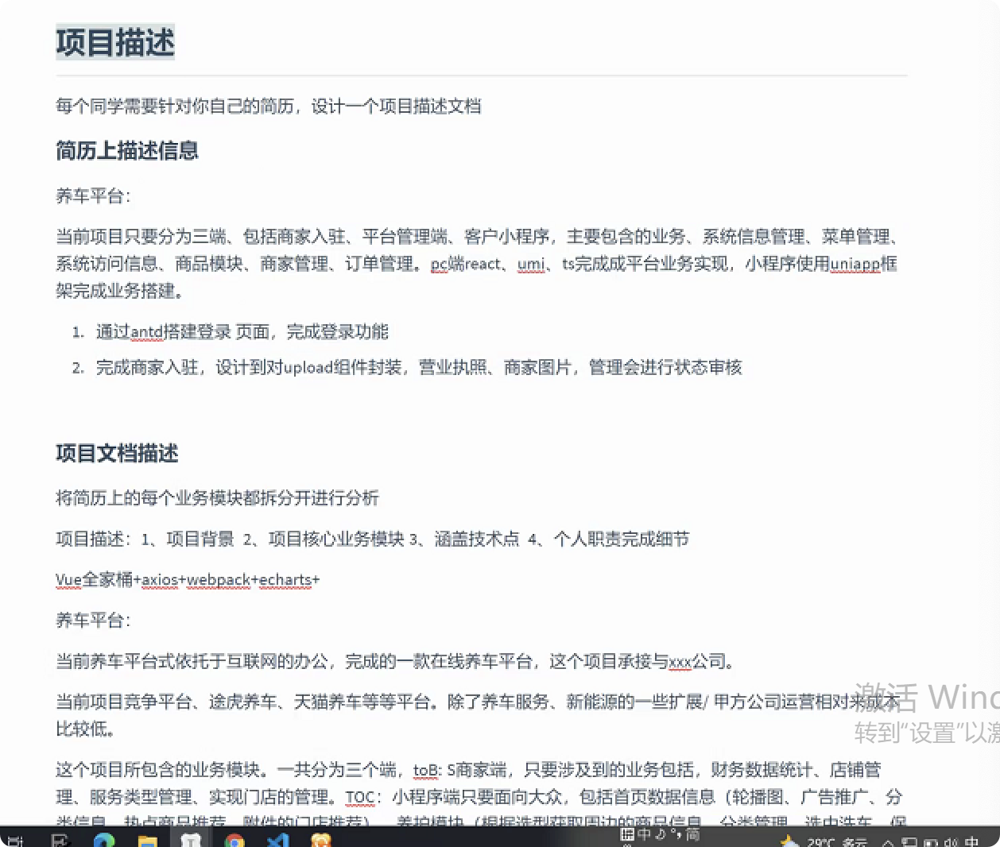
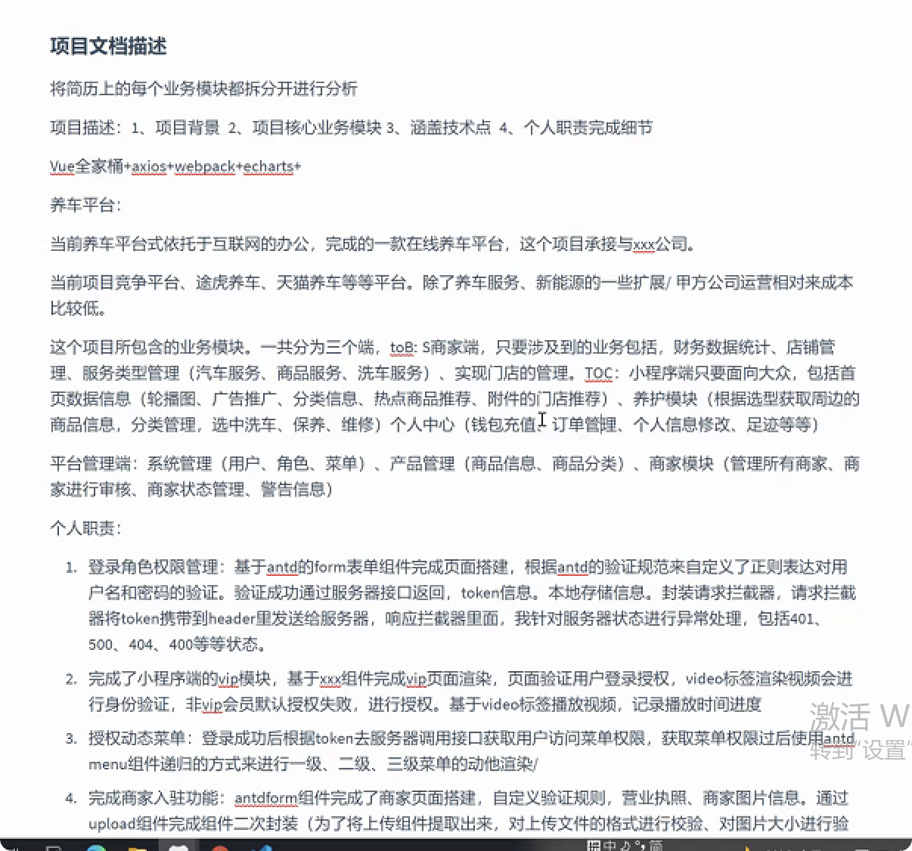

- 相关资料
- _1656379483822_0.pdf)
- 面试官关心
	- 
	- 
	- 拆分版块
	- 项目背景，更详细，Saas
	- 公司目标，合作公司，谁承接，谁分配，解决痛点
	- 维修保养
	- 核心业务板块：写清楚，
		- 请求封装成独立文件
		- 前半个月需求分析，拿到需求之后，确认需求，
		- 需求分析大会，分析产品
		- 细化到添加功能
	- 项目经理：精确到一人半天，
	- 敏捷开发
		- 开发人员自己评估，自己领任务，报
	- 价格
	- 迭代开发，第一个版本，三个月，交付第一个版本，第二个版本有什么
	- 项目不大，只有两个前端，多个项目共享一个UI，共享一个测试