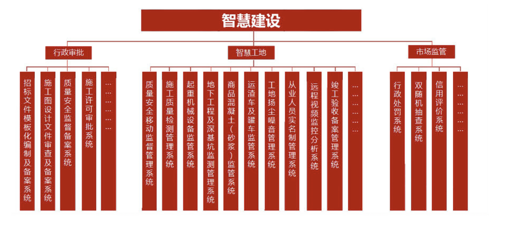

- 智建通（成都）科技有限公司
- 中国（四川）自由贸易试验区成都高新区府城大道西段399号天府新谷10栋1单元10-1-1504
- 1. 使用HBuilderX开发工具，配合VantUI框架实现布局
  2. 调用微信接口，登录并获取用户信息
  3. 使用vuex实现租赁器材状态管理
  4. 使用第三方地图服务，实现地图展示及距离显示
  5. 使用 Moment 对日期格式化处理，实现器材租赁日期的统一显示;
- 1. 使用 Vue-cli脚手架创建项目2. 使用Ant Design + Sass 完成页面布局；3. 使用Vue Router 管理路由的配置和跳转,使用路由守卫进行跳转前鉴权;3. 使用 Vuex 来管理状态变化和异步请求;5. 使用 Moment 对日期格式化处理;6.使用Vue Devtools 配合开发调试;
- 内部：电商建材B2B
	- 施工协同管理系统
	- 智慧工地-劳务实名制管理系统-App端
	  collapsed:: true
		- 使用Vue、uni-app实现移动端开发
		- 注册模块：根据用户选择不同角色，需要用户提供不同身份验证信息。为了验证用户真实性，使用间隔定时器setInterval、节流和阿里云提供的短信服务，实现手机验证码功能
		- 劳务模块：
			- 渲染搜索的劳务人员、劳务班组结果，提供实现按距离、信誉度排序功能。
			- 筛选-选择城市：当前后台创建的可选城市，渲染列表，默认当前定位城市在第一个。
	- 智慧工地监管云平台-疫情上报模块
	  collapsed:: true
		- 使用ECharts，通过绘制饼状图，展示今日劳务人员整体身体状况的统计数据
		- 使用，实现将今日或过往的进出人员的健康状况记录表格导出为CSV、XLS格式文件
		- 生成用于劳务人员上报健康状况的二维码
	- 劳务人班组工程商开发商劳务公司工程管理
		- React + redux + react-router + Ant Design
		- App端
			- 注册时选择角色，注册不同的用户信息
				- 上传身份信息(图片上传)
				- 验证身份，获取手机验证码：定时器Interval+60s后按钮可以触发，
					- 手机号做验证、防抖
					- [开通短信验证服务](https://ask.dcloud.net.cn/article/37534)
					- uniCloud、阿里云、腾讯云 都可注册服务
					- 使用则是调用接口
						- uniCloud：uniCloud.sendSms
							- 
						- [uni-id](https://uniapp.dcloud.net.cn/uniCloud/uni-id.html#mobile)  `uniID.sendSmsCode`
			- 分为劳务、搜索、我的(个人信息)三大模块。
			- 劳务
				- 使用腾讯云地图API，实现排序附近指定地点劳务人员，包括按距离搜索排序
				- 使用xxx，实现开发商缴付担保金和发放劳务班组的工资。
				- 使用[uni.requestPayment](https://uniapp.dcloud.io/api/plugins/payment.html#payment)，通过支付宝平台实现绑定提现账户、从App提现到支付宝账户，并记录提现明细
					- 提现细节
						- appid和appsecret，由公司提供
						- 测试的时候不能真机测试，必须打包安装测试
						- 提现金额至少是0.01元
					- 绑定：添加到后台数据库，每次使用直接调用后台数据库数据
					- 支付
						- [支付申请流程](https://blog.csdn.net/lianzhang861/article/details/117444582?utm_medium=distribute.pc_relevant.none-task-blog-2~default~baidujs_baidulandingword~default-0-117444582-blog-108364848.pc_relevant_default&spm=1001.2101.3001.4242.1&utm_relevant_index=3)
					- 提现：弹出数字框
					- 绑定提现账户：支付宝账号校验分为手机和邮箱
						- ```js
						  //  支付宝账号分为手机号和邮箱两种，可以通过正则表达式进行校验
						  let reg = /^(?:1[3-9]\d{9}|[a-zA-Z\d._-]*\@[a-zA-Z\d.-]{1,10}\.[a-zA-Z\d]{1,20})$/;
						  reg.test(账号);
						  //如果reg.test(账号)  为true,则表示为支付宝账号
						  //如果reg.test(账号)  为false,则表示不是支付宝账号
						  ```
						- 银行卡账号：阿里提供的银行卡号验证api
							- ```js
							  uni.request({
							      url: 'https://ccdcapi.alipay.com/validateAndCacheCardInfo.json?cardNo='+this.account+'&cardBinCheck=true', //仅为示例，并非真实接口地址。
							      success: (res) => {
							          console.log(res.data.validated,typeof res.data.validated);
							  		this.kaFlag = res.data.validated;
							  		if(!this.kaFlag){
							  			uni.showToast({
							  				title:"请输入正确的银行卡号",
							  				duration:1500,
							  				icon:"none"
							  			})
							  		}
							  	}
							  });
							  ```
						- `uni.requestPayment`
						-
				- 找劳务 - 筛选：按距离筛选(固定地点，储存距离，根据地点筛距离)
				- 地址选择：城市选择：显示当前已有劳务角色的地区，显示当前定位
				- 证件具有识别功能
				-
			- 鉴定
			- 培训
			- 使用u-charts 绘制圆环图，显示劳务人员男女比例
			-
		- 后台管理
			- 人员管理模块：
				- 1. 实现已有角色信息列表渲染
				  2. 使用Ant-Design中Transfer穿梭框组件，实现批量指派劳务角色
				  3. 创建账号界面，实现Excel文件的上传和下载
				  4.
			- 工资订单管理：
				- 渲染劳务订单列表的渲染，完成增加以及按编号、工资状态查询订单功能
				- 实现导出为.xls文件功能
				- 渲染工资流水列表，以及实现增、查功能
		- 1. 使用第三方地图API，实现排序附近指定地点劳务人员，包括按距离搜索排序
		  2. 城市选择功能中，根据后台数据仅显示已登记地区，并且置顶当前定位
		  我的(个人信息)模块：
		  1. 通过对角色鉴权，实现不同角色渲染不同的功能列表
		  2. 设置工作状态功能中，动态渲染所选月份的日历表，点击日期切换工作状态
	- 数智化监理工程项目前后台
		- 以强化监理、施工方、供应商多方联动为目的，实现“多项目集约式管理”
		- App
			- 动态联动筛选地区，二级显示当前地区所有工地，以及标注项目数，点击显示当前工地所有项目，
			- 使用momen处理项目启动日期，按日期倒序排列
			- 监理报告模块
				- 展示该道工序最新报告结果，监理及以上管理者可添加新验收记录，
				- 使用van-uploader组件和canvas，实现上传现场影像资料，并提供现场信息水印，用户可选择直接调用照相机或使用照片
			- 监理项目模块
				- 实现对项目的删查改
				- 使用vant中的表单组件实现项目信息填写以及表单验证
				- 使用上传组件，实现对上传影像资料的数量限制以及图片压缩
		- 后台管理： React + redux + react-router + ECharts +
			- 项目统计模块：使用ECharts，通过绘制折线图，展示当前所有监理人员的项目(已完成、未完成、总数)
			- 日志中心模块：记录登录登出，创建工地、冻结项目、转让等操作
				- 使用高阶组件，实现对按钮的鉴权，以及触发后，对当前操作类型、功能模块、操作人、操作时间、操作内容进行记录
			- 使用Git进行版本的管理
			- 使用Axios进行数据请求，实现页面交互、渲染数据、页面效果
	- 设备巡检
	  collapsed:: true
		- App
			- 地图：
				- 项目地点marker，
				- 动态联动筛选地区，二级显示当前地区所有工地，以及标注项目数，点击显示当前工地所有项目，使用momen处理项目启动日期，按日期倒序排列
			- 项目模块
				- 对角色鉴权，监理总监才能创建项目，使用Vuex实现对用户角色的全局管理
				- Vuex + computed 检测项目阶段进度，所有阶段都为完成状态，项目自动更新为完成
				- 监理项目
					- 监理阶段：点击显示详情
						- 展示当前项目所有监理阶段，以及对应阶段的进度
					- 监理报告：
						- 展示每道工序的验收内容，验收结果
						- 验收详情：展示该道工序最新报告结果，监理及以上权限者可添加新验收记录，上传现场验收图片
							- 上传图片(小程序，上传到后端或图床，图床保存地址)需要加水印
							- 确保验收内容真实性，需要获取当前地址信息，为现场验收影像资料提供[水印](https://news.tom.com/202103/4195544680.html)
							- 全局水印遮挡细节，
							- 上传图片使用uni-app的uni.chooseImage（）方法，[水印是用canvas](https://blog.csdn.net/i_am_a_div/article/details/118302757)
							- van-uploader上传组件实现图片上传，上传之前before-read中调用添加水印函数
								- 配置capture属性，直接调用照相机([需要获取用户权限](https://uniapp.dcloud.io/api/other/authorize.html))
								- 配置multiple属性，可多选照片
						- 签字栏：
							- 使用点击提示文字弹出模态框，[配合canvas实现电子签名功能](https://blog.csdn.net/gypzp/article/details/107638182)，有重置画布功能，保存canvas为base64格式，同时保存签字时间
							-
				- 创建项目
					- 使用vant中的表单组件van-form实现项目信息填写以及表单验证
						- 配置rules属性  2.5.3
							- ```js
							  if(newVal)
							    this.$nextTick(() => {
							      this.$refs.uForm.setRules(this.rules);
							    });
							  ```
						- pattern：正则验证
						- required：必填
						- validator：函数校验
						- formatter：格式化函数
					- 上传图片van-uploader：数量限制，过大图片需要进行压缩
						- max-count：限制上传数量
						- max-size ：限制上传文件的大小，超过大小的文件会被自动过滤，这些文件信息可以通过 `oversize` 事件获取。
							- `:max-size="500 * 1024"`   500kb
						- 在oversize实现图片压缩：上传之后，返回过大图片
						  collapsed:: true
							- [uni.compressImage](https://uniapp.dcloud.io/api/media/image.html)：[异步转同步](https://blog.csdn.net/weixin_41765786/article/details/107627895?spm=1001.2101.3001.6650.5&utm_medium=distribute.pc_relevant.none-task-blog-2%7Edefault%7EBlogCommendFromBaidu%7ERate-5-107627895-blog-107446162.pc_relevant_paycolumn_v3&depth_1-utm_source=distribute.pc_relevant.none-task-blog-2%7Edefault%7EBlogCommendFromBaidu%7ERate-5-107627895-blog-107446162.pc_relevant_paycolumn_v3&utm_relevant_index=9)
								- ```js
								  uni.compressImage({
								    src: '/static/logo.jpg',
								    quality: 80,
								    success: res => {
								      console.log(res.tempFilePath)
								    }
								  })
								  ```
						- before-read：上传前置处理(压缩图片)返回 true 表示校验通过，返回 false 表示校验失败。
							- 支持返回 `Promise` 对 file 对象进行自定义处理，例如压缩图片。
							- `:before-read="beforeRead"`
							-
					- 地区、工地 二级联动
					- 角色鉴权：若创建人是监理总监，读取监理总监下的监理；若创建人是超管/管理员，读取所有的监理
		- 后台管理
			- 首页：
			- 项目统计模块
				- [使用uCharts绘制图表](https://blog.csdn.net/lhkuxia/article/details/113385757)，展示当前所有监理人员的项目(已完成、未完成、总数)
					- 原理：canvas对象，引入js，配置参数，创建ucharts实例，调用绘制函数(传入canvasid和图表数据)
					- [Ucharts官网](https://www.ucharts.cn/v2/#/doc/index)
			- 工地管理模块：列表渲染，增删查改
				- 根据位置重复判断是否已有工地信息，仅可保存通过系统搜索到的位置信息，若不是系统的地址，点击保存，位置清空。
				- 前台仅保存实际位置信息，数据库地址名称、地址信息、坐标都要保存
					- 前端只显示实际位置信息，但是传给后端的参数需要包含地址名称、地址信息、坐标
				- 实现逻辑：用户输入关键字，调用api实现关键字查询，无输入内容，默认初始化位置为当前定位
					- 1. 获取当前定位(位置授权 uni.authorize)，用户点击输入框，弹出提示下拉框
						- ```js
						  uni.authorize({
						    scope: 'scope.userLocation',
						    success() { // 允许授权
						      self.getLocationInfo();
						    },
						    fail(){    // 拒绝授权
						      self.openConfirm();
						      console.log("你拒绝了授权，无法获得周边信息")
						    }
						  })
						  
						  //获取地理位置
						  uni.getLocation({
						    type: 'wgs84',
						    success (res) {
						      console.log(res,"当前位置");
						      // 移动到当前位置
						      self.toLocation(res)
						      self.latitude = res.latitude;
						      self.longitude = res.longitude;
						    }
						  });
						  ```
					- 注意获取定位要设置权限 开启位置接口配置(uniapp配置manifest.json文件)
						- https://s2.loli.net/2022/06/25/yTK5MkiUqNgZpsD.jpg{:height 315, :width 471}
					- 2. 调用关键字搜索api  `search`方法(需要用到 [腾讯地图](https://lbs.qq.com) 提供的 api)
						- 流程：
							- 申请开发者密钥（key）
							- 开通webserviceAPI服务：控制台 ->[key管理](https://lbs.qq.com/dev/console/key/manage) -> 设置（使用该功能的key）-> 勾选webserviceAPI -> 保存
							- 下载微信小程序JavaScriptSDK，导入
							- 将里面的 qqmap-wx-jssdk.js 文件拷贝到项目里面。然后在需要的页面导入。
								- ```js
								  var QQMapWX = require('../../common/qqmap/qqmap-wx-jssdk.min.js');
								  const QQMapWX = new qqmapsdk({
								  	key: '在腾讯位置服务申请的key'
								  });
								  ```
						- 很多地方都会用到地图，比如(。。。。)，封装成behaviors对象，方便之后复用
						  background-color:: #978626
						- [腾讯地图小程序api](https://lbs.qq.com/miniProgram/jsSdk/jsSdkGuide/qqMapwx)
					- 3. 用户选择地址后，显示地图icon，点击显示弹窗，显示输入地址的详细地图
						- https://s2.loli.net/2022/06/25/Hw2f658YQMk1SaN.png{:height 54, :width 51}
				-
			- 项目管理模块
				- 项目列表渲染，增删查改
				- 工地、用户手机、监理 都需要关联数据库数据，用户手机号可预置，待用户注册，再自动关联
				- 每个用户注册时，搜索数据库是否有项目关联当前用户，有，修改原预置手机号
				- 展示监理阶段信息，点击进入详情页
					- 阶段详情包含验收状态、验收内容和签字栏、签字时间
			- 监理阶段管理：
				- 按照权重由大到小排序，数字越小权重越高(权重由用户自定义)
				- 创建建立阶段
					- 阶段属性分为：道检、验收、自定义，
						- 自定义(需要设置自定义模板ID)：业主方授权委托书、人员联系表、图纸、预算、合同审核报告书
					- 上传附件：预览文件、重新上传
						- 预览：生成preview，上传文件类型为doc、xml、pdf
						- 微软接口：在线预览，不可编辑，内网环境无法使用在线预览服务，除了自己搭建微软预览服务器、kkfileview
						- 后端将文件转为图片，前端以图片形式预览
						- pdf：直接通过页面内嵌iframe、embed、object
							- accept属性，doc文件`.doc,.docx,application/msword,application/vnd.openxmlformats-officedocument.wordprocessingml.document`
							- PDF.js    将PDF文件渲染成Canvas
			- 用户管理模块：列表渲染、增删查改
				- 管理员能够冻结用户账户
				- 显示用户参与的项目详情
			- 权限管理：管理角色权限
				- 超管可创建管理员；
				  管理员仅可创建监理总监、监理
				- 监理总监、监理不支持登录后台；
				- 冻结、转让 逻辑
					- 冻结按钮需要二次确认
					- 仅监理账号冻结后，显示批量转让按钮
					- 转让监理项目，点击转让后，出现弹窗，
					- 自定义输入不支持保存，提示输入正确的监理，即需要检验当前内容是否符合数据库数据
					- 监理总监同理
			- 日志中心
				- 记录登录登出，创建工地、冻结项目、转让....
				- 使用v-directive `自定义指令`，实现对按钮的鉴权，以及触发后，对当前操作类型、功能模块、操作人、操作时间、操作内容进行记录 ([借鉴](https://blog.csdn.net/badoldboy/article/details/116116804))
				- ```js
				  Vue.directive("track", {
				    //钩子函数，只调用一次，指令第一次绑定到元素时调用。在这里可以进行一次性的初始化设置
				    /*
				     * el:指令所绑定的元素，可以用来直接操作 DOM
				     * binding：一个对象，包含以下 property:
				     *   name：指令名，不包括 v- 前缀。
				     *   value：指令的绑定值，例如：v-my-directive="1 + 1" 中，绑定值为 2。
				     *   expression：字符串形式的指令表达式。例如 v-my-directive="1 + 1" 中，表达式为 "1 + 1"。
				     *   arg：传给指令的参数，可选。例如 v-my-directive:foo 中，参数为 "foo"。
				     *   modifiers：一个包含修饰符的对象。例如：v-my-directive.foo.bar 中，修饰符对象为 { foo: true, bar: true }。
				     * vnode：Vue 编译生成的虚拟节点
				     */
				    bind: (el, binding, ) => {
				  ```
				- 操作内容有固定模板
				- [React实现按钮鉴权](https://blog.csdn.net/Govern66/article/details/117574454)
				- [React高阶组件应用：权限限制](https://blog.csdn.net/weixin_34388207/article/details/89064715?spm=1001.2101.3001.6650.1&utm_medium=distribute.pc_relevant.none-task-blog-2%7Edefault%7ECTRLIST%7ERate-1-89064715-blog-117574454.pc_relevant_paycolumn_v3&depth_1-utm_source=distribute.pc_relevant.none-task-blog-2%7Edefault%7ECTRLIST%7ERate-1-89064715-blog-117574454.pc_relevant_paycolumn_v3&utm_relevant_index=2)
				-
-
- 外：
	- 设备巡检(实习)
		- 小程序
			- 采用技术 Uni-App + Vue.js + Vant +
			- 项目描述 ：设备管理、巡检任务、巡检报告查验、一键报修
			- 项目职责
			  collapsed:: true
				- 内部使用小程序(没有对外开放注册)，可以直接引导用户进行账号登录
				- 角色鉴权，不同角色展示不同模块，例如管理员才能审核报告
				- 系统管理：
					- 该功能针对系统管理员开放或对检测中心的有关领导开发，包括
					  用户、角色、权限的管理和分配；
				- 技术设施维护管理模块
				  collapsed:: true
					- 技术资料管理：
						- 对监测中心使用设备的相关技术资料以附件的形式作管理，
						  该功能模块下实现了附件的`上传和下载`的功能。
					- 并可进行添加、批量添加、编辑、删除、导出的功能操作。
					- 设备校准和检修管理
						- 导出到csv、xls
				- 使用AJAX 动态级联，通过筛选对应日期的班次信息、值班人员，生成当日巡检任务清单，完后成提交报告。
				- 对用户角色鉴权，实现仅管理者拥有审核巡检报告功能。
				- 扫描并解析设备二维码，使用uni-app提供request接口，从后台异步获取对应设备信息、过往维护记录以及对故障设备的报修处理
					- [vue+H5实现扫码条形码及二维码功能](https://blog.csdn.net/weixin_43216105/article/details/120311799)
					- vuex获取后台设备检修状态，完成检修，提交报告
		- 后台管理(Vue+Element)
			- 新增设备，生成二维码，提供打印功能，加入设备组
				- vue-qr：生成二维码
					- [拖拽](https://www.jianshu.com/p/5710880bc1c7)
			- 使用Element Transfer穿梭框组件，实现所有设备和当前设备组设备的移入和移出
			- 导入、导出
				- 导入xls生成对应表格数据
					- 批量导入
				- 导出成csv或者xls格式文件
					- 全部导出
			- 巡检报告管理模块：通过对角色鉴权，实现仅管理员能审核通过报告，普通角色仅能查看
			- 提炼可复用组件 批量导入导出，
				- 传入自定义config属性，生成自定义表格
			- 技术设施维护管理模块
				- 技术资料管理：
					- 对监测中心使用设备的相关技术资料以附件的形式做管理，该功能模块下实现了附件的`上传和下载`的功能。
					- 并可进行添加、`批量添加`、编辑、删除、导出的功能操作。
					- 批量上传、下载文件，格式word、pdf、txt、excel
	- 项目职责：
	- 使用Sass预处理变编译css，优化代码，减少冗余代码，
	-
	-
	-
- IT技能
  collapsed:: true
	- 1.熟悉Vue全家桶开发，熟悉Vue的基础语法、路由配置，熟悉组件间的通信，熟练使用Vuex进行数据的全局状态管理。了解Vue响应式原理，掌握组件二次开发的技巧（有组件封装经验）。
	- 2.熟悉React全家桶开发，熟练使用函数编程，熟悉常用的hook，了解redux的工作流程。
	- 3.熟悉微信小程序开发流程，熟练使用uni-app开发。
	- 4.熟练使用AJAX、JSON、正则表达式。熟悉ES6常见的编程规范，熟悉Promise编程。
	- 5.熟练使用Sass，熟悉moment、lodash等工具库。
	- 6.熟练使用常见UI 框架如：Bootstrap、Element-UI、Vant、Ant-design 等
	- 7.熟悉 git 命令，以及熟练使用Apifox等相关开发工具。
	- 8.了解TypeScript基础语法、了解泛型编程、接口设计等等、面向对象设计思路。
	- 9.熟悉Mongodb。
- 劳务实名制管理系统
	- 后台
	- 1. 使用Ant-Design完成人员管理、工程管理所有模块列表渲染、增删查、以及过审操作
	- 2. 使用Ant-Design中Transfer穿梭框组件，实现批量指派劳务角色
	  3. 创建账号界面，实现Excel文件的上传和下载
- 工程协同管理系统
	- 后台：
	- 使用React第三方插件Braft Editor实现富文本编辑组件，实现自定义工作分类管理说明的文本编辑。
	-
	- # Braft Editor
	-
- [智建云-demo](https://demo.buildingqm.com/public/setting/uc/member_manage.html?project_id=141783&page_level=project#/)
- 人员管理模块
	- 人员管理：渲染项目人员列表，提供人员增删查改功能
		- 编辑：用户名不可编辑，真实姓名、手机号码、邮箱地址可编辑
	- 按钮鉴权：用户没有权限修改角色信息，隐藏功能
	- 可导出选中人寻信息表
	-
- 业务应用模块
- 智慧工地平台更新日志(真实)
	- 2021-4-19
	- 劳务实名制 - 新增考勤汇总/自定义查询出勤
	- 2021-03-30
	- 劳务实名制 - 考勤数据实时状态监控
	- 2021-1-21
	- 劳务实名制 - 优化定时任务执行流程
	- 新增对接四川省建科院
	- 2019-12-10
	- 智慧工地2.0系统 - 全新智慧工地平台
- 竣工验收管理系统
- 劳务实名制管理系统
- 
-
- [鹏业软件](http://www.pengye.com.cn/AttractInvestment/html/index.html#CPJX)
- 行业痛点
- 
-
-
-
-
- 之前记录
- 智慧工地-人员管理系统-疫情上报模块(实习）[智建通（成都）科技有限公司][2020-07-15-2020-09-18]
- 采用技术：Vue + Vuex + ElementUI + Axios + Moment + Sass + Echarts
- 编辑删除
- 项目描述：统计进出劳务人员当日健康状况，每日生成防控日报表统计相关数据，提供导出过往记录功能，统一管理工地劳务班组的疫情防控工作。
- 项目职责：1. 使用ElementUI + Sass 完成页面统一布局2. 使用ECharts，通过绘制饼状图，展示今日劳务人员整体身体状况的统计数据3. 使用 Moment 对日期格式化处理;4. 实现将今日或过往的进出人员的健康状况记录表格导出为CSV、XLS格式文件5. 生成用于劳务人员上报健康状况的二维码
-
- 智慧工地-质量管理系统-设备巡检模块-APP端[智建通（成都）科技有限公司][2020-12-11-2021-03-03]
- 采用技术：Uni-App + Vant + Axios
- 编辑删除
- 项目描述：提高巡检人效和管理效率，实现设备管理、巡检任务、巡检报告查验、快捷报修的管理模块。
- 项目职责：1. 使用HBuilderX开发工具，配合VantUI框架实现布局2. 调用微信接口，登录并获取用户信息3. 对角色鉴权，不同角色展示不同模块；4. 使用AJAX 动态级联，通过筛选对应日期的班次信息、值班人员，生成当日巡检任务清单，完后成提交报告。5. 调取摄像头扫描并解析设备二维码，从后台获取对应设备信息、过往维护记录以及对故障设备的报修处理；6. 获取后台设备检修状态，完成检修，提交报告
-
- 劳务实名制管理系统-APP端[智建通（成都）科技有限公司][2021-04-15-2021-10-02]
- 采用技术：React + Ant-Design + Redux + ES6 + uni-app + Vant
- 项目描述：打造集实名信息证书、考勤、工资、培训等于一体的人员信息化管理平台，有效避免劳务纠纷，规范人员行为，落实工地教育，保障施工，是科技型工程用工和劳动力分析工具。
- 项目职责：1. 维护1. 使用Ant Design + Sass 完成页面布局；2. 使用Ant-Design完成人员管理、工程管理、培训课程管理、考勤管理中所有模块列表渲染、增删查、以及过审操作3. 实现人员信息以.xls文件形式下载4. 使用Ant-Design中Transfer穿梭框组件，实现批量指派劳务角色5. 使用 Moment 对考勤日期等做统一格式化处理;
-
- 劳务实名制管理系统-APP端[智建通（成都）科技有限公司][2021-04-15-2021-10-02]
- 采用技术：React + Ant-Design + Redux + ES6 + uni-app + Vant
- 编辑删除
- 项目描述：打造集实名信息证书、考勤、工资、培训等于一体的人员信息化管理平台，有效避免劳务纠纷，规范人员行为，落实工地教育，保障施工，是科技型工程用工和劳动力分析工具。
- 项目职责：1. 维护1. 使用Ant Design + Sass 完成页面布局；2. 使用Ant-Design完成人员管理、工程管理、培训课程管理、考勤管理中所有模块列表渲染、增删查、以及过审操作3. 实现人员信息以.xls文件形式下载4. 使用Ant-Design中Transfer穿梭框组件，实现批量指派劳务角色5. 使用 Moment 对考勤日期等做统一格式化处理;
-
- 自我介绍、看项目，实现困难、懒加载，防抖节流、有咩有用防抖、
- 点击菜单进入详情，返回时，保存商品信息，本地存储(local不能设置时间)，
- 状态机的储存、常用hook，useState、之类
- 平常用的中间件：thunk、saga
  background-color:: #978626
- useCallBack：区别作用
- 代码题
-